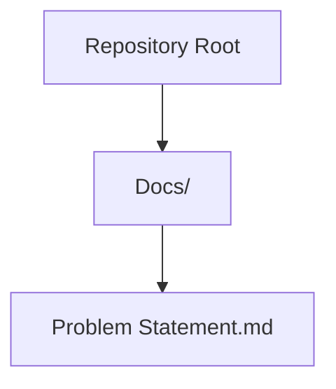
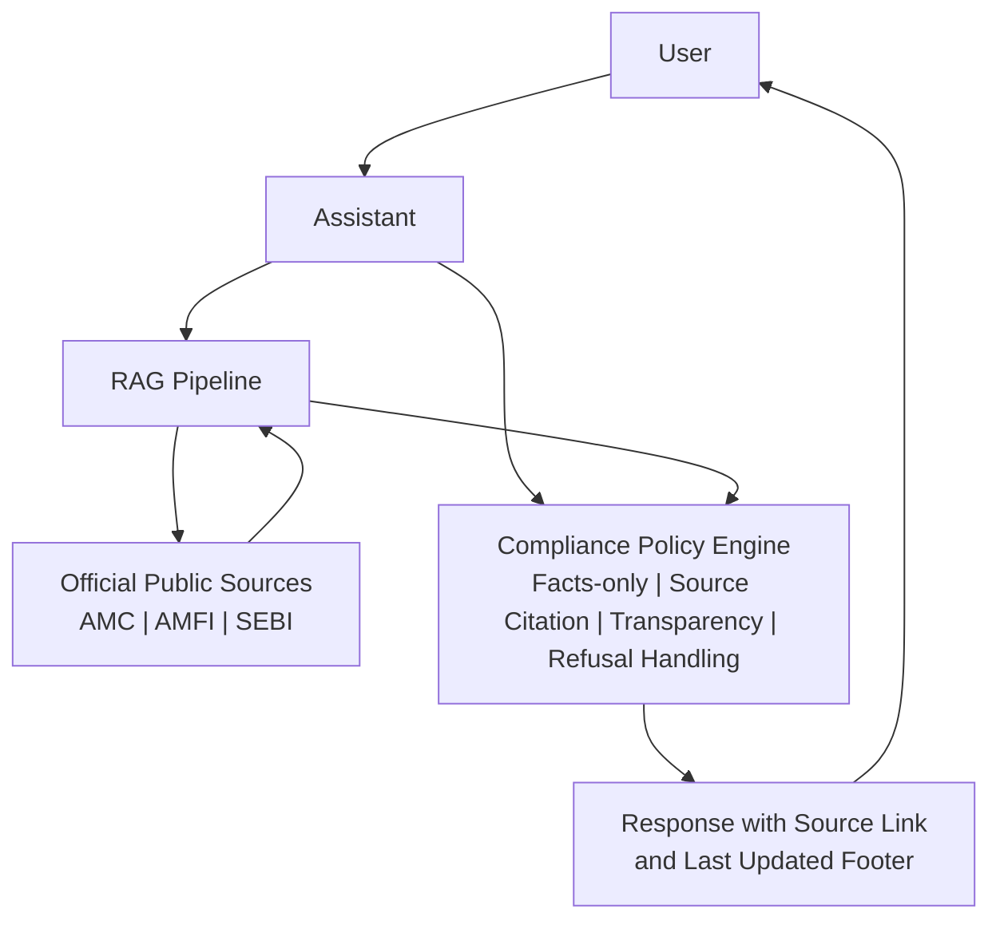
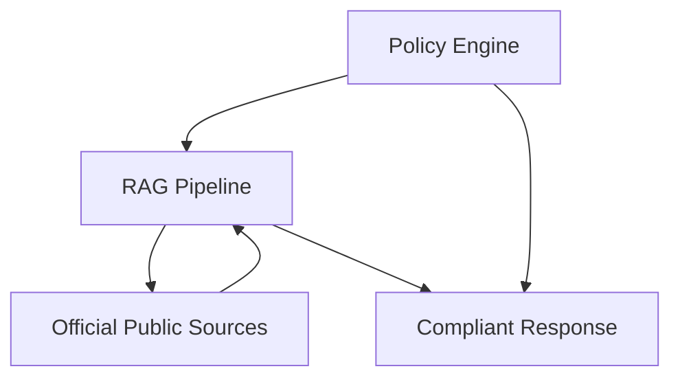

# Compliance and Legal Framework

<cite>
**Referenced Files in This Document**
- [Problem Statement.md](file://Docs/Problem Statement.md)
</cite>

## Table of Contents
1. [Introduction](#introduction)
2. [Project Structure](#project-structure)
3. [Core Components](#core-components)
4. [Architecture Overview](#architecture-overview)
5. [Detailed Component Analysis](#detailed-component-analysis)
6. [Dependency Analysis](#dependency-analysis)
7. [Performance Considerations](#performance-considerations)
8. [Troubleshooting Guide](#troubleshooting-guide)
9. [Conclusion](#conclusion)

## Introduction
This document outlines the compliance and legal framework governing the Mutual Fund FAQ Assistant project. It focuses on financial services regulations compliance, data privacy requirements, content restriction guidelines, facts-only constraints, source citation requirements, transparency obligations, and the refusal handling mechanism for advisory queries. The guidance is derived from the project’s problem statement and is intended to ensure adherence to applicable financial industry standards and regulatory expectations.

## Project Structure
The repository contains a single document that defines the project’s scope, constraints, and compliance requirements. The document establishes the facts-only nature of responses, the use of official public sources, and the prohibition of personal data collection. It also specifies refusal handling for advisory queries and the inclusion of transparency footers.

**Diagram sources**
- [Problem Statement.md:1-140](file://Docs/Problem Statement.md#L1-L140)

**Section sources**
- [Problem Statement.md:1-140](file://Docs/Problem Statement.md#L1-L140)

## Core Components
This section summarizes the compliance-relevant components defined in the problem statement.

- Financial Services Regulations Compliance
  - Use only official public sources (AMC, AMFI, SEBI) for factual information.
  - Avoid providing investment advice, opinions, or recommendations.
  - Ensure responses are limited to factual, verifiable information.

- Data Privacy Requirements
  - Do not collect, store, or process sensitive personal identifiers (e.g., PAN, Aadhaar, account numbers, OTPs, email addresses, phone numbers).
  - Maintain strict separation between user interactions and personal data handling.

- Content Restriction Guidelines
  - Prohibit investment advice or recommendations.
  - Avoid performance comparisons or return calculations.
  - For performance-related queries, direct users to official factsheets only.

- Facts-Only Constraint Implementation
  - Responses must be factual and verifiable.
  - Limit responses to a maximum of three sentences.
  - Include exactly one source link per response.

- Source Citation Requirements
  - Every response must include a single, clear source link.
  - Include a footer indicating the last updated date from the source.

- Transparency Obligations
  - Responses must be short, factual, and verifiable.
  - Include a disclaimer stating “Facts-only. No investment advice.”

- Refusal Handling Mechanism for Advisory Queries
  - Refuse advisory or comparative queries politely and clearly.
  - Reinforce the facts-only limitation.
  - Redirect users to relevant educational resources (e.g., AMFI or SEBI guidance pages).

**Section sources**
- [Problem Statement.md:4-7](file://Docs/Problem Statement.md#L4-L7)
- [Problem Statement.md:42-73](file://Docs/Problem Statement.md#L42-L73)
- [Problem Statement.md:85-111](file://Docs/Problem Statement.md#L85-L111)
- [Problem Statement.md:101-106](file://Docs/Problem Statement.md#L101-L106)
- [Problem Statement.md:107-111](file://Docs/Problem Statement.md#L107-L111)
- [Problem Statement.md:121-124](file://Docs/Problem Statement.md#L121-L124)
- [Problem Statement.md:61-73](file://Docs/Problem Statement.md#L61-L73)

## Architecture Overview
The compliance architecture centers on the assistant’s adherence to facts-only constraints and official sourcing. The system retrieves information from trusted public sources and enforces content restrictions and transparency requirements during response generation.

**Diagram sources**
- [Problem Statement.md:42-73](file://Docs/Problem Statement.md#L42-L73)
- [Problem Statement.md:85-111](file://Docs/Problem Statement.md#L85-L111)

## Detailed Component Analysis

### Financial Services Regulations Compliance
- Regulatory Alignment
  - The assistant relies exclusively on official public sources (AMC, AMFI, SEBI) to ensure alignment with financial industry standards and regulatory expectations.
  - By avoiding investment advice, the system minimizes exposure to regulatory scrutiny related to unlicensed financial advice.

- Practical Implications
  - Responses must be verifiable against official documents.
  - Educational redirection ensures users access authoritative guidance when advisory queries arise.

**Section sources**
- [Problem Statement.md:4-7](file://Docs/Problem Statement.md#L4-L7)
- [Problem Statement.md:34-39](file://Docs/Problem Statement.md#L34-L39)
- [Problem Statement.md:63-72](file://Docs/Problem Statement.md#L63-L72)

### Data Privacy Requirements
- Prohibited Data Collection Practices
  - The system explicitly prohibits collecting, storing, or processing sensitive personal identifiers and communication details.
  - This aligns with privacy-preserving design principles and reduces risk of data breaches or misuse.

- Privacy and Security Constraints
  - No personal identifiers or credentials should be captured or retained.
  - Access logs and storage mechanisms must exclude personally identifiable information.

**Section sources**
- [Problem Statement.md:92-100](file://Docs/Problem Statement.md#L92-L100)

### Content Restriction Guidelines
- Investment Advice and Recommendations
  - The assistant must not provide investment advice, opinions, or recommendations.
  - Comparative analyses or return projections are strictly prohibited.

- Performance-Related Queries
  - For performance-related questions, direct users to official factsheets only.

**Section sources**
- [Problem Statement.md:101-106](file://Docs/Problem Statement.md#L101-L106)

### Facts-Only Constraint Implementation
- Factual Accuracy and Verifiability
  - Responses must be factual and verifiable against official sources.
  - Sentence limits and single-source citations ensure clarity and traceability.

- Response Formatting
  - Maximum of three sentences per response.
  - Exactly one source link included per response.
  - Footer indicating the last updated date from the source.

**Section sources**
- [Problem Statement.md:55-60](file://Docs/Problem Statement.md#L55-L60)
- [Problem Statement.md:107-111](file://Docs/Problem Statement.md#L107-L111)

### Source Citation Requirements
- Single Source Link Requirement
  - Every response must include a single, clear source link.
  - The link must point to an official public source.

- Last Updated Footer
  - Include a footer indicating the last updated date from the source.

**Section sources**
- [Problem Statement.md:57-60](file://Docs/Problem Statement.md#L57-L60)
- [Problem Statement.md:109-111](file://Docs/Problem Statement.md#L109-L111)

### Transparency Obligations
- Short, Factual, and Verifiable Responses
  - Responses must be concise, factual, and verifiable.
  - Include a disclaimer stating “Facts-only. No investment advice.”

**Section sources**
- [Problem Statement.md:109-111](file://Docs/Problem Statement.md#L109-L111)
- [Problem Statement.md:121-124](file://Docs/Problem Statement.md#L121-L124)

### Refusal Handling Mechanism for Advisory Queries
- Advisory Query Detection
  - Refuse advisory or comparative queries politely and clearly.
  - Reinforce the facts-only limitation.

- Educational Resource Redirection
  - Provide a relevant educational link (e.g., AMFI or SEBI guidance pages).

**Section sources**
- [Problem Statement.md:61-73](file://Docs/Problem Statement.md#L61-L73)

### Practical Examples of Compliance Scenarios and Validation Processes
- Scenario 1: Expense Ratio Query
  - Input: “What is the expense ratio of a specific scheme?”
  - Validation: Retrieve official factsheet, confirm the expense ratio, include a single source link, and add the last updated footer.
  - Outcome: Factual, verifiable response meeting sentence limit and citation requirements.

- Scenario 2: Advisory Query
  - Input: “Should I invest in this fund?”
  - Validation: Detect advisory intent, refuse politely, reinforce facts-only limitation, and redirect to an educational resource.
  - Outcome: Clear refusal with educational redirection.

- Scenario 3: Performance Comparison
  - Input: “Which fund is better?”
  - Validation: Detect comparative intent, refuse politely, and redirect to official factsheets for comparison.
  - Outcome: No recommendation provided; user directed to official documents.

- Scenario 4: Personal Identifier Request
  - Input: “Can you share my PAN for KYC?”
  - Validation: Reject the request immediately; no personal data collection occurs.
  - Outcome: Clear policy enforcement without data capture.

**Section sources**
- [Problem Statement.md:46-54](file://Docs/Problem Statement.md#L46-L54)
- [Problem Statement.md:63-72](file://Docs/Problem Statement.md#L63-L72)
- [Problem Statement.md:94-100](file://Docs/Problem Statement.md#L94-L100)

## Dependency Analysis
Compliance depends on the assistant’s adherence to official sourcing, content restrictions, and transparency requirements. The RAG pipeline must prioritize official public sources, while the policy engine enforces facts-only constraints, source citation, and refusal handling.

**Diagram sources**
- [Problem Statement.md:42-73](file://Docs/Problem Statement.md#L42-L73)
- [Problem Statement.md:85-111](file://Docs/Problem Statement.md#L85-L111)

**Section sources**
- [Problem Statement.md:42-73](file://Docs/Problem Statement.md#L42-L73)
- [Problem Statement.md:85-111](file://Docs/Problem Statement.md#L85-L111)

## Performance Considerations
- Retrieval Efficiency
  - Focus on official public sources to streamline retrieval and reduce ambiguity.
  - Ensure fast response times by limiting response length and avoiding unnecessary processing.

- Compliance Validation Overhead
  - Integrate policy checks early in the response pipeline to minimize post-processing adjustments.
  - Maintain a small set of official sources to simplify verification and reduce latency.

[No sources needed since this section provides general guidance]

## Troubleshooting Guide
- Non-Factual or Advisory Queries
  - Action: Refuse politely, reinforce facts-only limitation, and redirect to educational resources.
  - Reference: [Problem Statement.md:63-72](file://Docs/Problem Statement.md#L63-L72)

- Missing Source Link
  - Action: Ensure every response includes a single, clear source link and a last updated footer.
  - Reference: [Problem Statement.md:57-60](file://Docs/Problem Statement.md#L57-L60)

- Excessive Response Length
  - Action: Limit responses to a maximum of three sentences.
  - Reference: [Problem Statement.md:55-57](file://Docs/Problem Statement.md#L55-L57)

- Personal Identifier Requests
  - Action: Reject requests immediately; do not collect or process personal data.
  - Reference: [Problem Statement.md:94-100](file://Docs/Problem Statement.md#L94-L100)

**Section sources**
- [Problem Statement.md:55-60](file://Docs/Problem Statement.md#L55-L60)
- [Problem Statement.md:63-72](file://Docs/Problem Statement.md#L63-L72)
- [Problem Statement.md:94-100](file://Docs/Problem Statement.md#L94-L100)

## Conclusion
The Mutual Fund FAQ Assistant operates under a strict compliance framework designed to ensure accuracy, transparency, and adherence to financial industry standards. By relying exclusively on official public sources, enforcing facts-only constraints, and implementing robust refusal handling for advisory queries, the system maintains trust and regulatory alignment. The explicit prohibition of personal data collection and the requirement for clear source citations further strengthen privacy and transparency obligations.