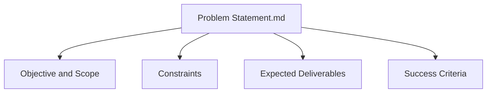
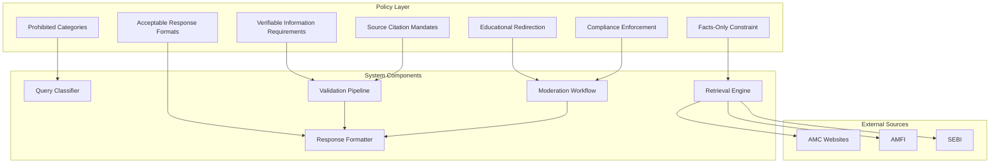
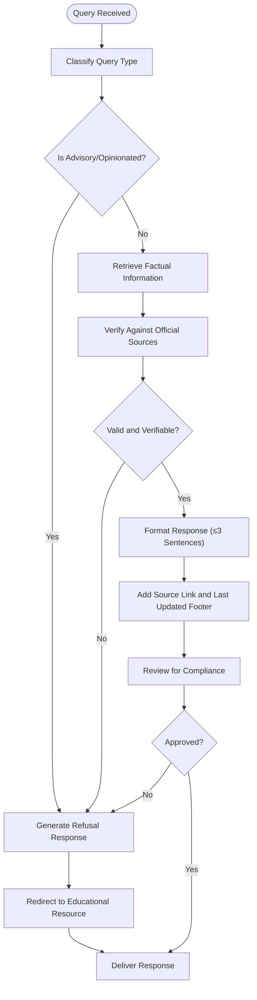
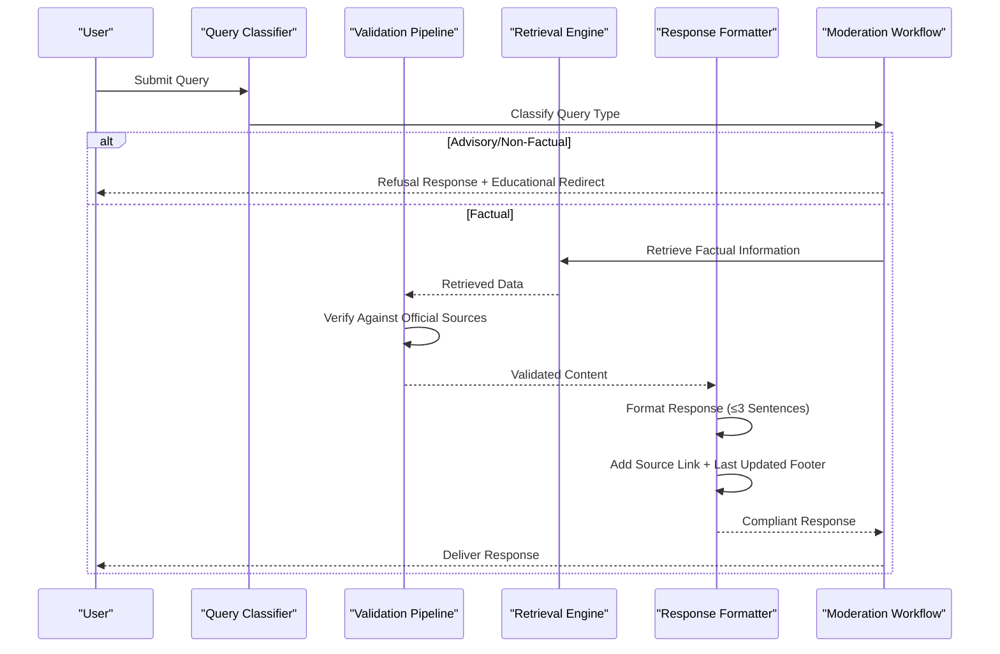
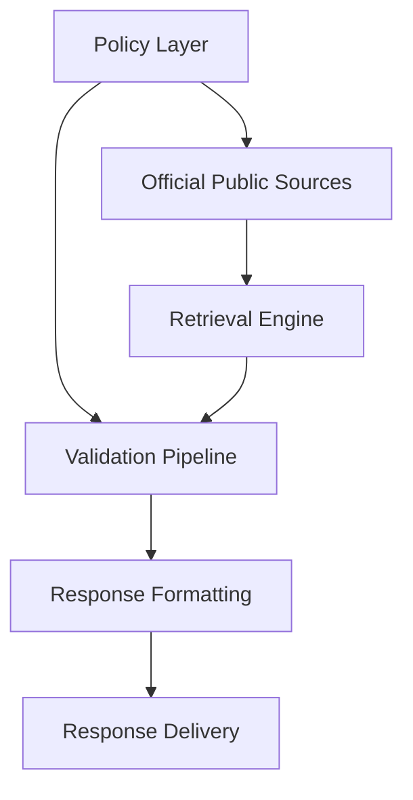

# Content Restrictions and Guidelines

<cite>
**Referenced Files in This Document**
- [Problem Statement.md](file://Docs/Problem Statement.md)
</cite>

## Table of Contents
1. [Introduction](#introduction)
2. [Project Structure](#project-structure)
3. [Core Components](#core-components)
4. [Architecture Overview](#architecture-overview)
5. [Detailed Component Analysis](#detailed-component-analysis)
6. [Dependency Analysis](#dependency-analysis)
7. [Performance Considerations](#performance-considerations)
8. [Troubleshooting Guide](#troubleshooting-guide)
9. [Conclusion](#conclusion)

## Introduction
This document outlines the content restrictions and editorial guidelines for the Mutual Fund FAQ Assistant. It defines what content is permitted and prohibited, establishes the facts-only constraint, and specifies validation processes, citation requirements, and moderation workflows. The guidelines ensure compliance with regulatory expectations for transparency, accuracy, and the avoidance of investment advice or recommendations.

## Project Structure
The repository provides a problem statement that defines the scope, constraints, and expected outcomes for the assistant. The content restriction policies are embedded within the problem statement and serve as the foundation for building and operating the system.

**Diagram sources**
- [Problem Statement.md:1-140](file://Docs/Problem Statement.md#L1-L140)

**Section sources**
- [Problem Statement.md:1-140](file://Docs/Problem Statement.md#L1-L140)

## Core Components
This section summarizes the key policy components derived from the problem statement.

- Prohibited content categories:
  - Investment advice or recommendations
  - Performance comparisons or return calculations
  - Speculative or opinionated statements
  - Non-verifiable claims

- Facts-only constraint:
  - Responses must be objective, verifiable, and limited to factual information retrievable from official public sources.

- Verifiable information requirements:
  - Each response must include a single, clear source link and a last-updated date footer.

- Source citation mandates:
  - Official public sources only (e.g., AMC websites, AMFI, SEBI).
  - Do not use third-party blogs or aggregator websites.

- Acceptable response formats:
  - Concise, factual answers limited to a maximum of three sentences.
  - Footer: “Last updated from sources: <date>”.

- Educational resource redirection:
  - For advisory-type queries, politely refuse and redirect users to relevant educational resources (e.g., AMFI or SEBI guidance pages).

- Compliance enforcement mechanisms:
  - Strict adherence to facts-only responses.
  - Consistent inclusion of valid source citations.
  - Proper refusal of advisory queries.
  - Clear user-facing disclaimers.

**Section sources**
- [Problem Statement.md:55-111](file://Docs/Problem Statement.md#L55-L111)

## Architecture Overview
The content policy architecture integrates retrieval, validation, and response generation to enforce facts-only constraints and source citation requirements.

[No sources needed since this diagram shows conceptual workflow, not actual code structure]

## Detailed Component Analysis

### Content Validation Processes
The validation pipeline ensures that every response adheres to the facts-only constraint and includes required citations.

[No sources needed since this diagram shows conceptual workflow, not actual code structure]

### Prohibited Language Patterns
The system must detect and prevent the use of language indicative of advice, recommendations, or speculation. Examples of prohibited patterns include:
- Imperatives suggesting actions (“Invest in X,” “Avoid Y”)
- Comparative statements (“Better than,” “Higher returns than”)
- Predictive or speculative phrasing (“Will likely increase,” “May outperform”)
- Subjective descriptors (“Safe,” “Best option”)
- Opinion-based conclusions (“In my view,” “I recommend”)

These patterns are enforced during moderation to ensure strict adherence to facts-only responses.

[No sources needed since this section doesn't analyze specific source files]

### Acceptable Response Formats
Responses must meet the following criteria:
- Factual and verifiable
- Limited to a maximum of three sentences
- Include a single, clear source link
- Include a footer: “Last updated from sources: <date>”
- Avoid any advisory or recommendation language

[No sources needed since this section doesn't analyze specific source files]

### Content Moderation Workflow
The moderation workflow enforces compliance by:
- Classifying incoming queries
- Rejecting advisory or non-factual requests
- Validating retrieved information against official sources
- Ensuring citations and footers are present
- Redirecting users to educational resources when appropriate

[No sources needed since this diagram shows conceptual workflow, not actual code structure]

### Examples of Restricted Content Categories
Restricted categories include, but are not limited to:
- Investment advice or recommendations
- Performance comparisons or return projections
- Speculative statements about future market movements
- Subjective evaluations of fund quality or risk

[No sources needed since this section doesn't analyze specific source files]

### Acceptable Alternatives
Permitted content includes:
- Objective, verifiable facts from official sources
- Links to official factsheets and documents
- Educational resources from recognized authorities (e.g., AMFI, SEBI)
- Clear, concise summaries limited to three sentences

[No sources needed since this section doesn't analyze specific source files]

## Dependency Analysis
The policy layer depends on external official sources to validate information and ensure compliance. The retrieval engine must prioritize official sources while the validation pipeline enforces citation and formatting requirements.

[No sources needed since this diagram shows conceptual workflow, not actual code structure]

## Performance Considerations
- Limit response length to improve readability and reduce ambiguity.
- Ensure fast retrieval from official sources to maintain user satisfaction.
- Automate moderation checks to minimize manual intervention while preserving accuracy.

[No sources needed since this section provides general guidance]

## Troubleshooting Guide
Common issues and resolutions:
- Advisory queries: Politely explain the facts-only limitation and redirect to educational resources.
- Missing citations: Require a single, clear source link and a last-updated footer.
- Overly long responses: Enforce a maximum of three sentences.
- Non-official sources: Replace with links to AMC, AMFI, or SEBI documents.

**Section sources**
- [Problem Statement.md:61-73](file://Docs/Problem Statement.md#L61-L73)
- [Problem Statement.md:101-111](file://Docs/Problem Statement.md#L101-L111)

## Conclusion
The content restrictions and editorial guidelines establish a robust framework for delivering accurate, verifiable, and compliant mutual fund information. By enforcing facts-only responses, requiring official source citations, and implementing a clear moderation workflow, the system maintains trustworthiness and regulatory alignment while providing a user-friendly experience.