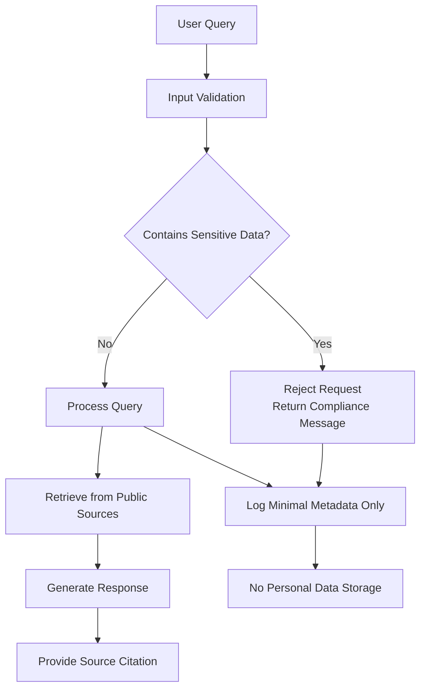
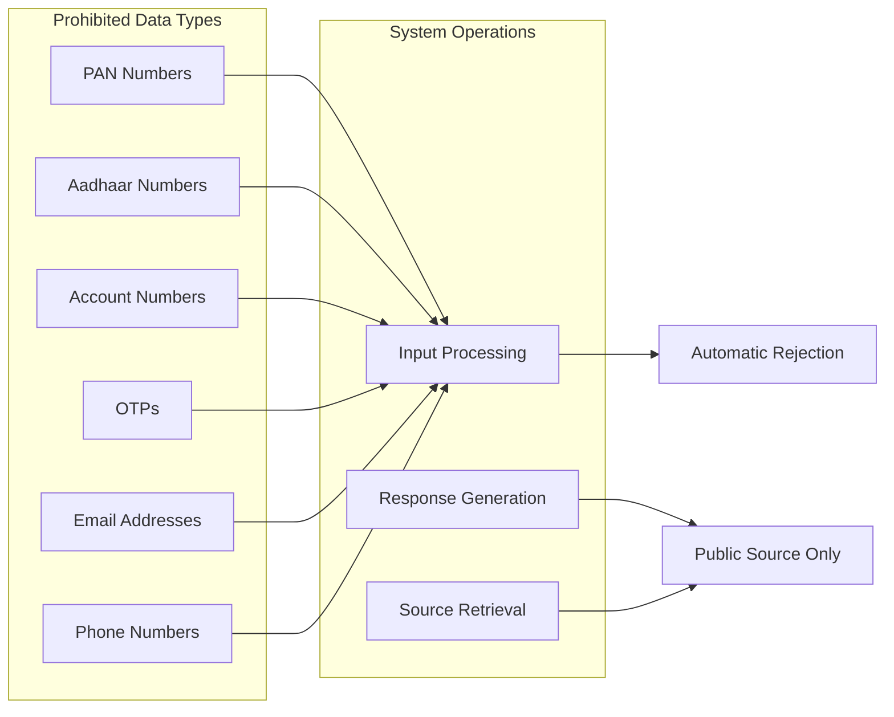

# Data Privacy and Security

<cite>
**Referenced Files in This Document**
- [Problem Statement.md](file://Docs/Problem Statement.md)
</cite>

## Table of Contents
1. [Introduction](#introduction)
2. [Privacy and Security Framework](#privacy-and-security-framework)
3. [Prohibited Data Collection Practices](#prohibited-data-collection-practices)
4. [Privacy-by-Design Implementation](#privacy-by-design-implementation)
5. [Data Minimization Principles](#data-minimization-principles)
6. [Secure Data Handling Practices](#secure-data-handling-practices)
7. [Technical Security Measures](#technical-security-measures)
8. [Data Retention and Deletion Policies](#data-retention-and-deletion-policies)
9. [Breach Notification Protocols](#breach-notification-protocols)
10. [GDPR Compliance Considerations](#gdpr-compliance-considerations)
11. [Data Subject Rights](#data-subject-rights)
12. [Implementation Guidelines](#implementation-guidelines)
13. [Monitoring and Auditing](#monitoring-and-auditing)
14. [Conclusion](#conclusion)

## Introduction

This document establishes comprehensive data privacy and security requirements for the Mutual Fund FAQ Assistant project. The system operates as a facts-only information retrieval system that must strictly avoid collecting, storing, or processing sensitive personal data. The implementation must adhere to privacy-by-design principles while maintaining compliance with applicable data protection regulations.

The project's constraint-based approach creates a unique privacy landscape where the system is designed to minimize data exposure through careful architectural decisions and operational practices.

## Privacy and Security Framework

The Mutual Fund FAQ Assistant operates under strict privacy constraints that fundamentally shape the system's architecture and operational model:

**Diagram sources**
- [Problem Statement.md:92-100](file://Docs/Problem Statement.md#L92-L100)

The framework emphasizes zero data collection of sensitive information while maintaining system functionality through public source utilization.

**Section sources**
- [Problem Statement.md:92-100](file://Docs/Problem Statement.md#L92-L100)

## Prohibited Data Collection Practices

The system explicitly prohibits collection, storage, or processing of the following sensitive data categories:

### Financial Identification Information
- **PAN (Permanent Account Number)**: Individual taxpayer identification numbers
- **Aadhaar Numbers**: Unique identification numbers issued by the Indian government
- **Account Numbers**: Bank account, demat account, or investment account numbers

### Authentication and Communication Data
- **OTP (One-Time Passwords)**: Temporary authentication codes
- **Email Addresses**: Electronic mail addresses
- **Phone Numbers**: Mobile or landline telephone numbers

### Implementation Requirements

**Diagram sources**
- [Problem Statement.md:94-99](file://Docs/Problem Statement.md#L94-L99)

**Section sources**
- [Problem Statement.md:94-99](file://Docs/Problem Statement.md#L94-L99)

## Privacy-by-Design Implementation

Privacy-by-design requires embedding privacy protections into the system architecture from the ground up:

### Architectural Privacy Controls
- **Zero Data Collection**: System design prevents any sensitive data capture
- **Public Source Dependency**: All information retrieval occurs from publicly accessible sources
- **Minimal Data Processing**: Only essential metadata for system operation is processed
- **Encrypted Communication**: All data transmission uses secure protocols

### Input Validation Mechanisms
- Real-time sensitive data detection in user inputs
- Automatic rejection of requests containing prohibited data types
- Transparent communication of compliance violations to users

**Section sources**
- [Problem Statement.md:92-100](file://Docs/Problem Statement.md#L92-L100)

## Data Minimization Principles

The system adheres to strict data minimization principles:

### Essential Data Only
- **System Logs**: Minimal operational logs for debugging and monitoring
- **Query Metadata**: Basic query statistics without personal identifiers
- **Performance Metrics**: System performance data without user correlation

### Data Lifecycle Management
- **Immediate Processing**: Data processed immediately without persistent storage
- **Automatic Cleanup**: All temporary data purged upon session completion
- **No Archival**: No long-term data retention or archival capabilities

**Section sources**
- [Problem Statement.md:92-100](file://Docs/Problem Statement.md#L92-L100)

## Secure Data Handling Practices

### Input Sanitization and Validation
- Comprehensive validation of all user inputs against prohibited patterns
- Real-time detection and blocking of sensitive data attempts
- Transparent feedback mechanisms for compliance violations

### Output Protection
- Response generation exclusively from public sources
- Source attribution for all information provided
- No inference or extrapolation of personal financial data

### Communication Security
- HTTPS/TLS encryption for all external communications
- Secure API integrations with public financial portals
- Encrypted internal communications between system components

**Section sources**
- [Problem Statement.md:92-100](file://Docs/Problem Statement.md#L92-L100)

## Technical Security Measures

### Network Security
- **Transport Encryption**: All external communications encrypted using TLS 1.3+
- **Certificate Validation**: Automated certificate verification and renewal
- **Firewall Configuration**: Restrictive network policies limiting external access

### Access Control
- **Least Privilege**: System components operate with minimal necessary permissions
- **Network Segmentation**: Isolation of processing environments
- **Audit Logging**: Comprehensive logging of all system access and operations

### Data Protection
- **Memory Security**: Secure memory handling preventing accidental data exposure
- **Temporary File Management**: Secure handling of any temporary data artifacts
- **Process Isolation**: Separate processes for different system functions

**Section sources**
- [Problem Statement.md:92-100](file://Docs/Problem Statement.md#L92-L100)

## Data Retention and Deletion Policies

### Immediate Data Handling
- **No Persistent Storage**: System operates without permanent data repositories
- **Session-Based Processing**: All data processing occurs within active user sessions
- **Automatic Cleanup**: System automatically clears all temporary data upon completion

### Log Management
- **Operational Logs**: Limited to system health and performance metrics
- **Retention Period**: Logs retained for 30 days maximum for troubleshooting
- **Deletion Process**: Automated log rotation and deletion according to schedule

### Exception Handling
- **Error Logging**: System errors logged without exposing sensitive context
- **Debug Information**: Development-only debug information excluded from production
- **Security Events**: All security incidents logged with appropriate sensitivity

**Section sources**
- [Problem Statement.md:92-100](file://Docs/Problem Statement.md#L92-L100)

## Breach Notification Protocols

### Incident Classification
- **Data Exposure**: Any unauthorized access to system logs or temporary data
- **System Compromise**: Detection of unauthorized system modifications
- **Service Disruption**: Security-related service availability issues

### Response Procedures
- **Immediate Containment**: Automatic isolation of compromised system components
- **Investigation Protocol**: Systematic analysis of incident scope and impact
- **Notification Requirements**: Mandatory reporting to relevant authorities within 72 hours

### Communication Strategy
- **Stakeholder Notification**: Affected parties informed within 72 hours of discovery
- **Regulatory Reporting**: Appropriate regulatory bodies notified per legal requirements
- **Public Disclosure**: Transparent communication respecting privacy considerations

**Section sources**
- [Problem Statement.md:92-100](file://Docs/Problem Statement.md#L92-L100)

## GDPR Compliance Considerations

### Legal Basis and Processing
- **Legitimate Interest**: Processing justified by system functionality requirements
- **Contract Performance**: Data processing necessary for system operation
- **Legal Obligation**: Compliance with data protection regulations

### Lawfulness, Fairness, and Transparency
- **Clear Notice**: Users informed about system privacy practices
- **Purpose Limitation**: Data processed only for specified system functions
- **Data Minimization**: Only essential data processed for system operation

### Individual Rights Compliance
- **Access Requests**: System designed to handle user data access requests
- **Rectification**: Mechanisms for correcting inaccurate system information
- **Erasure**: Complete removal of user data from system processing

**Section sources**
- [Problem Statement.md:92-100](file://Docs/Problem Statement.md#L92-L100)

## Data Subject Rights

### Rights Framework
- **Information Access**: Users can request information about system data processing
- **Data Portability**: System designed to facilitate data portability where applicable
- **Object to Processing**: Users can object to system data processing activities
- **Right to be Forgotten**: Complete removal of user data from system processing

### Exercise of Rights
- **Request Mechanism**: Clear procedures for exercising data subject rights
- **Response Timeline**: Standardized response times for right exercise requests
- **Verification Process**: Secure identity verification for right exercise requests

### Compliance Measures
- **Policy Integration**: Data subject rights integrated into system policies
- **Training Requirements**: Staff trained on data subject rights implementation
- **Monitoring Systems**: Systems to monitor and report on rights exercise

**Section sources**
- [Problem Statement.md:92-100](file://Docs/Problem Statement.md#L92-L100)

## Implementation Guidelines

### System Design Requirements
- **Privacy Impact Assessment**: Conducted for all system components and data flows
- **Security Architecture**: Integrated security controls at every system layer
- **Compliance Monitoring**: Continuous monitoring of privacy and security compliance

### Operational Procedures
- **Daily Security Checks**: Automated system health and security monitoring
- **Weekly Compliance Reviews**: Manual review of system privacy and security practices
- **Monthly Incident Analysis**: Review of security events and compliance issues

### Training and Awareness
- **Staff Training**: Regular training on privacy and security requirements
- **User Education**: Clear communication of system privacy practices to users
- **Incident Response**: Comprehensive training for security incident response

**Section sources**
- [Problem Statement.md:92-100](file://Docs/Problem Statement.md#L92-L100)

## Monitoring and Auditing

### Security Monitoring
- **Real-time Alerts**: Automated alerts for security incidents and compliance violations
- **Behavioral Analytics**: Monitoring for unusual system access patterns
- **Performance Baseline**: Establishing normal system behavior for anomaly detection

### Audit Trails
- **Comprehensive Logging**: Complete audit trail of all system operations
- **Access Control**: Detailed logging of all system access and modifications
- **Data Processing**: Complete record of all data processing activities

### Compliance Verification
- **Automated Checks**: Regular automated verification of privacy and security controls
- **Manual Audits**: Periodic manual audits of system compliance
- **Third-party Assessment**: Annual independent assessment of privacy and security practices

**Section sources**
- [Problem Statement.md:92-100](file://Docs/Problem Statement.md#L92-L100)

## Conclusion

The Mutual Fund FAQ Assistant represents a unique privacy-focused system that demonstrates how privacy-by-design principles can be effectively implemented in AI-powered applications. By operating exclusively on public sources and implementing strict data prohibition policies, the system achieves comprehensive privacy protection while maintaining functional effectiveness.

The comprehensive framework established in this document provides a foundation for building and operating the system in compliance with applicable privacy and security requirements. The zero-data collection approach, combined with robust technical and procedural safeguards, creates a system that users can trust for accessing factual financial information without privacy concerns.

Continuous monitoring, regular compliance assessments, and adherence to the outlined procedures will ensure the system maintains its privacy-first approach as it evolves and scales to meet user demands.