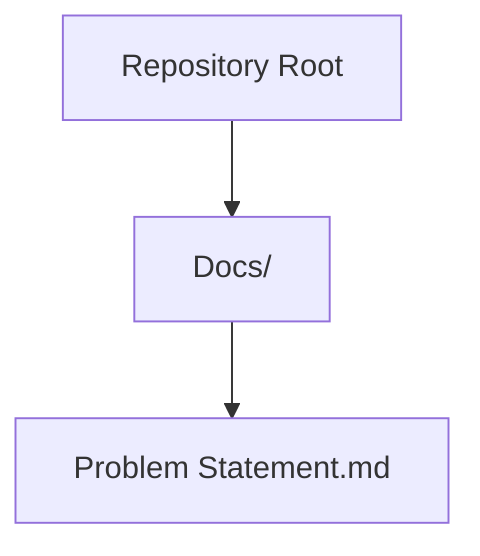
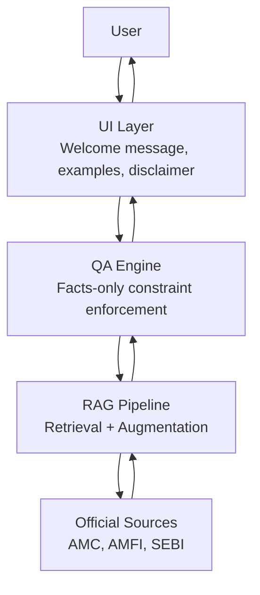
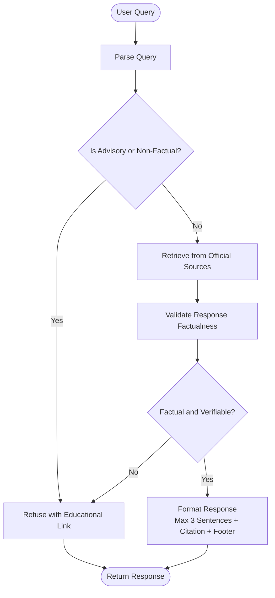
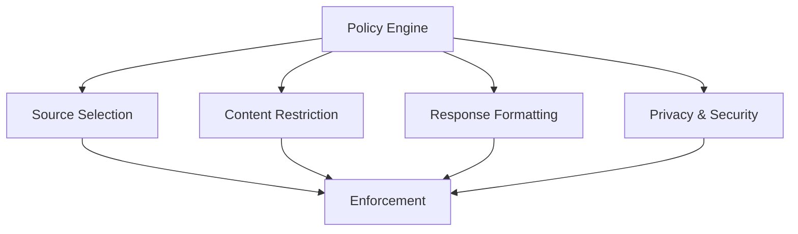
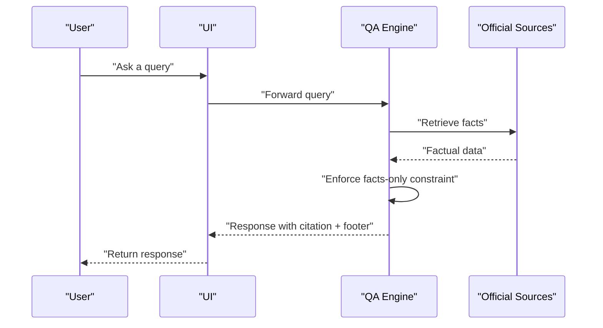
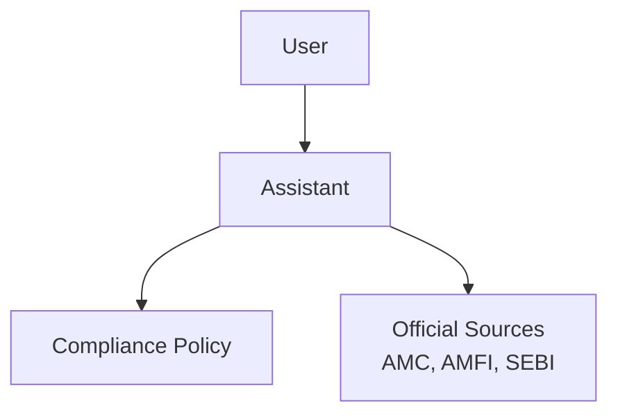

# Financial Regulations and Compliance

<cite>
**Referenced Files in This Document**
- [Problem Statement.md](file://Docs/Problem Statement.md)
</cite>

## Table of Contents
1. [Introduction](#introduction)
2. [Project Structure](#project-structure)
3. [Core Components](#core-components)
4. [Architecture Overview](#architecture-overview)
5. [Detailed Component Analysis](#detailed-component-analysis)
6. [Dependency Analysis](#dependency-analysis)
7. [Performance Considerations](#performance-considerations)
8. [Troubleshooting Guide](#troubleshooting-guide)
9. [Conclusion](#conclusion)
10. [Appendices](#appendices)

## Introduction
This document consolidates financial regulations and compliance requirements for building a facts-only mutual fund assistant aligned with SEBI guidelines and financial services regulations. It focuses on the facts-only constraint, prohibited advisory activities, and regulatory framework for financial information providers. It also outlines compliance obligations for automated financial assistants, disclosure requirements, and regulatory reporting considerations, with practical examples of compliant versus non-compliant responses and violation scenarios.

## Project Structure
The repository contains a single problem statement document that defines the scope, constraints, and compliance requirements for a mutual fund FAQ assistant. The document specifies:
- Use of official public sources (AMC, AMFI, SEBI)
- Facts-only responses with citations and last updated dates
- Prohibition of investment advice, recommendations, and performance comparisons
- Privacy and security constraints (no personal identifiers)
- Disclosure requirements (visible disclaimer “Facts-only. No investment advice.”)

**Diagram sources**
- [Problem Statement.md:1-140](file://Docs/Problem Statement.md#L1-L140)

**Section sources**
- [Problem Statement.md:1-140](file://Docs/Problem Statement.md#L1-L140)

## Core Components
This section maps the compliance-relevant components defined in the problem statement to the assistant’s operational model.

- Facts-only constraint
  - Responses must be objective, verifiable, and limited to a maximum of three sentences.
  - Each response must include exactly one citation link and a footer indicating the last updated date from sources.
  - Performance-related queries must link to the official factsheet only.

- Prohibited advisory activities
  - No investment advice or recommendations.
  - No performance comparisons or return calculations.
  - Non-factual or advisory queries must be refused politely and redirected to educational resources.

- Regulatory framework for financial information providers
  - Use only official public sources (AMC, AMFI, SEBI).
  - Do not use third-party blogs or aggregator websites.

- Privacy and security
  - Do not collect, store, or process PAN, Aadhaar, account numbers, OTPs, email addresses, or phone numbers.

- Disclosure and transparency
  - Responses must be short, factual, and verifiable.
  - Include a visible disclaimer: “Facts-only. No investment advice.”

**Section sources**
- [Problem Statement.md:42-113](file://Docs/Problem Statement.md#L42-L113)

## Architecture Overview
The assistant architecture aligns with a retrieval-augmented generation (RAG) model that retrieves answers from curated, official sources and enforces strict compliance constraints at inference time.

**Diagram sources**
- [Problem Statement.md:13-17](file://Docs/Problem Statement.md#L13-L17)
- [Problem Statement.md:42-60](file://Docs/Problem Statement.md#L42-L60)

## Detailed Component Analysis

### Compliance Control Flow
The assistant enforces compliance through a deterministic control flow at inference time.

**Diagram sources**
- [Problem Statement.md:61-73](file://Docs/Problem Statement.md#L61-L73)
- [Problem Statement.md:42-60](file://Docs/Problem Statement.md#L42-L60)

**Section sources**
- [Problem Statement.md:42-73](file://Docs/Problem Statement.md#L42-L73)

### Compliance Enforcement Mechanisms
- Source selection policy: Only official public sources (AMC, AMFI, SEBI) are used.
- Content policy: No investment advice, recommendations, performance comparisons, or return calculations.
- Presentation policy: Each response includes a single citation link and a last updated footer.
- Privacy policy: No personal identifiers or sensitive data collection.

**Diagram sources**
- [Problem Statement.md:87-111](file://Docs/Problem Statement.md#L87-L111)

**Section sources**
- [Problem Statement.md:87-111](file://Docs/Problem Statement.md#L87-L111)

### Automated Financial Assistant Compliance Obligations
- Disclosure obligations: Display a visible disclaimer stating “Facts-only. No investment advice.”
- Transparency: Include a citation link and last updated date for every response.
- Accuracy: Limit responses to factual, verifiable information from official sources.
- Non-advisory: Refuse queries seeking advice or recommendations.

**Diagram sources**
- [Problem Statement.md:74-82](file://Docs/Problem Statement.md#L74-L82)
- [Problem Statement.md:42-60](file://Docs/Problem Statement.md#L42-L60)

**Section sources**
- [Problem Statement.md:74-82](file://Docs/Problem Statement.md#L74-L82)
- [Problem Statement.md:42-60](file://Docs/Problem Statement.md#L42-L60)

### Practical Examples: Compliant vs Non-Compliant Responses
- Compliant response example
  - Query: “What is the expense ratio of this scheme?”
  - Response: “The expense ratio is X%. See the factsheet for details.” [Link to factsheet]
  - Footer: Last updated from sources: YYYY-MM-DD
  - Outcome: Factual, verifiable, cites official source.

- Non-compliant response example
  - Query: “Should I invest in this fund?”
  - Response: “Yes, because it has performed well.”
  - Outcome: Advisory content; violates facts-only constraint.

- Non-compliant response example
  - Query: “Which fund is better?”
  - Response: “Fund A is better than Fund B.”
  - Outcome: Comparative recommendation; violates prohibition on performance comparisons.

- Non-compliant response example
  - Query: “How much will I earn?”
  - Response: “You will earn approximately Y%.”
  - Outcome: Projection or return calculation; violates prohibition on return calculations.

- Compliant refusal example
  - Query: “Which fund is better?”
  - Response: “I cannot compare funds or provide recommendations. Please review the official factsheets and educational resources.” [Link to SEBI/AMFI resource]
  - Outcome: Polite refusal with redirection to educational material.

**Section sources**
- [Problem Statement.md:46-53](file://Docs/Problem Statement.md#L46-L53)
- [Problem Statement.md:63-73](file://Docs/Problem Statement.md#L63-L73)
- [Problem Statement.md:103-105](file://Docs/Problem Statement.md#L103-L105)

### Regulatory Violation Scenarios
- Scenario 1: Providing investment advice
  - Action: Responding to “Should I invest in this fund?” with a recommendation.
  - Violation: Breach of facts-only constraint and advisory prohibition.
  - Mitigation: Refuse and redirect to educational resources.

- Scenario 2: Performance comparison
  - Action: Comparing two funds and recommending one.
  - Violation: Breach of content restriction on performance comparisons.
  - Mitigation: Provide a link to official factsheets only.

- Scenario 3: Return projection
  - Action: Estimating future returns.
  - Violation: Breach of prohibition on return calculations.
  - Mitigation: Provide a link to the factsheet and explain that projections are not included.

- Scenario 4: Using unofficial sources
  - Action: Citing third-party blogs or aggregator websites.
  - Violation: Breach of source selection policy.
  - Mitigation: Use only AMC, AMFI, and SEBI official sources.

- Scenario 5: Collecting personal data
  - Action: Requesting PAN, Aadhaar, account numbers, OTPs, email addresses, or phone numbers.
  - Violation: Breach of privacy and security constraints.
  - Mitigation: Do not collect, store, or process any personal identifiers.

**Section sources**
- [Problem Statement.md:89-105](file://Docs/Problem Statement.md#L89-L105)
- [Problem Statement.md:94-99](file://Docs/Problem Statement.md#L94-L99)
- [Problem Statement.md:63-73](file://Docs/Problem Statement.md#L63-L73)

## Dependency Analysis
The assistant depends on official sources and enforces policies at runtime.

**Diagram sources**
- [Problem Statement.md:87-111](file://Docs/Problem Statement.md#L87-L111)

**Section sources**
- [Problem Statement.md:87-111](file://Docs/Problem Statement.md#L87-L111)

## Performance Considerations
- Retrieval quality: Ensure curated, official sources are indexed and retrievable to minimize hallucinations and non-factual responses.
- Response formatting: Enforce sentence limits and citation requirements to maintain clarity and verifiability.
- Refusal handling: Automate refusal prompts to maintain consistency and reduce human error.
- Privacy checks: Validate inputs to prevent accidental collection of personal identifiers.

## Troubleshooting Guide
- Symptom: Responses include advice or recommendations.
  - Action: Review refusal handling logic and ensure advisory queries are redirected to educational resources.
  - Reference: [Problem Statement.md:63-73](file://Docs/Problem Statement.md#L63-L73)

- Symptom: Responses lack citations or last updated dates.
  - Action: Enforce response formatting rules and validate output before returning.
  - Reference: [Problem Statement.md:55-60](file://Docs/Problem Statement.md#L55-L60)

- Symptom: Queries seek performance comparisons or projections.
  - Action: Apply content restriction rules and provide a link to the factsheet only.
  - Reference: [Problem Statement.md:103-105](file://Docs/Problem Statement.md#L103-L105)

- Symptom: Personal identifiers are requested or processed.
  - Action: Enforce privacy and security constraints and reject such queries.
  - Reference: [Problem Statement.md:94-99](file://Docs/Problem Statement.md#L94-L99)

**Section sources**
- [Problem Statement.md:55-60](file://Docs/Problem Statement.md#L55-L60)
- [Problem Statement.md:63-73](file://Docs/Problem Statement.md#L63-L73)
- [Problem Statement.md:94-99](file://Docs/Problem Statement.md#L94-L99)
- [Problem Statement.md:103-105](file://Docs/Problem Statement.md#L103-L105)

## Conclusion
The assistant’s compliance posture is anchored in a strict facts-only constraint, prohibition on advisory activities, and reliance on official sources. By enforcing disclosure, transparency, and privacy controls, the system ensures adherence to SEBI guidelines and financial services regulations while maintaining trust and verifiability for retail investors.

## Appendices
- Disclaimer snippet for UI: “Facts-only. No investment advice.”
- Example questions for UI: Include typical factual queries (e.g., expense ratio, exit load, minimum SIP amount, lock-in period, riskometer classification, benchmark index, statement download process).
- Educational links: Redirect advisory queries to SEBI or AMFI resources.

**Section sources**
- [Problem Statement.md:78-82](file://Docs/Problem Statement.md#L78-L82)
- [Problem Statement.md:122-123](file://Docs/Problem Statement.md#L122-L123)