# Transparency and Disclosure Requirements

<cite>
**Referenced Files in This Document**
- [Problem Statement.md](file://Docs/Problem Statement.md)
</cite>

## Table of Contents
1. [Introduction](#introduction)
2. [Project Structure](#project-structure)
3. [Core Components](#core-components)
4. [Architecture Overview](#architecture-overview)
5. [Detailed Component Analysis](#detailed-component-analysis)
6. [Dependency Analysis](#dependency-analysis)
7. [Performance Considerations](#performance-considerations)
8. [Troubleshooting Guide](#troubleshooting-guide)
9. [Conclusion](#conclusion)
10. [Appendices](#appendices)

## Introduction
This document defines the transparency and disclosure obligations for the Mutual Fund FAQ Assistant project. It establishes the source citation requirements, last updated date implementation, and response formatting standards. It also outlines the transparency framework, including disclosure of limitations, disclaimer requirements, and source attribution mechanisms. Compliance validation processes, citation verification procedures, and quality assurance measures are detailed, along with examples of compliant disclosure formats, citation best practices, and transparency reporting requirements. Guidance for user education about source reliability and information verification is included to ensure responsible use of the assistant.

## Project Structure
The repository contains a single problem statement document that defines the transparency and disclosure requirements for the assistant. The document specifies:
- Official public sources for factual information retrieval
- Response formatting constraints (sentence limits, citation requirements, last updated date)
- Disclaimer placement and refusal handling for advisory queries
- Known limitations and compliance expectations

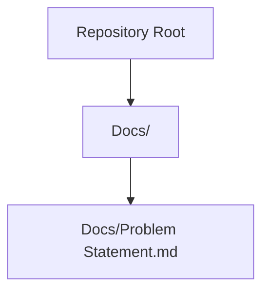

**Diagram sources**
- [Problem Statement.md](file://Docs/Problem Statement.md)

**Section sources**
- [Problem Statement.md](file://Docs/Problem Statement.md)

## Core Components
This section summarizes the transparency and disclosure requirements derived from the problem statement document.

- Source Citation Requirements
  - Every response must include a single, clear source link.
  - Responses must be limited to a maximum of three sentences.
  - Responses must include a footer indicating the last updated date from sources.

- Last Updated Date Implementation
  - The last updated date must be included in the response footer.
  - The date must reflect the latest update observed in the cited source.

- Response Formatting Standards
  - Responses must be short, factual, and verifiable.
  - Each response must include exactly one citation link.
  - The footer must follow the format: "Last updated from sources: <date>".

- Transparency Framework
  - The assistant must strictly avoid providing investment advice, opinions, or recommendations.
  - Responses must be facts-only and verifiable.
  - The system must use only official public sources (AMC, AMFI, SEBI).
  - For performance-related queries, provide a link to the official factsheet only.

- Disclaimer Requirements
  - A visible disclaimer must be present in the user interface: "Facts-only. No investment advice."

- Refusal Handling
  - Advisory queries must be refused politely and clearly.
  - Refusal responses must reinforce the facts-only limitation.
  - Provide a relevant educational link (e.g., AMFI or SEBI resource).

- Known Limitations
  - The assistant answers only factual queries about mutual fund schemes.
  - It does not provide investment advice or recommendations.
  - It avoids performance comparisons or return calculations.

**Section sources**
- [Problem Statement.md](file://Docs/Problem Statement.md)

## Architecture Overview
The transparency and disclosure architecture centers on the assistant’s response pipeline, which enforces strict formatting and sourcing rules. The system retrieves information from official public sources and ensures every response adheres to the established transparency requirements.

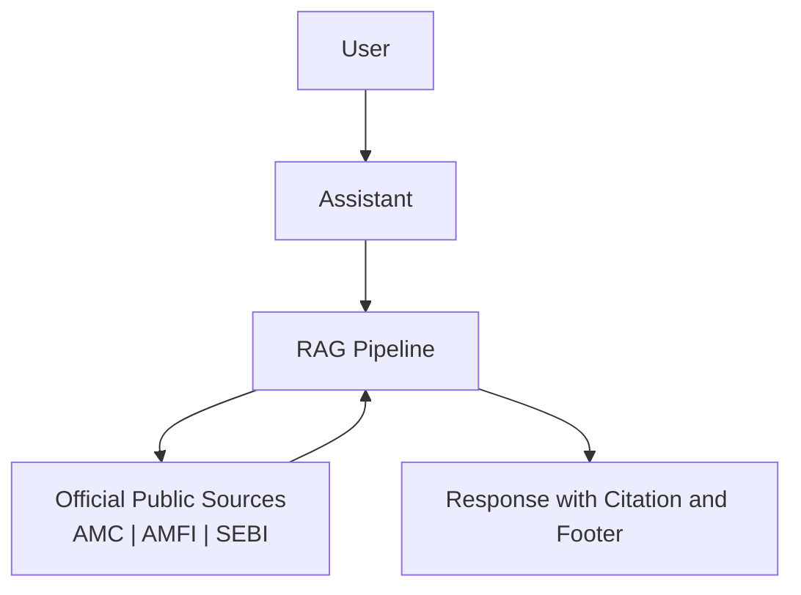

[No sources needed since this diagram shows conceptual workflow, not actual code structure]

## Detailed Component Analysis

### Source Citation Requirements
- Requirement: Every response must include a single, clear source link.
- Constraint: Responses must be limited to a maximum of three sentences.
- Footer requirement: Include a footer with the last updated date from sources.

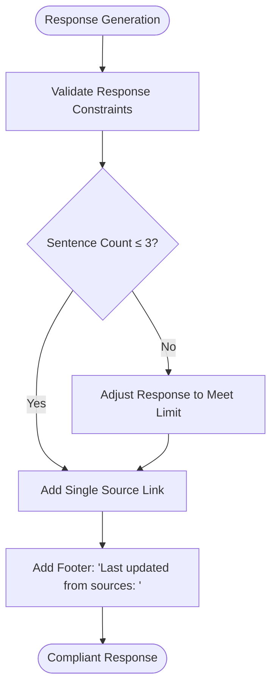

**Section sources**
- [Problem Statement.md](file://Docs/Problem Statement.md)

### Last Updated Date Implementation
- Requirement: Include the last updated date in the response footer.
- Mechanism: Extract the latest update date from the cited source during retrieval.
- Format: Use the standardized footer format: "Last updated from sources: <date>".

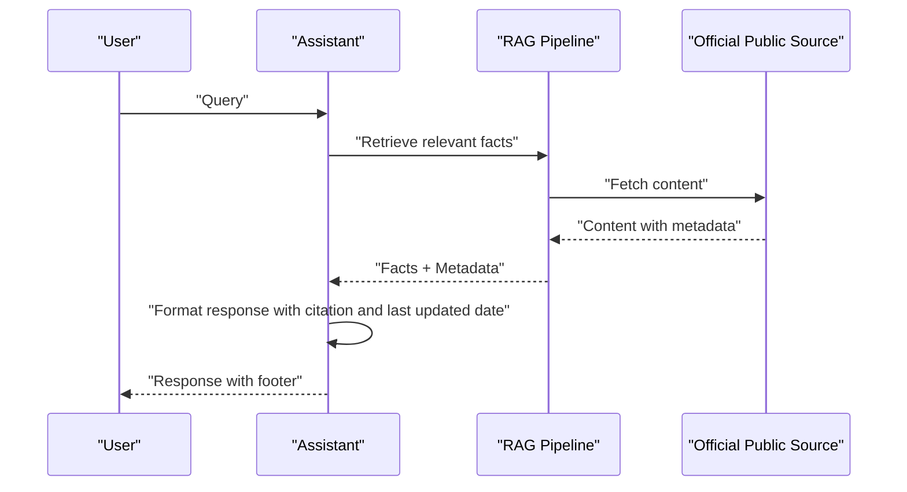

**Section sources**
- [Problem Statement.md](file://Docs/Problem Statement.md)

### Response Formatting Standards
- Response must be short, factual, and verifiable.
- Must include exactly one citation link.
- Must include the standardized footer with the last updated date.

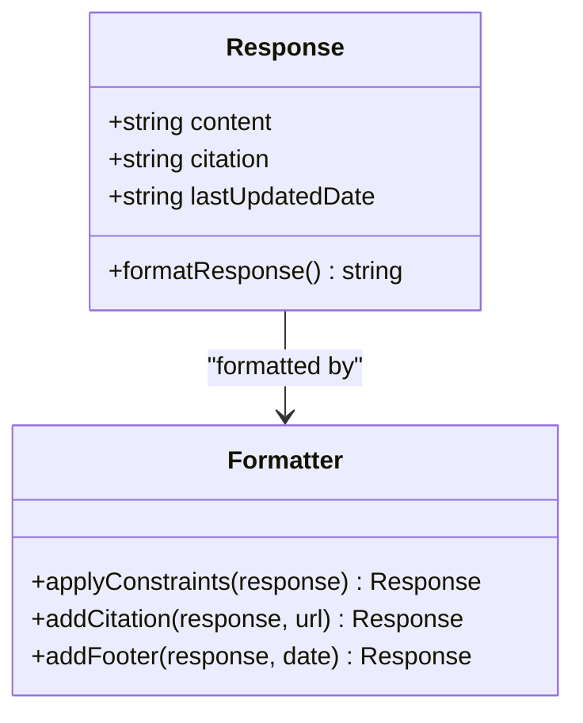

**Section sources**
- [Problem Statement.md](file://Docs/Problem Statement.md)

### Transparency Framework
- Facts-only responses: Avoid investment advice, opinions, or recommendations.
- Official public sources only: Use AMC, AMFI, and SEBI websites.
- Performance queries: Provide a link to the official factsheet only.

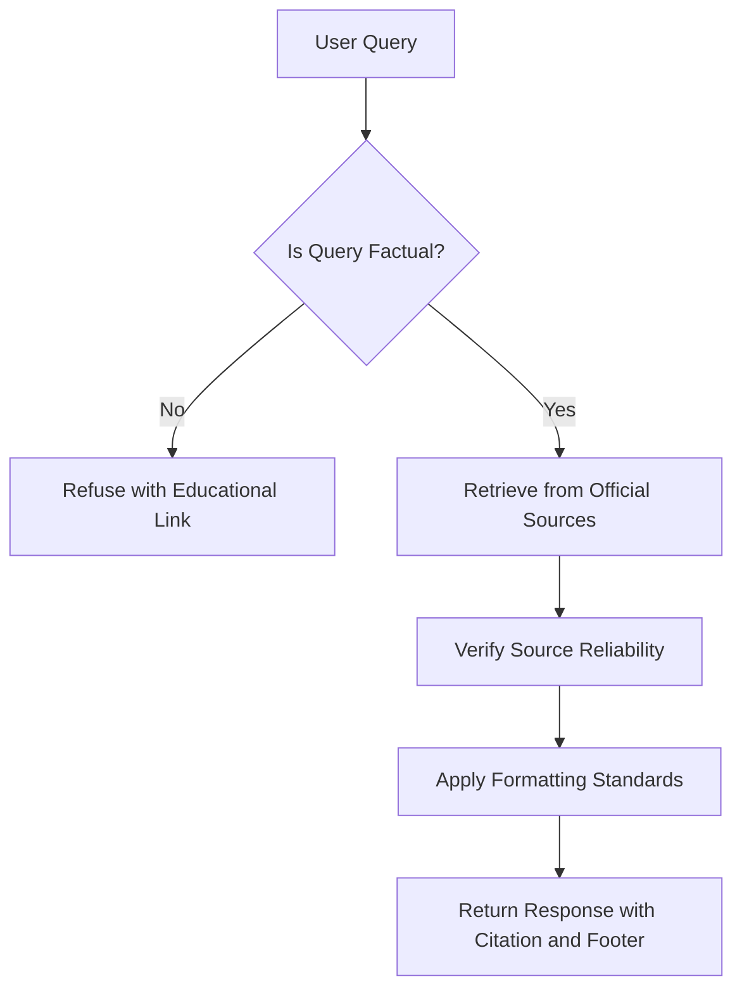

**Section sources**
- [Problem Statement.md](file://Docs/Problem Statement.md)

### Disclaimer Requirements
- Visible disclaimer: "Facts-only. No investment advice."
- Placement: Include in the user interface alongside welcome messages and example questions.

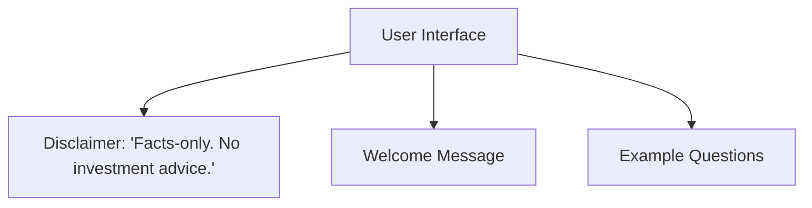

**Section sources**
- [Problem Statement.md](file://Docs/Problem Statement.md)

### Refusal Handling
- Advisory queries must be refused politely and clearly.
- Reinforce the facts-only limitation.
- Provide a relevant educational link (e.g., AMFI or SEBI resource).

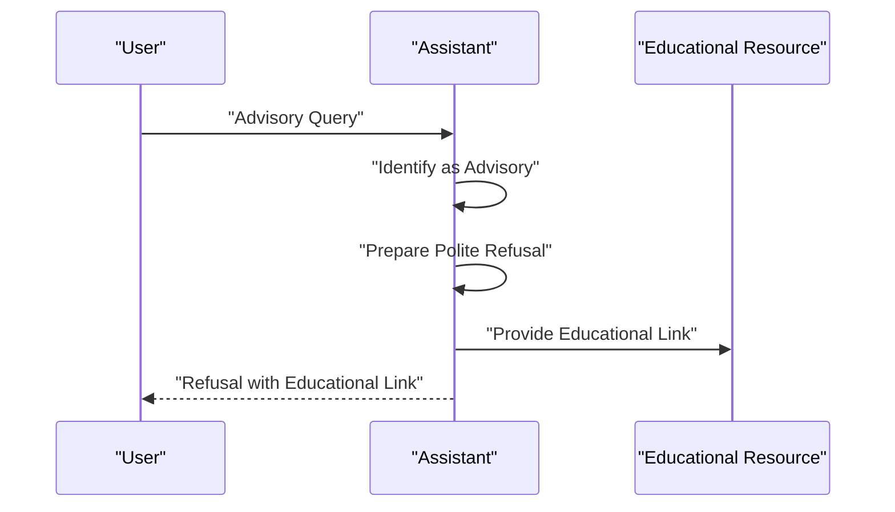

**Section sources**
- [Problem Statement.md](file://Docs/Problem Statement.md)

### Compliance Validation Processes
- Accuracy validation: Ensure factual correctness against official sources.
- Adherence validation: Confirm response constraints (sentence limit, citation, footer).
- Refusal validation: Verify advisory queries are refused appropriately.
- Quality assurance: Maintain clean, minimal, and user-friendly interface.

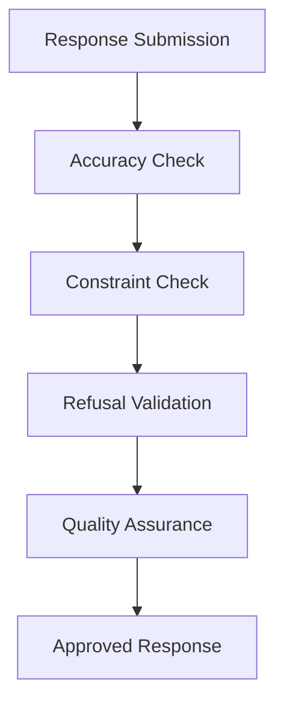

**Section sources**
- [Problem Statement.md](file://Docs/Problem Statement.md)

### Citation Verification Procedures
- Source verification: Confirm the cited URL belongs to official public sources (AMC, AMFI, SEBI).
- Content alignment: Ensure the cited content supports the response.
- Date validation: Verify the last updated date is present and reasonable.

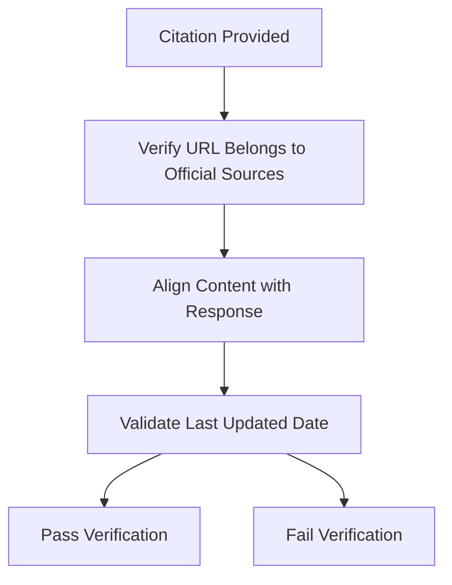

**Section sources**
- [Problem Statement.md](file://Docs/Problem Statement.md)

### Quality Assurance Measures
- Success criteria: Accurate retrieval, strict adherence to facts-only responses, consistent inclusion of valid source citations, proper refusal of advisory queries, and a clean, minimal, and user-friendly interface.
- Known limitations: The assistant answers only factual queries and avoids investment advice or recommendations.

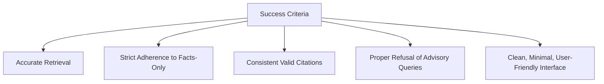

**Section sources**
- [Problem Statement.md](file://Docs/Problem Statement.md)

### Examples of Compliant Disclosure Formats
- Response with citation and footer: Include a single, clear source link and the standardized footer with the last updated date.
- Example footer format: "Last updated from sources: <date>".
- Example citation: Provide a direct link to the official factsheet or relevant page.

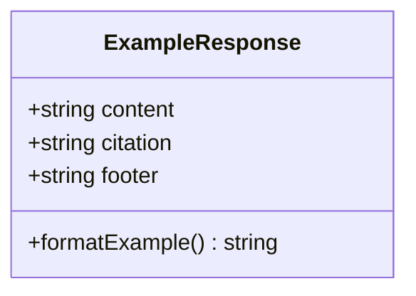

**Section sources**
- [Problem Statement.md](file://Docs/Problem Statement.md)

### Citation Best Practices
- Use official public sources only (AMC, AMFI, SEBI).
- Prefer direct links to primary documents (factsheets, KIM, SID).
- Ensure the cited content directly supports the response.
- Include the last updated date from the source.

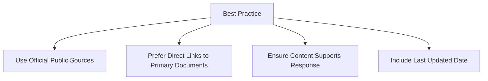

**Section sources**
- [Problem Statement.md](file://Docs/Problem Statement.md)

### Transparency Reporting Requirements
- Expected deliverables include a README document with setup instructions, selected AMC and schemes, architecture overview (RAG approach), and known limitations.
- The README must also include a disclaimer snippet: "Facts-only. No investment advice."

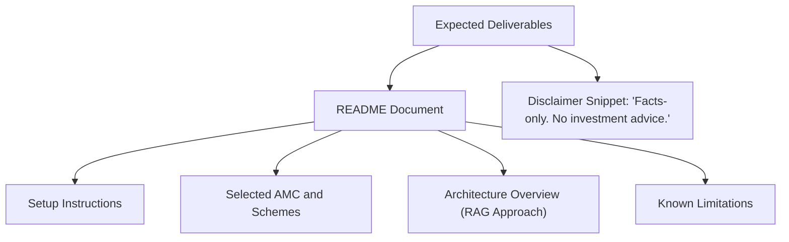

**Section sources**
- [Problem Statement.md](file://Docs/Problem Statement.md)

### User Education About Source Reliability and Information Verification
- Educate users to rely on official public sources for accurate information.
- Encourage users to verify information by visiting the cited source directly.
- Advise users to consult educational resources (AMFI or SEBI) for broader financial literacy.

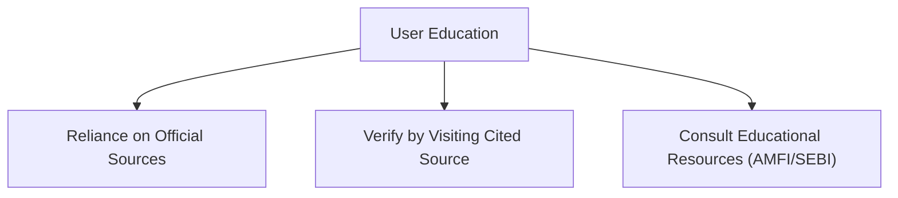

**Section sources**
- [Problem Statement.md](file://Docs/Problem Statement.md)

## Dependency Analysis
The transparency and disclosure requirements depend on:
- Official public sources for factual information retrieval.
- Response formatting constraints enforced by the assistant.
- Disclaimer placement within the user interface.
- Compliance validation processes ensuring adherence to facts-only guidelines.

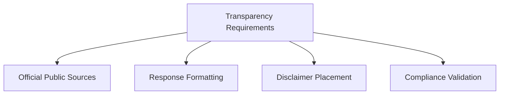

**Section sources**
- [Problem Statement.md](file://Docs/Problem Statement.md)

## Performance Considerations
- Maintain response speed while enforcing formatting and sourcing constraints.
- Ensure reliable retrieval from official public sources to minimize latency.
- Optimize citation verification to reduce processing overhead.

[No sources needed since this section provides general guidance]

## Troubleshooting Guide
- If a response fails constraint checks, adjust content to meet sentence limits and ensure a single citation link is included.
- If the last updated date is missing, retrieve the date from the cited source and add it to the footer.
- If a query is flagged as advisory, refuse it politely and provide an educational link.

**Section sources**
- [Problem Statement.md](file://Docs/Problem Statement.md)

## Conclusion
The Mutual Fund FAQ Assistant must prioritize transparency and disclosure by strictly adhering to facts-only responses, using official public sources, and implementing clear citation and footer requirements. Compliance validation, citation verification, and quality assurance measures ensure responsible delivery of verified financial information. User education about source reliability and information verification complements these technical controls to promote informed decision-making.

[No sources needed since this section summarizes without analyzing specific files]

## Appendices
- Compliance checklist:
  - Response includes a single, clear source link.
  - Response is limited to a maximum of three sentences.
  - Response includes the standardized footer with the last updated date.
  - Dismissal of advisory queries is handled politely with an educational link.
  - Known limitations are documented in the README.

[No sources needed since this section provides general guidance]