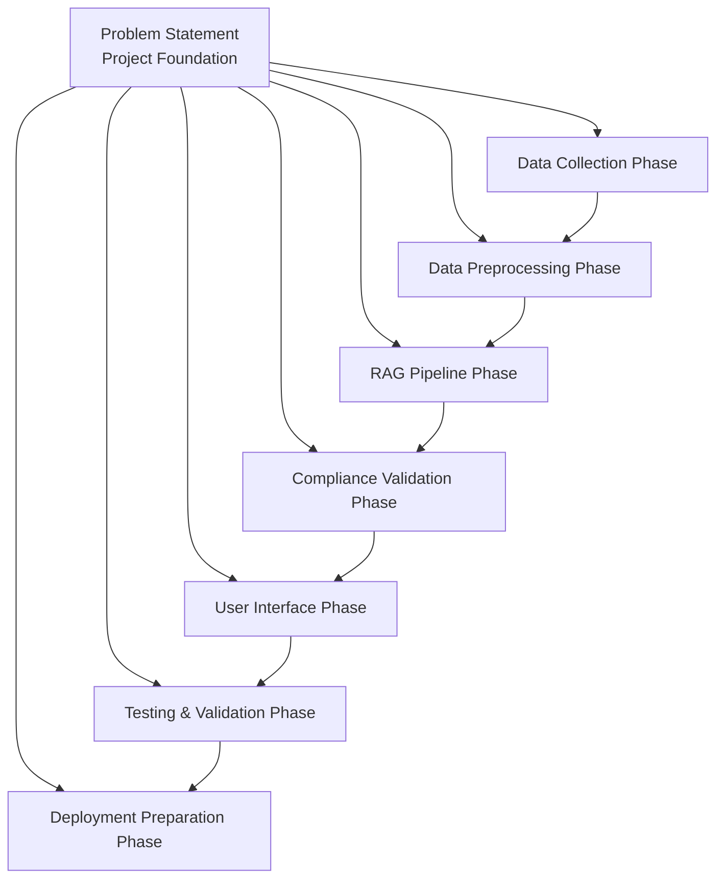
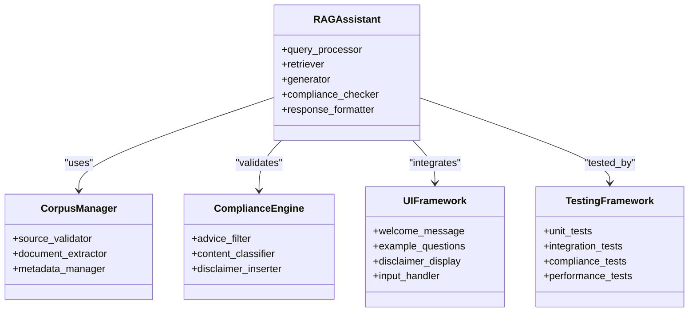
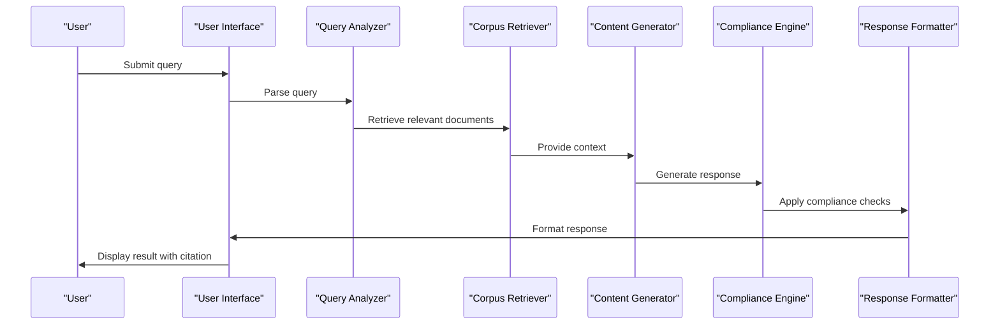
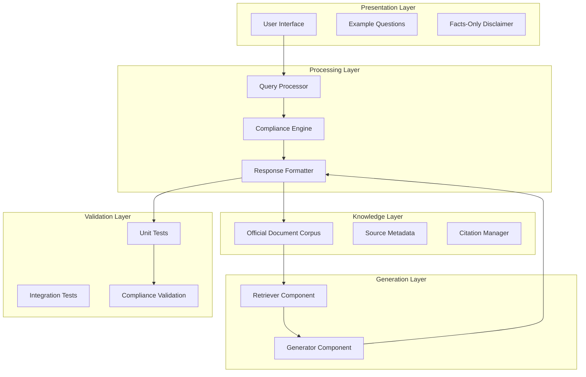
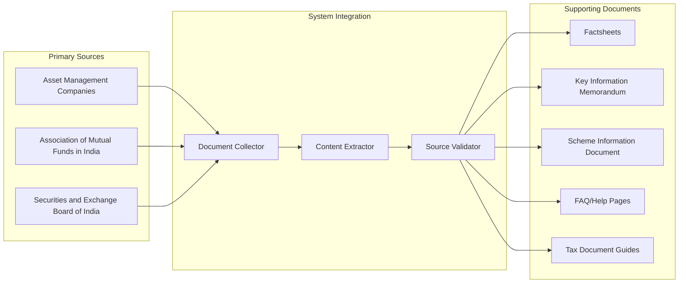
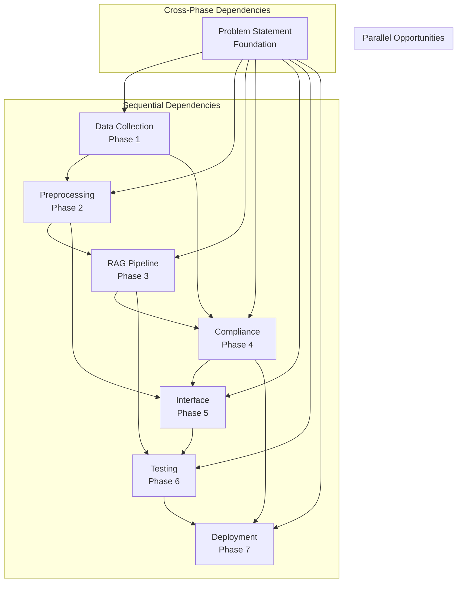
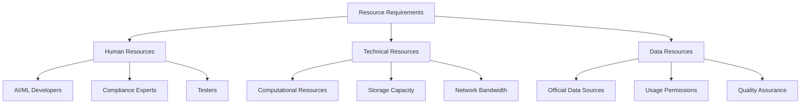

# Development Milestones

<cite>
**Referenced Files in This Document**
- [Problem Statement.md](file://Docs/Problem Statement.md)
</cite>

## Table of Contents
1. [Introduction](#introduction)
2. [Project Structure](#project-structure)
3. [Core Components](#core-components)
4. [Architecture Overview](#architecture-overview)
5. [Detailed Component Analysis](#detailed-component-analysis)
6. [Dependency Analysis](#dependency-analysis)
7. [Performance Considerations](#performance-considerations)
8. [Troubleshooting Guide](#troubleshooting-guide)
9. [Conclusion](#conclusion)
10. [Appendices](#appendices)

## Introduction
This document provides a comprehensive milestone tracking framework for developing a Retrieval-Augmented Generation (RAG)-based mutual fund assistant. The project focuses on building a facts-only FAQ assistant that answers objective queries about mutual fund schemes using curated official sources. The development follows a structured phased approach from corpus collection through system deployment, with defined timelines, deliverables, acceptance criteria, and risk mitigation strategies.

The assistant targets retail investors and customer support teams, emphasizing accuracy, transparency, and compliance with financial regulations. The system strictly avoids providing investment advice while ensuring every response includes a verifiable source link and proper attribution.

## Project Structure
The repository contains a single problem statement document that defines the project scope, requirements, and constraints. The development process will involve multiple phases that build upon this foundational document.

**Diagram sources**
- [Problem Statement.md:1-140](file://Docs/Problem Statement.md#L1-L140)

**Section sources**
- [Problem Statement.md:1-140](file://Docs/Problem Statement.md#L1-L140)

## Core Components
The RAG-based mutual fund assistant consists of several interconnected components that work together to provide accurate, source-backed responses to user queries.

### System Architecture Components
The system architecture follows a modular design pattern with clear separation of concerns:

**Diagram sources**
- [Problem Statement.md:12-18](file://Docs/Problem Statement.md#L12-L18)
- [Problem Statement.md:74-82](file://Docs/Problem Statement.md#L74-L82)

### Data Flow Architecture
The system processes user queries through a well-defined pipeline that ensures compliance and accuracy:

**Diagram sources**
- [Problem Statement.md:42-73](file://Docs/Problem Statement.md#L42-L73)

**Section sources**
- [Problem Statement.md:12-18](file://Docs/Problem Statement.md#L12-L18)
- [Problem Statement.md:42-73](file://Docs/Problem Statement.md#L42-L73)

## Architecture Overview
The RAG assistant architecture combines modern AI technologies with strict compliance requirements to deliver reliable financial information.

### System Components
The architecture comprises five primary layers:

**Diagram sources**
- [Problem Statement.md:74-82](file://Docs/Problem Statement.md#L74-L82)
- [Problem Statement.md:114-124](file://Docs/Problem Statement.md#L114-L124)

### Data Sources Architecture
The system relies on official financial data sources to ensure accuracy and compliance:

**Diagram sources**
- [Problem Statement.md:30-41](file://Docs/Problem Statement.md#L30-L41)

**Section sources**
- [Problem Statement.md:30-41](file://Docs/Problem Statement.md#L30-L41)
- [Problem Statement.md:74-82](file://Docs/Problem Statement.md#L74-L82)

## Detailed Component Analysis

### Phase 1: Data Source Identification (2-3 Days)
This initial phase establishes the foundation for the entire project by identifying and validating official data sources.

#### Timeline Estimation
- **Day 1**: Research and identify primary financial regulatory bodies
- **Day 2**: Catalog official document types and URL structures
- **Day 3**: Validate source accessibility and update policies

#### Deliverables
- Comprehensive list of official financial data sources
- Document type taxonomy (factsheets, KIM, SID, FAQs)
- Source accessibility assessment report
- URL collection framework specification

#### Acceptance Criteria
- Complete coverage of required document categories
- Validated source URLs with expected content
- Accessibility documentation for all identified sources
- Compliance verification for each source type

#### Risk Assessment
- **Source Unavailability**: Some official websites may temporarily unavailable
- **Content Changes**: Regulatory bodies frequently update their content
- **Technical Access Issues**: Some sources may require special access or authentication

#### Contingency Planning
- Maintain backup source lists from alternative regulatory bodies
- Implement source redundancy mechanisms
- Establish monitoring protocols for content changes
- Prepare alternative document formats (PDF archives, cached versions)

**Section sources**
- [Problem Statement.md:30-41](file://Docs/Problem Statement.md#L30-L41)

### Phase 2: Document Collection and Preprocessing (3-5 Days)
This phase involves systematically collecting official documents and preparing them for RAG processing.

#### Timeline Estimation
- **Days 1-2**: Automated document collection from identified sources
- **Day 3**: Content extraction and cleaning
- **Days 4-5**: Metadata extraction and document structuring

#### Deliverables
- Curated corpus of 15-25 official documents
- Structured document database with metadata
- Extracted content ready for embedding generation
- Source attribution and provenance tracking

#### Acceptance Criteria
- Complete document collection from all required sources
- Clean, structured content suitable for AI processing
- Comprehensive metadata including source URLs and dates
- Proper citation links embedded in extracted content

#### Risk Assessment
- **Content Quality Variability**: Different sources may have inconsistent formatting
- **Legal Compliance**: Ensuring all collected content is publicly accessible
- **Technical Extraction Challenges**: Complex PDF formats and dynamic web content

#### Contingency Planning
- Implement fallback extraction methods for problematic document types
- Maintain legal compliance documentation for all collected materials
- Develop robust error handling for technical extraction failures
- Prepare manual extraction procedures for automated failures

**Section sources**
- [Problem Statement.md:30-41](file://Docs/Problem Statement.md#L30-L41)

### Phase 3: RAG Pipeline Development (5-7 Days)
This intensive phase builds the core AI components that enable intelligent document retrieval and response generation.

#### Timeline Estimation
- **Days 1-2**: Embedding model selection and implementation
- **Days 3-4**: Retrieval algorithm development and optimization
- **Days 5-6**: Generator component integration and tuning
- **Day 7**: Pipeline integration and initial testing

#### Deliverables
- Fully functional RAG pipeline with embedding capabilities
- Optimized retrieval algorithm with relevance scoring
- Integrated generator component for response synthesis
- Performance benchmarks and quality metrics

#### Acceptance Criteria
- Accurate document retrieval from the corpus
- Relevant response generation with proper context
- Efficient processing with acceptable latency
- Consistent response quality across different query types

#### Risk Assessment
- **Model Performance**: Embedding models may not capture semantic relationships effectively
- **Computational Resources**: RAG systems can be computationally intensive
- **Integration Complexity**: Coordinating multiple AI components requires careful engineering

#### Contingency Planning
- Implement model switching capabilities for performance optimization
- Develop caching mechanisms to reduce computational overhead
- Prepare simplified fallback responses for edge cases
- Establish monitoring for system performance degradation

**Section sources**
- [Problem Statement.md:12-18](file://Docs/Problem Statement.md#L12-L18)

### Phase 4: Compliance Validation Implementation (3-4 Days)
This critical phase ensures the system adheres to financial regulations and ethical guidelines.

#### Timeline Estimation
- **Days 1-2**: Compliance rule definition and implementation
- **Day 3**: Advisory query detection and filtering
- **Days 4**: Content restriction enforcement and validation

#### Deliverables
- Comprehensive compliance validation framework
- Advisory query detection system
- Content restriction enforcement mechanism
- Compliance audit trail and reporting

#### Acceptance Criteria
- Accurate identification and rejection of advisory queries
- Proper enforcement of content restrictions
- Consistent application of disclaimer requirements
- Complete compliance with financial regulatory guidelines

#### Risk Assessment
- **False Positives**: Legitimate informational queries may be incorrectly flagged
- **False Negatives**: Non-compliant content may slip through detection
- **Regulatory Changes**: Financial regulations may evolve during development

#### Contingency Planning
- Implement human review mechanisms for borderline cases
- Develop flexible rule adjustment capabilities
- Establish continuous compliance monitoring
- Prepare regulatory consultation procedures for policy changes

**Section sources**
- [Problem Statement.md:61-73](file://Docs/Problem Statement.md#L61-L73)
- [Problem Statement.md:85-111](file://Docs/Problem Statement.md#L85-L111)

### Phase 5: User Interface Creation (2-3 Days)
This phase focuses on developing a clean, user-friendly interface that meets the project's minimal requirements.

#### Timeline Estimation
- **Days 1-2**: Interface design and implementation
- **Day 3**: User experience testing and refinement

#### Deliverables
- Minimal, clean user interface meeting project requirements
- Welcome message and example questions display
- Clear disclaimer presentation
- Responsive design for various devices

#### Acceptance Criteria
- Interface displays welcome message and example questions
- Disclaimer prominently displayed and clearly worded
- Interface responsive and accessible across devices
- Minimal design aligns with project constraints

#### Risk Assessment
- **Design Constraints**: Balancing minimalism with usability requirements
- **Technical Limitations**: Ensuring interface works across different browsers and devices
- **User Experience**: Meeting user expectations with limited interface complexity

#### Contingency Planning
- Prepare alternative interface designs for different user preferences
- Implement graceful degradation for unsupported browser features
- Develop user feedback collection mechanisms
- Establish rapid iteration capabilities for interface improvements

**Section sources**
- [Problem Statement.md:74-82](file://Docs/Problem Statement.md#L74-L82)

### Phase 6: Testing and Validation (2-3 Days)
This phase ensures system reliability, accuracy, and compliance through comprehensive testing procedures.

#### Timeline Estimation
- **Days 1-2**: System testing and validation
- **Day 3**: Performance optimization and final validation

#### Deliverables
- Comprehensive test suite covering all system components
- Performance benchmarking and optimization
- Compliance validation across multiple scenarios
- Final system documentation and user guides

#### Acceptance Criteria
- All system components function correctly under normal conditions
- Response accuracy meets established quality thresholds
- Compliance validation consistently identifies non-factual queries
- System performance meets latency and scalability requirements

#### Risk Assessment
- **Test Coverage Gaps**: Important failure modes may not be adequately tested
- **Performance Bottlenecks**: System may not meet performance requirements under load
- **Integration Issues**: Different components may not work together as expected

#### Contingency Planning
- Implement continuous integration testing for early issue detection
- Develop performance monitoring and optimization procedures
- Establish rollback procedures for failed deployments
- Prepare incident response protocols for production issues

**Section sources**
- [Problem Statement.md:127-134](file://Docs/Problem Statement.md#L127-L134)

### Phase 7: Deployment Preparation (1-2 Days)
This final phase prepares the system for production deployment and ongoing maintenance.

#### Timeline Estimation
- **Day 1**: Production deployment preparation
- **Day 2**: Monitoring setup and maintenance procedures

#### Deliverables
- Production-ready system deployment package
- Monitoring and alerting infrastructure
- Maintenance and update procedures
- User support and troubleshooting documentation

#### Acceptance Criteria
- System deployed and operational in production environment
- Monitoring systems actively tracking system health
- Maintenance procedures documented and understood
- Support infrastructure in place for user assistance

#### Risk Assessment
- **Deployment Failures**: System may not deploy correctly to production environment
- **Monitoring Gaps**: Critical system failures may not be detected promptly
- **Maintenance Burden**: Ongoing system maintenance may exceed planned capacity

#### Contingency Planning
- Implement blue-green deployment strategies for safe rollouts
- Establish automated monitoring and alerting systems
- Prepare disaster recovery procedures for system failures
- Develop maintenance scheduling and capacity planning

**Section sources**
- [Problem Statement.md:114-124](file://Docs/Problem Statement.md#L114-L124)

## Dependency Analysis
The development phases exhibit both sequential dependencies and parallel opportunities for efficient project execution.

**Diagram sources**
- [Problem Statement.md:1-140](file://Docs/Problem Statement.md#L1-L140)

### Resource Dependencies
The project requires several types of resources that influence timeline and success factors:

**Diagram sources**
- [Problem Statement.md:30-41](file://Docs/Problem Statement.md#L30-L41)
- [Problem Statement.md:85-111](file://Docs/Problem Statement.md#L85-L111)

**Section sources**
- [Problem Statement.md:1-140](file://Docs/Problem Statement.md#L1-L140)

## Performance Considerations
The RAG-based mutual fund assistant must balance accuracy, speed, and compliance while maintaining system reliability.

### Performance Metrics
- **Response Latency**: Queries should resolve within acceptable timeframes
- **Accuracy Thresholds**: Response accuracy must meet established quality standards
- **System Availability**: System uptime should meet operational requirements
- **Scalability**: System should handle increased user loads gracefully

### Optimization Strategies
- Implement caching mechanisms for frequently accessed documents
- Optimize embedding models for faster inference
- Develop efficient indexing strategies for document retrieval
- Establish monitoring for performance degradation

### Compliance Performance
- Real-time compliance checking for every query
- Audit trail generation for all system interactions
- Performance monitoring for compliance violations
- Automated alerting for compliance breaches

## Troubleshooting Guide
Common issues and their resolution strategies throughout the development lifecycle.

### Data Collection Issues
- **Source Unavailability**: Implement retry mechanisms and backup source identification
- **Content Format Changes**: Develop adaptive extraction algorithms
- **Legal Compliance Concerns**: Establish legal review processes for all collected content

### RAG Pipeline Problems
- **Poor Retrieval Accuracy**: Adjust embedding models and retrieval parameters
- **Response Quality Issues**: Fine-tune generator components and prompt engineering
- **Performance Bottlenecks**: Implement caching and optimize computational resources

### Compliance Validation Challenges
- **False Positive/Negative Rates**: Continuously tune compliance detection algorithms
- **Regulatory Changes**: Establish monitoring systems for regulatory updates
- **Edge Case Handling**: Develop comprehensive exception handling procedures

### Interface and User Experience
- **Accessibility Issues**: Implement comprehensive accessibility testing
- **Cross-Browser Compatibility**: Establish testing across multiple browser environments
- **Mobile Responsiveness**: Ensure optimal performance on mobile devices

**Section sources**
- [Problem Statement.md:61-73](file://Docs/Problem Statement.md#L61-L73)
- [Problem Statement.md:85-111](file://Docs/Problem Statement.md#L85-L111)

## Conclusion
The RAG-based mutual fund assistant development follows a structured, phased approach that balances technical complexity with regulatory compliance. Each phase builds upon previous work while establishing clear deliverables and acceptance criteria. The comprehensive timeline accounts for potential risks and provides contingency plans for various failure scenarios.

Success depends on maintaining focus on the project's core principles: accuracy, transparency, and compliance. The modular architecture allows for independent development and testing of components, while the sequential phases ensure proper foundation building for subsequent work.

The final system will provide retail investors and financial professionals with reliable, source-backed information about mutual fund schemes, delivered through a clean, user-friendly interface that maintains strict compliance with financial regulations.

## Appendices

### Appendix A: Detailed Timeline Summary
| Phase | Duration | Key Activities | Success Indicators |
|-------|----------|---------------|-------------------|
| Data Source Identification | 2-3 days | Source research, cataloging, validation | Complete source list with accessibility documentation |
| Document Collection & Preprocessing | 3-5 days | Automated collection, content extraction, structuring | Curated corpus with metadata and citations |
| RAG Pipeline Development | 5-7 days | Embedding models, retrieval algorithms, generators | Functional pipeline with performance benchmarks |
| Compliance Validation | 3-4 days | Rule implementation, advisory detection, content filters | Comprehensive compliance framework |
| User Interface Creation | 2-3 days | Interface design, implementation, testing | Clean, minimal interface meeting requirements |
| Testing & Validation | 2-3 days | System testing, performance optimization, validation | All components functioning under normal conditions |
| Deployment Preparation | 1-2 days | Production deployment, monitoring setup, maintenance | Production-ready system with monitoring |

### Appendix B: Risk Matrix
| Risk Category | Likelihood | Impact | Mitigation Strategies |
|---------------|------------|--------|----------------------|
| Source Unavailability | Medium | High | Backup sources, monitoring, legal compliance |
| Model Performance Issues | Medium | Medium | Model switching, performance monitoring |
| Compliance Violations | Low | High | Continuous validation, legal review |
| Technical Integration Failure | Low | Medium | Modular design, testing protocols |
| Regulatory Changes | Low | Medium | Monitoring systems, flexible architecture |

### Appendix C: Quality Assurance Checklist
- [ ] All official sources validated and accessible
- [ ] Document collection complete and properly structured
- [ ] RAG pipeline accurately retrieves relevant information
- [ ] Compliance validation consistently rejects advisory queries
- [ ] Interface meets all user experience requirements
- [ ] System performs adequately under expected load
- [ ] All deliverables documented and tested
- [ ] Deployment procedures established and tested