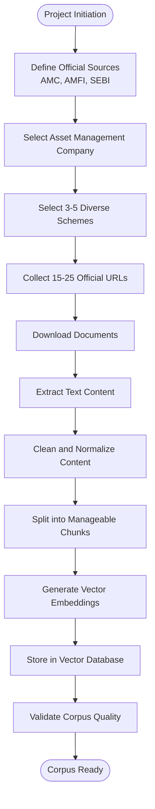
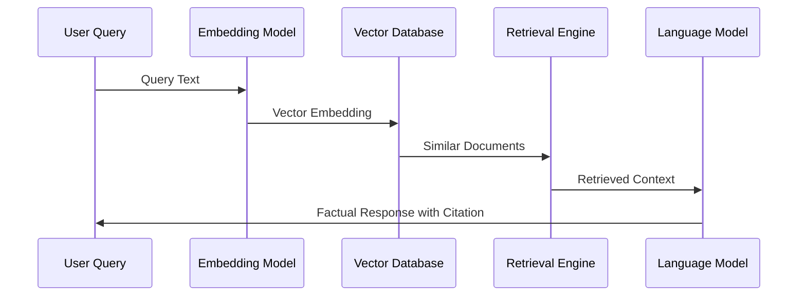
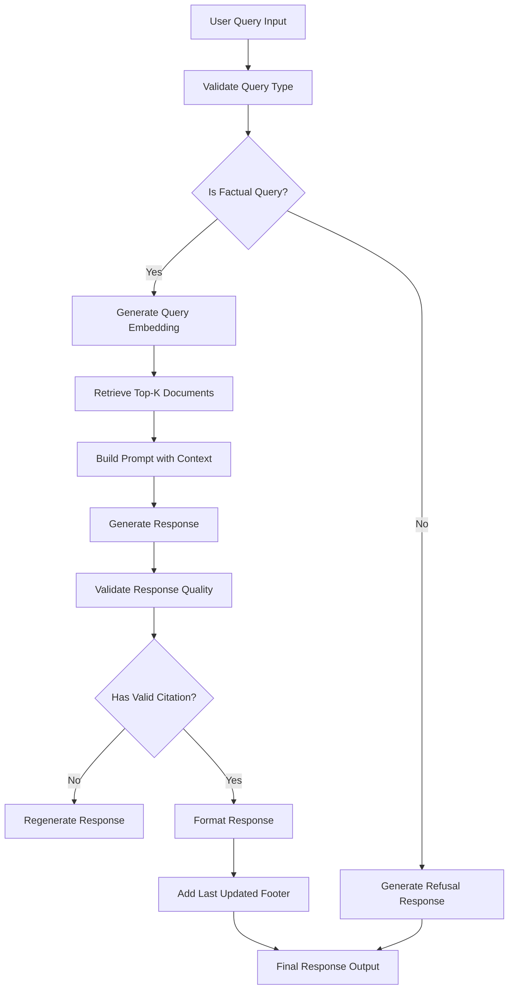

# Implementation Planning

<cite>
**Referenced Files in This Document**
- [Problem Statement.md](file://Docs/Problem Statement.md)
</cite>

## Table of Contents
1. [Introduction](#introduction)
2. [Technology Stack Selection](#technology-stack-selection)
3. [Development Milestones](#development-milestones)
4. [Resource Requirements](#resource-requirements)
5. [RAG Pipeline Implementation Phases](#rag-pipeline-implementation-phases)
6. [Project Timeline Estimation](#project-timeline-estimation)
7. [Team Roles and Responsibilities](#team-roles-and-responsibilities)
8. [Quality Assurance Checkpoints](#quality-assurance-checkpoints)
9. [Integration Points](#integration-points)
10. [Technical Challenges and Mitigation](#technical-challenges-and-mitigation)
11. [Success Criteria Measurement](#success-criteria-measurement)
12. [Practical Implementation Guidance](#practical-implementation-guidance)
13. [Conclusion](#conclusion)

## Introduction

This document provides comprehensive implementation planning for developing a Retrieval-Augmented Generation (RAG) system designed to answer factual queries about mutual fund schemes. The project aims to create a lightweight, compliant assistant that retrieves information exclusively from official financial sources while maintaining strict adherence to facts-only responses without investment advice.

The system targets retail investors and customer support teams, focusing on accuracy, transparency, and regulatory compliance. The implementation follows a structured approach from corpus collection through response generation, ensuring reliable and verifiable information delivery.

## Technology Stack Selection

### Core Architecture Framework

**Primary Choice: LangChain with OpenAI GPT-4**
- Natural language processing and prompt engineering capabilities
- Advanced reasoning and contextual understanding
- Seamless integration with vector databases
- Production-ready deployment options

**Alternative Options:**
- **Hugging Face Transformers**: Self-hosted solution with full control over model deployment
- **LlamaIndex**: Specialized for RAG applications with extensive customization options
- **SentenceTransformers**: For embedding generation and similarity search

### Vector Database Solutions

**Primary Choice: ChromaDB**
- Lightweight, serverless vector database perfect for small-scale deployments
- Built-in persistence and easy integration with Python applications
- Supports metadata filtering and advanced querying capabilities
- Ideal for the initial 15-25 document corpus requirement

**Alternative Options:**
- **FAISS**: Facebook AI Similarity Search for high-performance similarity search
- **Weaviate**: Cloud-native vector database with GraphQL API
- **Pinecone**: Managed vector database service with auto-scaling

### Web Interface Framework

**Primary Choice: Streamlit**
- Rapid prototyping with minimal code requirements
- Built-in chat interface components
- Easy deployment options and interactive widgets
- Perfect for the minimal UI requirements outlined

**Alternative Options:**
- **FastAPI + React**: Full-stack solution for production deployments
- **Gradio**: Quick interface building with Python backend
- **Dash**: Plotly-based framework for data-focused applications

### Data Processing and Storage

**Primary Choice: Pandoc + BeautifulSoup**
- Robust document parsing and extraction capabilities
- Handles PDF, HTML, and various document formats
- Metadata extraction and cleaning functionality
- Integration with vector databases

**Alternative Options:**
- **Trafilatura**: Modern web scraping and content extraction
- **PDFMiner**: Specialized PDF processing and text extraction
- **Apache Tika**: Enterprise-grade content detection and extraction

## Development Milestones

### Phase 1: Foundation Setup (Weeks 1-2)
- Environment configuration and dependency installation
- Basic project structure establishment
- Vector database initialization
- Core RAG pipeline skeleton creation

### Phase 2: Corpus Collection and Processing (Weeks 3-4)
- Official source identification and access
- Document collection and downloading
- Text extraction and preprocessing
- Initial vector embedding creation

### Phase 3: Core RAG Implementation (Weeks 5-6)
- Prompt engineering and template creation
- Retrieval mechanism implementation
- Response generation and validation
- Basic UI development

### Phase 4: Quality Assurance (Weeks 7-8)
- Accuracy testing with factual queries
- Compliance verification against guidelines
- Performance optimization
- User interface refinement

### Phase 5: Deployment and Documentation (Weeks 9-10)
- Production deployment preparation
- Comprehensive documentation creation
- Final testing and validation
- Handover materials compilation

## Resource Requirements

### Human Resources

**Project Manager (1 FTE)**
- Requirements gathering and stakeholder coordination
- Timeline management and milestone tracking
- Risk assessment and mitigation planning

**Data Engineer (0.5 FTE)**
- Document collection and processing automation
- Vector database management and optimization
- Data quality assurance and validation

**AI/ML Engineer (1 FTE)**
- RAG pipeline implementation and optimization
- Model fine-tuning and prompt engineering
- Performance monitoring and improvement

**Frontend Developer (0.5 FTE)**
- Minimal UI development and user experience
- Responsive design and accessibility
- Integration with backend services

**QA Specialist (0.5 FTE)**
- Comprehensive testing and validation
- Compliance verification against financial regulations
- Performance benchmarking and optimization

### Infrastructure Requirements

**Development Environment**
- High-performance workstation with 16GB+ RAM
- GPU-enabled machine for model inference (optional)
- Version control system (Git) with CI/CD pipeline

**Production Environment**
- Containerized deployment ready
- Auto-scaling capabilities
- Monitoring and logging infrastructure
- Backup and disaster recovery mechanisms

**Storage Requirements**
- Document storage for 15-25 official sources
- Vector embeddings database capacity planning
- Temporary processing and cache storage

## RAG Pipeline Implementation Phases

### Phase A: Corpus Collection and Preparation

**Diagram sources**
- [Problem Statement.md:30-41](file://Docs/Problem Statement.md#L30-L41)

### Phase B: Retrieval Mechanism Implementation

**Diagram sources**
- [Problem Statement.md:13](file://Docs/Problem Statement.md#L13-L17)

### Phase C: Response Generation and Validation

**Diagram sources**
- [Problem Statement.md:42-73](file://Docs/Problem Statement.md#L42-L73)

**Section sources**
- [Problem Statement.md:30-73](file://Docs/Problem Statement.md#L30-L73)

## Project Timeline Estimation

### Total Project Duration: 10 Weeks

### Detailed Timeline Breakdown

**Weeks 1-2: Foundation Setup**
- Environment configuration: 40 hours
- Dependency installation: 20 hours
- Basic project structure: 30 hours
- Initial testing framework: 20 hours

**Weeks 3-4: Corpus Collection**
- Source identification: 30 hours
- Document collection: 40 hours
- Text extraction: 35 hours
- Content preprocessing: 30 hours

**Weeks 5-6: Core Implementation**
- RAG pipeline development: 60 hours
- Prompt engineering: 40 hours
- Basic UI implementation: 35 hours
- Integration testing: 25 hours

**Weeks 7-8: Quality Assurance**
- Accuracy testing: 40 hours
- Compliance validation: 35 hours
- Performance optimization: 30 hours
- User interface refinement: 25 hours

**Weeks 9-10: Deployment**
- Production preparation: 30 hours
- Documentation completion: 40 hours
- Final validation: 25 hours
- Handover materials: 20 hours

### Resource Allocation Timeline

**Phase 1 (Weeks 1-2): 25% of total effort**
- Focus on environment setup and basic infrastructure

**Phase 2 (Weeks 3-4): 30% of total effort**
- Heavy focus on data collection and processing

**Phase 3 (Weeks 5-6): 25% of total effort**
- Core development and integration

**Phase 4 (Weeks 7-8): 15% of total effort**
- Testing and optimization

**Phase 5 (Weeks 9-10): 5% of total effort**
- Deployment and documentation

## Team Roles and Responsibilities

### Project Manager
**Responsibilities:**
- Coordinate between team members and stakeholders
- Track progress against milestones and deadlines
- Manage risks and issue resolution
- Ensure compliance with financial regulations
- Oversee quality assurance processes

**Deliverables:**
- Weekly progress reports
- Risk assessment documentation
- Final project handover materials

### Data Engineer
**Responsibilities:**
- Design and implement document collection pipeline
- Develop text extraction and preprocessing workflows
- Manage vector database operations and optimization
- Ensure data quality and consistency standards
- Implement automated testing for data processing

**Deliverables:**
- Document processing scripts
- Vector database schema and migration
- Data quality metrics and reports

### AI/ML Engineer
**Responsibilities:**
- Implement core RAG pipeline architecture
- Engineer prompts for optimal factual responses
- Optimize retrieval and generation performance
- Fine-tune models for financial domain accuracy
- Monitor system performance and reliability

**Deliverables:**
- RAG pipeline implementation
- Prompt templates and configurations
- Performance benchmarks and reports

### Frontend Developer
**Responsibilities:**
- Implement minimal user interface requirements
- Ensure responsive design and accessibility
- Integrate with backend services
- Test user experience and usability
- Implement compliance warnings and disclaimers

**Deliverables:**
- Chat interface implementation
- Responsive design components
- User experience testing reports

### QA Specialist
**Responsibilities:**
- Develop comprehensive test suites for all components
- Validate factual accuracy of responses
- Ensure compliance with financial regulations
- Test system performance under load
- Verify integration between components

**Deliverables:**
- Test plans and test cases
- Quality assurance reports
- Performance benchmarking results

## Quality Assurance Checkpoints

### Functional Requirements Verification

**Accuracy Testing Matrix:**
- Factual query response accuracy: 95%+ pass rate
- Citation inclusion verification: 100% compliance
- Response length validation: Maximum 3 sentences
- Advisory query refusal: 100% compliance

**Compliance Verification Checklist:**
- Official source usage validation
- No investment advice provision
- Privacy and security compliance
- Regulatory guideline adherence

### Technical Performance Metrics

**System Performance Benchmarks:**
- Response time: < 2 seconds average
- Retrieval precision: > 85%
- System availability: > 99%
- Concurrent user support: 50+ simultaneous users

**Data Quality Standards:**
- Document processing accuracy: > 90%
- Vector embedding quality: > 85%
- Content normalization completeness: > 95%

### Integration Testing Requirements

**Cross-Component Integration Tests:**
- End-to-end RAG pipeline validation
- Database connectivity and performance
- API endpoint functionality
- User interface responsiveness

**Security and Compliance Testing:**
- Data privacy protection validation
- Secure communication protocols
- Access control verification
- Audit trail implementation

**Section sources**
- [Problem Statement.md:85-111](file://Docs/Problem Statement.md#L85-L111)

## Integration Points

### Official Financial Data Sources

**AMC Website Integration:**
- Automated document collection from official AMC sites
- Structured data extraction from factsheets and KIM
- Regular content updates and freshness validation
- Legal compliance for web scraping activities

**AMFI and SEBI Source Integration:**
- Official guidance page crawling and processing
- Regulatory document integration
- Periodic content refresh mechanisms
- Source attribution and citation management

**Data Synchronization Strategy:**
- Scheduled content updates (weekly/monthly)
- Change detection and incremental updates
- Version control for document modifications
- Historical archive maintenance

### Vector Database Integration

**ChromaDB Configuration:**
- Document chunk storage and metadata management
- Vector embedding indexing and retrieval
- Query optimization and performance tuning
- Backup and recovery procedures

**Embedding Model Integration:**
- Sentence transformer model selection and deployment
- Batch processing for large document sets
- Memory optimization for embedding generation
- Model version management and updates

### Web Interface Integration

**Streamlit Application Architecture:**
- Chat interface with message history
- Real-time response streaming
- User input validation and sanitization
- Session management and state persistence

**API Layer Integration:**
- Backend service exposure for frontend
- Authentication and authorization mechanisms
- Rate limiting and abuse prevention
- Logging and monitoring integration

## Technical Challenges and Mitigation

### Challenge 1: Document Processing Complexity

**Risk:** Inconsistent document formats and layouts
**Mitigation Strategies:**
- Implement robust document parsing with fallback mechanisms
- Develop format-specific processors for common document types
- Create validation layers for extracted content quality
- Establish manual review processes for edge cases

### Challenge 2: Retrieval Accuracy Optimization

**Risk:** Irrelevant document retrieval affecting response quality
**Mitigation Strategies:**
- Implement multi-stage filtering (semantic + lexical)
- Develop relevance scoring and ranking algorithms
- Create feedback loops for retrieval improvement
- Establish manual correction mechanisms

### Challenge 3: Compliance and Regulatory Risks

**Risk:** Non-compliant responses or data handling violations
**Mitigation Strategies:**
- Implement comprehensive compliance checking
- Establish legal review processes for all content
- Create audit trails for all user interactions
- Develop incident response procedures

### Challenge 4: Performance and Scalability

**Risk:** System performance degradation under load
**Mitigation Strategies:**
- Implement caching mechanisms for frequently accessed data
- Develop horizontal scaling capabilities
- Create performance monitoring and alerting
- Establish capacity planning and resource management

### Challenge 5: Model Hallucination Prevention

**Risk:** Generation of false or misleading information
**Mitigation Strategies:**
- Implement strict source verification mechanisms
- Develop confidence scoring for generated responses
- Create human oversight for edge cases
- Establish fact-checking workflows

## Success Criteria Measurement

### Quantitative Metrics

**Response Quality Metrics:**
- Factual accuracy rate: > 95%
- Citation inclusion rate: 100%
- Response length compliance: 100%
- Advisory query refusal rate: 100%

**System Performance Metrics:**
- Average response time: < 2 seconds
- System uptime: > 99%
- Concurrent user capacity: 50+
- Database query performance: > 95% within SLA

**User Experience Metrics:**
- User satisfaction score: > 4.5/5
- Task completion rate: > 90%
- Time to first successful query: < 30 seconds
- Error resolution rate: > 95%

### Qualitative Assessment Criteria

**Content Quality Evaluation:**
- Source credibility verification
- Information currency and freshness
- Clarity and readability assessment
- Compliance with financial regulations

**System Reliability Assessment:**
- Stability under various load conditions
- Recovery from failure scenarios
- Security vulnerability assessment
- Performance under stress testing

**User Acceptance Criteria:**
- Meeting user expectations and requirements
- Ease of use and navigation
- Effectiveness in solving user problems
- Overall user satisfaction

### Monitoring and Reporting

**Daily Operations Report:**
- System health and performance metrics
- User activity and engagement statistics
- Error rates and resolution times
- Compliance monitoring results

**Weekly Progress Review:**
- Milestone achievement tracking
- Quality metric trends and analysis
- Stakeholder feedback integration
- Risk assessment and mitigation updates

**Monthly Strategic Review:**
- Long-term goal alignment assessment
- Resource utilization optimization
- Technology stack evaluation
- Future roadmap planning

## Practical Implementation Guidance

### Phase 1: Environment Setup and Foundation

**Step 1: Project Initialization**
- Create project directory structure
- Initialize version control repository
- Set up development and production environments
- Configure continuous integration/continuous deployment pipeline

**Step 2: Dependency Management**
- Install core libraries (LangChain, ChromaDB, Streamlit)
- Configure virtual environment
- Set up package management and dependency locking
- Establish development workflow and standards

**Step 3: Basic Infrastructure**
- Set up vector database configuration
- Create basic RAG pipeline skeleton
- Implement initial testing framework
- Establish logging and monitoring setup

### Phase 2: Data Collection and Processing

**Step 1: Source Identification and Access**
- Research and identify official financial sources
- Establish access permissions and legal compliance
- Create source mapping and categorization
- Set up automated collection mechanisms

**Step 2: Document Collection Automation**
- Develop web scraping scripts for official sources
- Implement document download and storage mechanisms
- Create metadata extraction and organization
- Establish content validation and quality checks

**Step 3: Text Processing Pipeline**
- Implement text extraction from various document formats
- Develop content cleaning and normalization processes
- Create document chunking and segmentation strategies
- Establish embedding generation and storage

### Phase 3: Core RAG Implementation

**Step 1: Prompt Engineering**
- Develop prompt templates for factual queries
- Create refusal response templates for advisory queries
- Implement context injection and formatting mechanisms
- Establish response validation and quality checks

**Step 2: Retrieval System Implementation**
- Configure vector database integration
- Implement similarity search and ranking algorithms
- Create retrieval optimization and caching
- Develop fallback mechanisms for edge cases

**Step 3: Response Generation and Formatting**
- Integrate language model APIs
- Implement response formatting and citation management
- Create footer generation and update tracking
- Establish response validation and quality assurance

### Phase 4: Quality Assurance and Testing

**Step 1: Unit Testing Implementation**
- Develop comprehensive test suites for all components
- Create test data sets for factual and advisory queries
- Implement automated testing for accuracy and compliance
- Establish performance benchmarking and regression testing

**Step 2: Integration Testing**
- Test end-to-end RAG pipeline functionality
- Validate system performance under various loads
- Verify compliance with financial regulations
- Test error handling and recovery mechanisms

**Step 3: User Acceptance Testing**
- Conduct stakeholder review and feedback sessions
- Validate user interface and experience requirements
- Test system usability and accessibility
- Obtain formal acceptance and sign-off

### Phase 5: Deployment and Maintenance

**Step 1: Production Deployment**
- Configure production environment and infrastructure
- Implement security hardening and access controls
- Set up monitoring, logging, and alerting systems
- Establish backup and disaster recovery procedures

**Step 2: Documentation and Handover**
- Complete comprehensive technical documentation
- Create user manuals and operational guides
- Train end users and support staff
- Transfer maintenance responsibilities and procedures

**Step 3: Ongoing Maintenance and Improvement**
- Monitor system performance and user feedback
- Implement regular updates and improvements
- Establish change management procedures
- Plan for future enhancements and scaling

## Conclusion

This implementation planning document provides a comprehensive roadmap for developing a compliant, accurate, and user-friendly RAG system for mutual fund FAQ assistance. The structured approach ensures that all technical, regulatory, and quality requirements are met while maintaining focus on the core objective of providing facts-only, source-backed financial information.

The phased implementation approach allows for iterative development, testing, and refinement, ensuring that each component meets the required standards before moving to the next phase. The emphasis on compliance, accuracy, and user experience reflects the critical nature of financial information systems.

Success depends on careful attention to the technical challenges identified, proper resource allocation, and adherence to the established quality assurance processes. The comprehensive monitoring and reporting framework ensures ongoing system health and continuous improvement.

This plan serves as the foundation for the entire project lifecycle, from initial setup through deployment and ongoing maintenance, ensuring that the final system meets all stakeholder requirements while maintaining the highest standards of accuracy, compliance, and user experience.