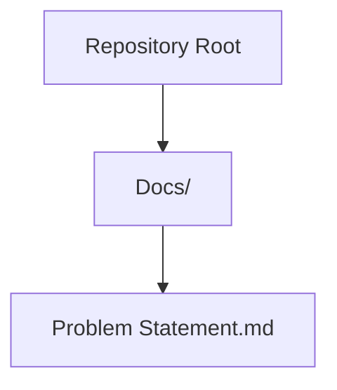
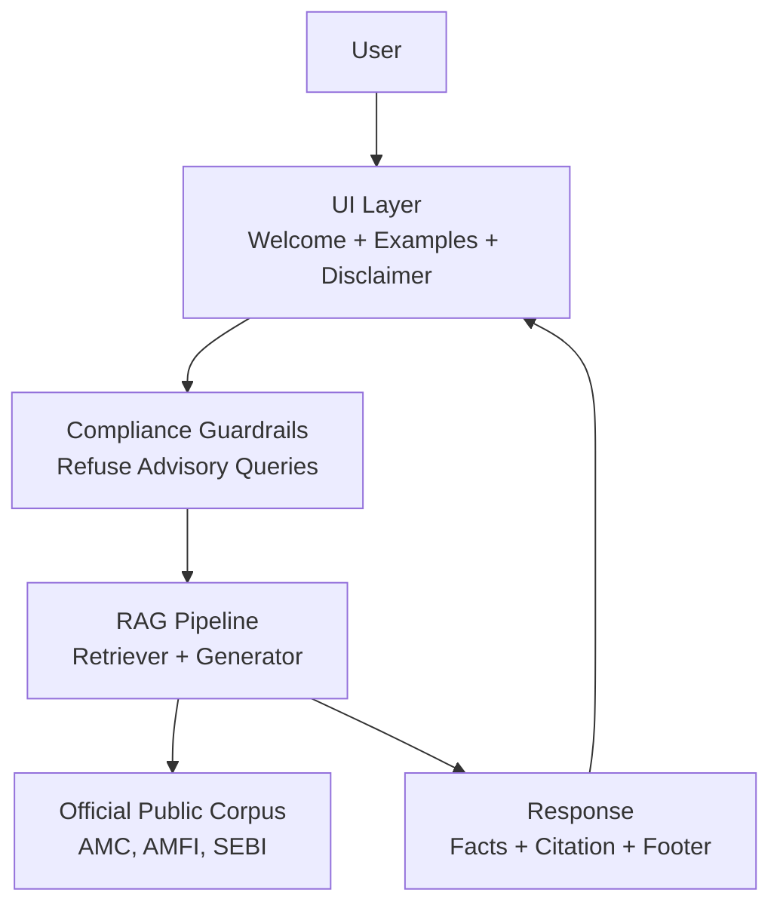
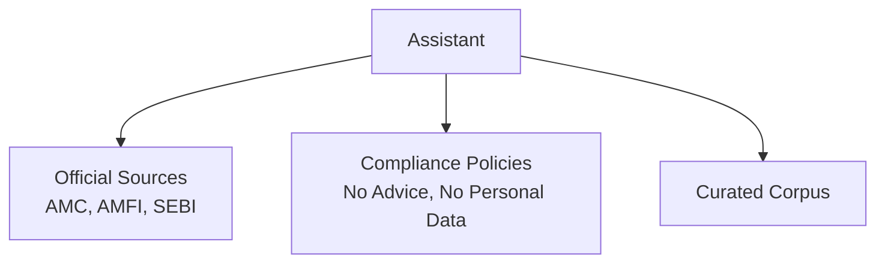

# Quality Assurance Checkpoints

<cite>
**Referenced Files in This Document**
- [Problem Statement.md](file://Docs/Problem Statement.md)
</cite>

## Table of Contents
1. [Introduction](#introduction)
2. [Project Structure](#project-structure)
3. [Core Components](#core-components)
4. [Architecture Overview](#architecture-overview)
5. [Detailed Component Analysis](#detailed-component-analysis)
6. [Dependency Analysis](#dependency-analysis)
7. [Performance Considerations](#performance-considerations)
8. [Troubleshooting Guide](#troubleshooting-guide)
9. [Conclusion](#conclusion)
10. [Appendices](#appendices)

## Introduction
This document defines comprehensive quality assurance (QA) checkpoints for a RAG-based mutual fund assistant. It establishes testing strategies, validation criteria, and performance metrics aligned with the project’s facts-only, compliance-first design. The QA plan covers unit testing for individual components, integration testing for system workflows, and user acceptance testing with representative queries. It also outlines continuous monitoring and feedback loops to ensure iterative improvement grounded in user interactions and compliance reviews.

## Project Structure
The repository currently contains only a problem statement document that defines the assistant’s scope, constraints, and success criteria. The absence of implementation files indicates this is a planning or specification phase. QA documentation therefore focuses on pre-release validation and readiness criteria.

**Diagram sources**
- [Problem Statement.md:1-140](file://Docs/Problem Statement.md#L1-L140)

**Section sources**
- [Problem Statement.md:1-140](file://Docs/Problem Statement.md#L1-L140)

## Core Components
The assistant is designed as a RAG system with the following core components:
- Retrieval module: selects relevant documents from a curated corpus of official sources (AMC, AMFI, SEBI).
- Generation module: produces concise, facts-only answers with a single source citation and a last-updated footer.
- Compliance guardrails: enforces refusal of advisory queries and strict content constraints.
- Minimal UI: displays a welcome message, example questions, and a “Facts-only. No investment advice.” disclaimer.

Validation criteria derived from the problem statement:
- Accuracy: factual correctness validated against official sources.
- Source citation validity: every response must include a single, clear source link and a last-updated date.
- Compliance adherence: no investment advice, no personal data collection, and adherence to transparency constraints.
- Response quality: concise, verifiable, and limited to a maximum of three sentences.

**Section sources**
- [Problem Statement.md:42-73](file://Docs/Problem Statement.md#L42-L73)
- [Problem Statement.md:85-111](file://Docs/Problem Statement.md#L85-L111)
- [Problem Statement.md:127-133](file://Docs/Problem Statement.md#L127-L133)

## Architecture Overview
The assistant follows a retrieval-augmented generation pipeline with guardrails and UI components. The architecture emphasizes verifiability and compliance.

[No sources needed since this diagram shows conceptual architecture, not a direct code mapping]

## Detailed Component Analysis

### Retrieval Module
Responsibilities:
- Retrieve relevant documents from the curated corpus for a given query.
- Ensure retrieved content is from official public sources.

Validation criteria:
- Retrieval precision: top-k results must include the correct factual information.
- Source validity: retrieved documents must be official sources (AMC, AMFI, SEBI).

Testing scenarios:
- Factual queries: expense ratio, exit load, minimum SIP amount, ELSS lock-in period, riskometer classification, benchmark index.
- Edge cases: near-duplicate schemes, ambiguous terms, typos in scheme names.
- Non-factual queries: refusals should trigger guardrails before retrieval.

**Section sources**
- [Problem Statement.md:30-41](file://Docs/Problem Statement.md#L30-L41)
- [Problem Statement.md:46-54](file://Docs/Problem Statement.md#L46-L54)

### Generation Module
Responsibilities:
- Produce concise, facts-only answers with a single source citation and a last-updated footer.
- Enforce sentence limits and content restrictions.

Validation criteria:
- Response length: maximum of three sentences.
- Citation completeness: exactly one source link and a last-updated date.
- Compliance: no advisory content, no personal data.

Testing scenarios:
- Factual queries with varied complexity.
- Refusal handling for advisory queries.
- Error conditions: retrieval failures, missing citations.

**Section sources**
- [Problem Statement.md:55-59](file://Docs/Problem Statement.md#L55-L59)
- [Problem Statement.md:101-111](file://Docs/Problem Statement.md#L101-L111)

### Compliance Guardrails
Responsibilities:
- Identify and refuse advisory or non-factual queries.
- Provide a polite refusal with an educational link.

Validation criteria:
- Correct refusal decisions for advisory queries.
- Appropriate educational links included in refusals.

Testing scenarios:
- Advisory queries: “Should I invest in this fund?”
- Comparative queries: “Which fund is better?”
- Edge cases: borderline advisory phrasing.

**Section sources**
- [Problem Statement.md:61-73](file://Docs/Problem Statement.md#L61-L73)

### UI Layer
Responsibilities:
- Present a welcome message, example questions, and a “Facts-only. No investment advice.” disclaimer.

Validation criteria:
- Clarity and visibility of disclaimer.
- Example questions reflect typical factual queries.

Testing scenarios:
- Accessibility and readability.
- Example questions coverage of scheme attributes.

**Section sources**
- [Problem Statement.md:74-82](file://Docs/Problem Statement.md#L74-L82)

### Data and Privacy Constraints
Responsibilities:
- Do not collect, store, or process sensitive personal data.
- Use only official public sources.

Validation criteria:
- No personal identifiers in logs or responses.
- Source exclusivity to official channels.

Testing scenarios:
- Input sanitization for personal data.
- Source verification checks.

**Section sources**
- [Problem Statement.md:92-99](file://Docs/Problem Statement.md#L92-L99)
- [Problem Statement.md:87-91](file://Docs/Problem Statement.md#L87-L91)

## Dependency Analysis
The assistant depends on:
- Official public sources for factual accuracy.
- A curated corpus of scheme documents and regulatory guidance.
- Compliance policies to prevent advisory content and protect privacy.

[No sources needed since this diagram shows conceptual dependencies, not a direct code mapping]

## Performance Considerations
Targeted performance metrics for readiness and ongoing validation:
- Response time targets: sub-second latency for typical queries to ensure a responsive UI.
- Retrieval precision metrics: top-k recall and precision for factual queries to minimize irrelevant results.
- System reliability standards: availability SLA and error rate thresholds for retrieval and generation.

Guidance:
- Monitor latency distributions and p95/p99 response times during load testing.
- Track retrieval hit rates and citation accuracy post-deployment.
- Implement circuit breakers for downstream source failures.

[No sources needed since this section provides general guidance]

## Troubleshooting Guide
Common issues and remediation steps:
- Incorrect refusal decisions: review guardrail logic and training/test examples.
- Missing or invalid citations: validate retrieval-to-generation linking and footer formatting.
- Compliance violations: audit logs for personal data and advisory content.
- UI accessibility problems: validate screen reader compatibility and contrast ratios.

Validation checklist:
- Run representative query sets daily to detect regressions.
- Review compliance logs weekly for policy violations.
- Conduct monthly user feedback sessions to refine refusal prompts and examples.

**Section sources**
- [Problem Statement.md:101-111](file://Docs/Problem Statement.md#L101-L111)

## Conclusion
This QA plan aligns testing and validation efforts with the assistant’s facts-only, compliance-first mission. By focusing on retrieval accuracy, citation validity, refusal handling, and UI clarity, the plan ensures reliable, trustworthy operation. Continuous monitoring and feedback loops will sustain quality improvements over time.

[No sources needed since this section summarizes without analyzing specific files]

## Appendices

### Testing Scenarios Matrix
- Factual queries: expense ratio, exit load, minimum SIP amount, ELSS lock-in period, riskometer classification, benchmark index.
- Edge cases: near-duplicate schemes, ambiguous terms, typos, long-tail queries.
- Refusal handling: advisory queries, comparative queries, borderline phrasing.
- Error conditions: retrieval failures, missing citations, source unavailability.
- Compliance checks: personal data detection, advisory content, source exclusivity.

[No sources needed since this section provides general guidance]