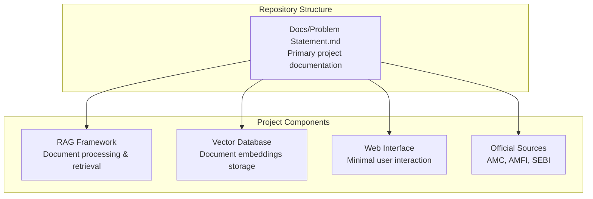
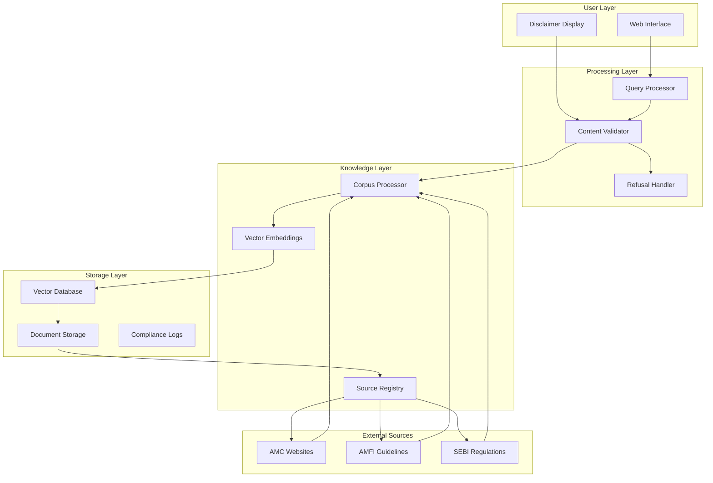
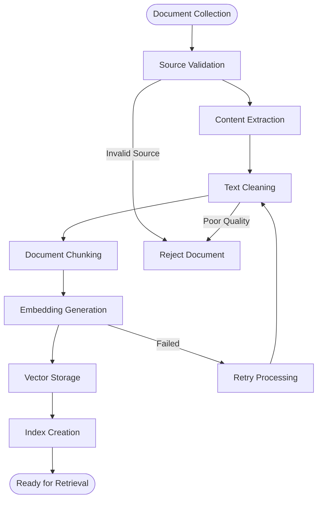
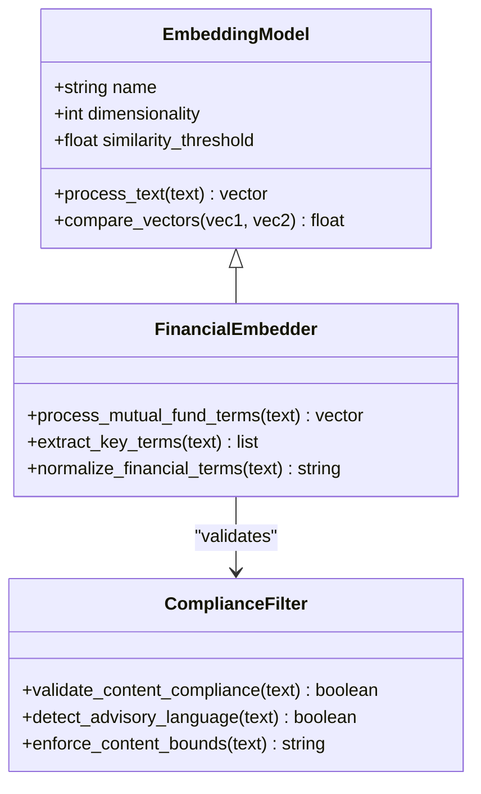
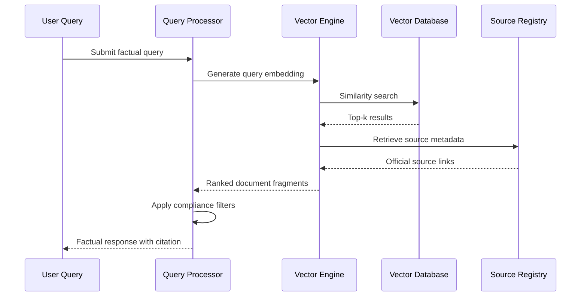
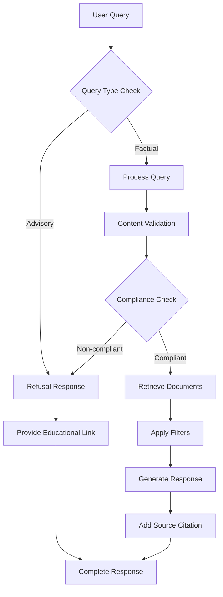
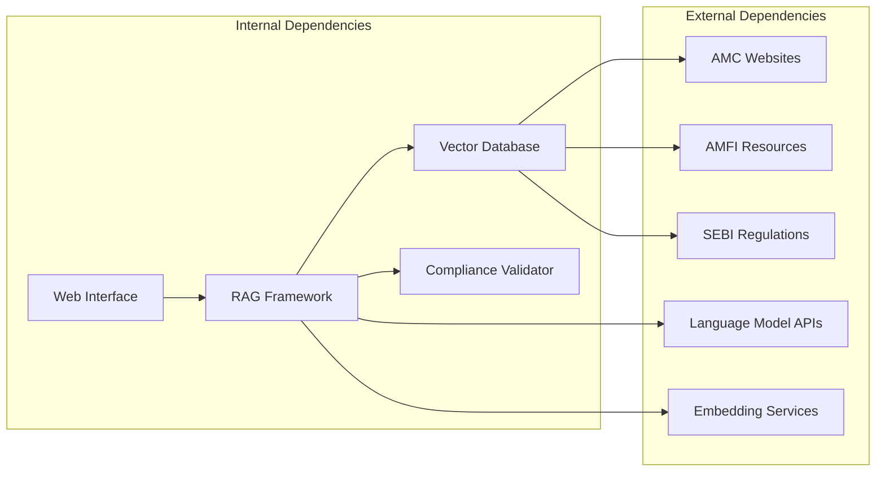

# Technology Stack Selection

<cite>
**Referenced Files in This Document**
- [Problem Statement.md](file://Docs/Problem Statement.md)
</cite>

## Table of Contents
1. [Introduction](#introduction)
2. [Project Structure](#project-structure)
3. [Core Components](#core-components)
4. [Architecture Overview](#architecture-overview)
5. [Detailed Component Analysis](#detailed-component-analysis)
6. [Dependency Analysis](#dependency-analysis)
7. [Performance Considerations](#performance-considerations)
8. [Troubleshooting Guide](#troubleshooting-guide)
9. [Conclusion](#conclusion)
10. [Appendices](#appendices)

## Introduction
This document provides comprehensive technology stack selection guidance for the Mutual Fund FAQ Assistant project. The system is designed as a facts-only assistant that answers objective queries about mutual fund schemes using official financial data sources. The project emphasizes compliance, transparency, and accuracy while avoiding investment advice or recommendations.

The assistant operates on a Retrieval-Augmented Generation (RAG) architecture, focusing on curated official sources including Asset Management Company (AMC) websites, Association of Mutual Funds in India (AMFI), and Securities and Exchange Board of India (SEBI). The system maintains strict content boundaries, ensuring all responses are verifiable and source-backed.

## Project Structure
The repository currently contains a single problem statement document that defines the project scope and requirements. The structure follows a documentation-first approach, emphasizing clear specification before implementation.

**Diagram sources**
- [Problem Statement.md:1-140](file://Docs/Problem Statement.md#L1-L140)

**Section sources**
- [Problem Statement.md:1-140](file://Docs/Problem Statement.md#L1-L140)

## Core Components

### RAG Framework Architecture
The system employs a lightweight Retrieval-Augmented Generation approach optimized for factual mutual fund queries. The framework focuses on efficient document processing and precise information retrieval from official sources.

**Selection Criteria:**
- Lightweight implementation for minimal resource requirements
- Strong focus on factual accuracy over complex reasoning
- Compliance with financial regulatory requirements
- Scalable architecture for document corpus expansion

### Vector Database System
The vector database serves as the core storage mechanism for processed document embeddings. It enables fast similarity search and retrieval of relevant information for user queries.

**Requirements:**
- Efficient similarity search capabilities
- Support for semantic document matching
- Scalable storage for growing document collections
- Integration flexibility with various embedding models

### Web Interface Technologies
The interface maintains simplicity while providing essential user interaction capabilities. The design emphasizes clarity, compliance, and ease of use for retail investors.

**Key Features:**
- Welcome message and example questions
- Clear disclaimer presentation
- Minimal form factors for query submission
- Responsive design considerations

### Compliance Validation Tools
Built-in validation ensures adherence to financial regulations and content restrictions. The system automatically filters out advisory content and maintains source verification.

**Validation Mechanisms:**
- Advisory content detection
- Source verification systems
- Content restriction enforcement
- Compliance logging and monitoring

**Section sources**
- [Problem Statement.md:11-140](file://Docs/Problem Statement.md#L11-L140)

## Architecture Overview

The Mutual Fund FAQ Assistant follows a structured RAG architecture designed specifically for financial information retrieval:

**Diagram sources**
- [Problem Statement.md:4-140](file://Docs/Problem Statement.md#L4-L140)

The architecture emphasizes compliance-first design with clear separation between user interaction, content validation, and source processing layers.

## Detailed Component Analysis

### Document Processing Pipeline

The document processing system handles official financial documents from multiple sources with strict quality controls:

**Diagram sources**
- [Problem Statement.md:30-41](file://Docs/Problem Statement.md#L30-L41)

**Processing Requirements:**
- Multi-source document ingestion from AMC, AMFI, and SEBI
- Structured extraction of factual information
- Quality assurance for document reliability
- Automated chunking for optimal embedding size

### Embedding Model Specifications

The embedding model selection prioritizes semantic similarity for financial terminology while maintaining computational efficiency:

**Diagram sources**
- [Problem Statement.md:13-17](file://Docs/Problem Statement.md#L13-L17)

**Technical Specifications:**
- Dimensionality optimized for financial document similarity
- Threshold settings for relevant result filtering
- Financial terminology normalization
- Compliance validation integration

### Retrieval Algorithm Implementation

The retrieval system balances precision and recall for factual mutual fund information:

**Diagram sources**
- [Problem Statement.md:42-72](file://Docs/Problem Statement.md#L42-L72)

**Algorithm Characteristics:**
- Semantic similarity ranking
- Official source preference
- Compliance-aware result filtering
- Citation integration system

### Compliance Validation System

The validation system enforces strict content boundaries and regulatory requirements:

**Diagram sources**
- [Problem Statement.md:61-72](file://Docs/Problem Statement.md#L61-L72)

**Validation Features:**
- Advisory content detection algorithms
- Educational resource linking
- Source verification mechanisms
- Compliance logging systems

**Section sources**
- [Problem Statement.md:28-140](file://Docs/Problem Statement.md#L28-L140)

## Dependency Analysis

The technology stack exhibits low internal coupling with strong external dependencies on official financial sources:

**Diagram sources**
- [Problem Statement.md:4-41](file://Docs/Problem Statement.md#L4-L41)

**Dependency Characteristics:**
- External source dependencies for content
- API service dependencies for advanced features
- Open-source component integration
- Cloud service integration possibilities

**Section sources**
- [Problem Statement.md:4-41](file://Docs/Problem Statement.md#L4-L41)

## Performance Considerations

### Scalability Factors

The system architecture supports horizontal scaling through modular component design:

**Document Processing Scalability:**
- Parallel document ingestion capabilities
- Distributed embedding generation
- Elastic vector database scaling
- Load balancing for source crawling

**Query Processing Performance:**
- Optimized similarity search algorithms
- Caching mechanisms for frequent queries
- Batch processing for bulk operations
- Memory-efficient embedding storage

### Cost-Benefit Analysis

**Cloud-Based Solutions:**
- Pros: Managed services, automatic scaling, reduced maintenance
- Cons: Ongoing subscription costs, vendor lock-in, data privacy concerns
- Best for: Production deployments requiring high availability

**Self-Hosted Solutions:**
- Pros: Full control, cost predictability, data sovereignty
- Cons: Higher initial setup, maintenance overhead, expertise requirements
- Best for: Development environments, controlled deployments

**Hybrid Approach:**
- Pros: Balanced cost and control, flexible scaling
- Cons: Complex architecture, integration challenges
- Best for: Growing applications requiring both control and scalability

### Maintenance Requirements

**Routine Maintenance:**
- Document corpus updates from official sources
- Embedding model retraining schedules
- Compliance policy updates
- Performance monitoring and optimization

**Operational Considerations:**
- Source availability monitoring
- Content freshness verification
- System health checks
- Backup and disaster recovery procedures

## Troubleshooting Guide

### Common Issues and Solutions

**Document Processing Failures:**
- Source accessibility problems
- Content extraction errors
- Embedding generation failures
- Vector storage issues

**Query Response Problems:**
- Low relevance results
- Compliance filter false positives
- Citation generation errors
- Interface rendering issues

**System Performance Issues:**
- Slow query response times
- Memory consumption problems
- Database connection issues
- External API rate limiting

### Monitoring and Logging

The system requires comprehensive monitoring for compliance and performance:

**Compliance Monitoring:**
- Advisory content detection logs
- Source verification records
- User query audit trails
- Response validation metrics

**Performance Monitoring:**
- Query latency measurements
- Resource utilization tracking
- Error rate monitoring
- System uptime metrics

**Section sources**
- [Problem Statement.md:85-111](file://Docs/Problem Statement.md#L85-L111)

## Conclusion

The Mutual Fund FAQ Assistant represents a specialized RAG implementation focused on compliance, accuracy, and transparency. The technology stack selection emphasizes official financial data sources, strict content boundaries, and regulatory adherence while maintaining technical excellence.

The architecture provides a solid foundation for future enhancements while meeting current requirements for factual mutual fund information delivery. The modular design facilitates gradual feature expansion and performance optimization as the system evolves.

## Appendices

### Implementation Guidance

**Development Environment Setup:**
- Python 3.8+ with virtual environment
- Required packages for document processing
- Vector database installation and configuration
- Web framework setup for interface development

**Testing Framework:**
- Unit tests for individual components
- Integration tests for end-to-end workflows
- Compliance validation testing
- Performance benchmarking procedures

**Deployment Considerations:**
- Containerization for consistent environments
- CI/CD pipeline setup for automated testing
- Monitoring and alerting configuration
- Backup and recovery procedures