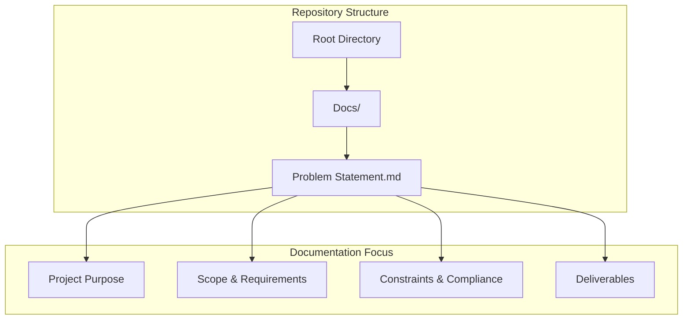
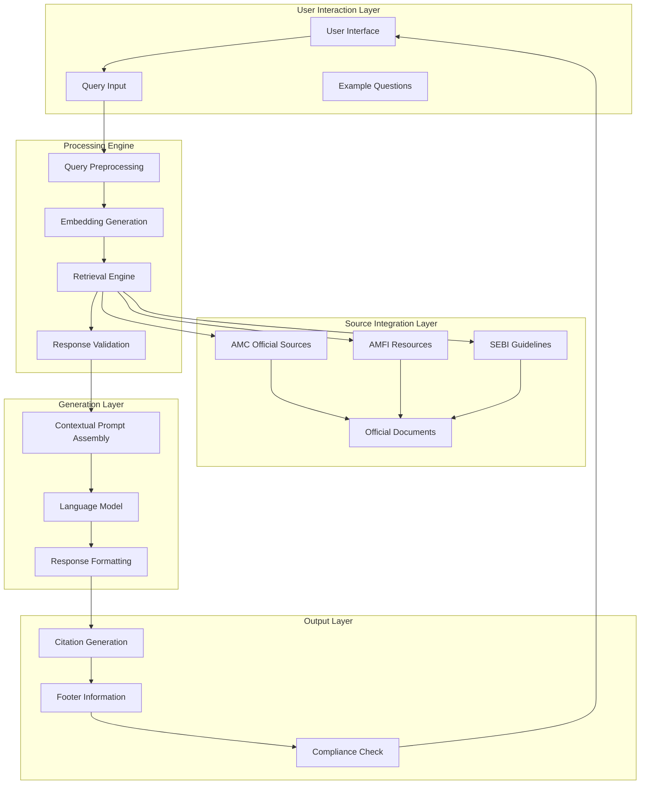
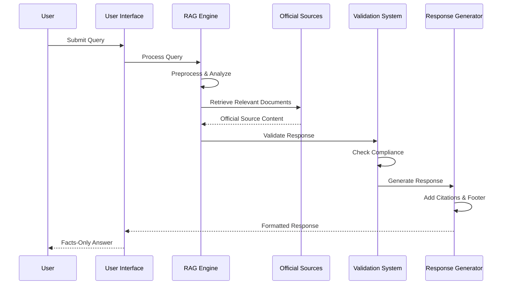
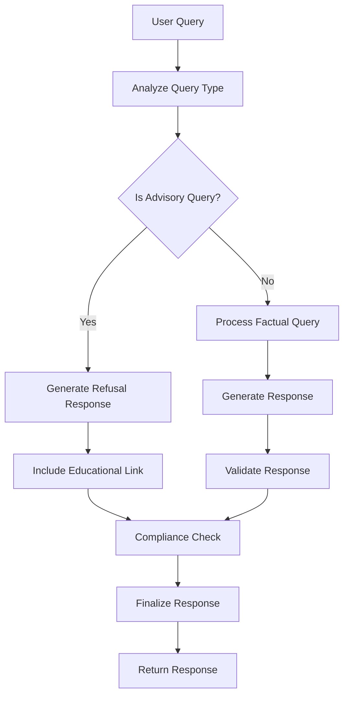
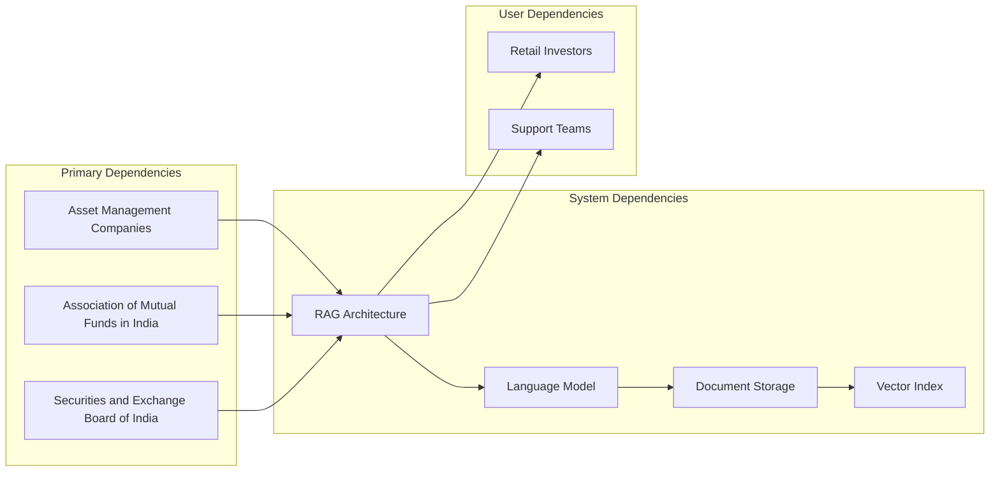

# Project Overview

<cite>
**Referenced Files in This Document**
- [Problem Statement.md](file://Docs/Problem Statement.md)
</cite>

## Table of Contents
1. [Introduction](#introduction)
2. [Project Structure](#project-structure)
3. [Core Components](#core-components)
4. [Architecture Overview](#architecture-overview)
5. [Detailed Component Analysis](#detailed-component-analysis)
6. [Dependency Analysis](#dependency-analysis)
7. [Performance Considerations](#performance-considerations)
8. [Troubleshooting Guide](#troubleshooting-guide)
9. [Conclusion](#conclusion)
10. [Appendices](#appendices)

## Introduction
The Mutual Fund FAQ Assistant is a facts-only Retrieval-Augmented Generation (RAG)-based assistant designed to provide objective, verifiable answers about mutual fund schemes. Built as a lightweight solution using Groww as the reference product context, the system retrieves information exclusively from official public sources including Asset Management Company (AMC) websites, Association of Mutual Funds in India (AMFI), and Securities and Exchange Board of India (SEBI).

The primary objective is to serve as a reliable information hub that ensures users receive only verified, source-backed financial information without any advisory bias or speculative content. The system strictly avoids providing investment advice, opinions, or recommendations, maintaining transparency and compliance with regulatory requirements.

**Section sources**
- [Problem Statement.md:1-140](file://Docs/Problem Statement.md#L1-L140)

## Project Structure
The repository follows a documentation-first approach with a single primary document containing all project specifications and requirements. The structure is intentionally minimal to focus on the essential problem definition and solution requirements.

**Diagram sources**
- [Problem Statement.md:1-140](file://Docs/Problem Statement.md#L1-L140)

**Section sources**
- [Problem Statement.md:1-140](file://Docs/Problem Statement.md#L1-L140)

## Core Components
The Mutual Fund FAQ Assistant comprises several interconnected components that work together to deliver factual, source-backed responses about mutual fund schemes.

### Primary Components

**Facts-Only RAG Engine**
The core engine implements a retrieval-augmented generation architecture that combines semantic search with language model generation to produce accurate, contextually relevant responses. The system maintains strict adherence to facts-only responses, avoiding any advisory or recommendation content.

**Official Source Integration Layer**
A specialized integration layer connects to official financial sources including AMC websites, AMFI resources, and SEBI guidelines. This layer ensures all retrieved information comes from verified, authoritative sources.

**Content Curation Pipeline**
A structured pipeline processes and organizes official documents including scheme factsheets, Key Information Memorandums (KIM), Scheme Information Documents (SID), and regulatory guidance materials. The pipeline maintains document freshness and relevance.

**Response Validation System**
An automated validation system checks all generated responses against predefined criteria including factual accuracy, source citation requirements, and compliance with content restrictions.

**User Interface Framework**
A minimal, user-friendly interface designed to present information clearly while maintaining compliance requirements. The interface includes welcome messaging, example questions, and prominent disclaimers.

**Section sources**
- [Problem Statement.md:11-140](file://Docs/Problem Statement.md#L11-L140)

## Architecture Overview
The Mutual Fund FAQ Assistant employs a sophisticated RAG architecture designed specifically for financial information retrieval and compliance requirements.

**Diagram sources**
- [Problem Statement.md:11-140](file://Docs/Problem Statement.md#L11-L140)

### Data Flow Architecture
The system processes user queries through a carefully orchestrated flow that ensures compliance and accuracy at every step.

**Diagram sources**
- [Problem Statement.md:42-73](file://Docs/Problem Statement.md#L42-L73)

**Section sources**
- [Problem Statement.md:11-140](file://Docs/Problem Statement.md#L11-L140)

## Detailed Component Analysis

### Corpus Definition and Management
The system requires careful curation of official documents from selected Asset Management Companies (AMCs) to ensure comprehensive coverage of mutual fund schemes.

#### Document Collection Strategy
The corpus must include diverse official sources covering different aspects of mutual fund operations:

- **Scheme Factsheets**: Detailed performance and composition data
- **Key Information Memorandum (KIM)**: Essential scheme information and risk factors  
- **Scheme Information Document (SID)**: Comprehensive scheme details and regulations
- **AMC FAQ/Help Pages**: Frequently asked questions and operational procedures
- **AMFI/SEBI Guidance**: Industry standards and regulatory requirements
- **Statement/Tax Document Guides**: Operational procedures and compliance information

#### Scheme Selection Criteria
The system targets 3-5 mutual fund schemes from a single AMC, ensuring category diversity including large-cap, flexi-cap, and ELSS schemes to provide comprehensive coverage of different investment approaches.

**Section sources**
- [Problem Statement.md:30-41](file://Docs/Problem Statement.md#L30-L41)

### Response Generation and Validation
The assistant implements sophisticated mechanisms to ensure all responses meet strict factual and compliance requirements.

#### Response Structure Requirements
Each response must adhere to specific formatting and content guidelines:

- **Conciseness**: Maximum of 3 sentences per response
- **Single Citation**: Exactly one source link included
- **Transparency Footer**: Standardized "Last updated from sources: <date>" footer
- **Factual Accuracy**: Verifiable, objective information only

#### Advisory Query Detection
The system includes intelligent detection mechanisms to identify and refuse advisory queries that fall outside the facts-only scope.

**Diagram sources**
- [Problem Statement.md:61-73](file://Docs/Problem Statement.md#L61-L73)

**Section sources**
- [Problem Statement.md:42-73](file://Docs/Problem Statement.md#L42-L73)

### Compliance and Content Governance
The system enforces strict compliance measures to maintain accuracy and regulatory adherence.

#### Data Source Restrictions
The assistant operates under explicit constraints regarding acceptable data sources:

- **Official Public Sources Only**: AMC websites, AMFI, and SEBI resources
- **Prohibited Sources**: Third-party blogs or aggregator websites
- **Source Verification**: All information must be traceable to official channels

#### Privacy and Security Protocols
The system implements comprehensive privacy protections:

- **No Personal Data Collection**: PAN/Aadhaar numbers, account numbers, OTPs, emails, or phone numbers
- **Data Minimization**: Only official financial information is processed
- **Security Measures**: Secure handling of all collected documents

#### Content Restrictions
The assistant maintains strict boundaries on content delivery:

- **No Investment Advice**: Explicitly prohibits recommendations or opinions
- **No Performance Comparisons**: Avoids comparative analysis or return calculations
- **Educational Focus**: Redirects performance-related queries to official factsheets

**Section sources**
- [Problem Statement.md:85-111](file://Docs/Problem Statement.md#L85-L111)

## Dependency Analysis
The Mutual Fund FAQ Assistant has well-defined dependencies that ensure its operation within regulatory and technical constraints.

### External Dependencies
The system relies on several external sources for authoritative information:

**Diagram sources**
- [Problem Statement.md:5-7](file://Docs/Problem Statement.md#L5-L7)

### Internal Component Dependencies
The system components have specific interdependencies that ensure proper operation:

- **RAG Engine** depends on **Document Processing Pipeline**
- **Validation System** requires **Compliance Framework**
- **Response Generator** needs **Citation Management**
- **Interface Layer** integrates with **All Processing Components**

**Section sources**
- [Problem Statement.md:11-140](file://Docs/Problem Statement.md#L11-L140)

## Performance Considerations
The system is designed with performance optimization in mind, particularly for a lightweight implementation focused on facts-only responses.

### Retrieval Performance
The RAG system optimizes for:
- **Fast Response Times**: Minimal latency for query processing
- **Efficient Indexing**: Optimized vector embeddings for quick retrieval
- **Scalable Architecture**: Ability to handle increased document volumes

### Resource Efficiency
The lightweight design prioritizes:
- **Memory Usage**: Optimized memory footprint for deployment
- **Processing Speed**: Efficient query processing without unnecessary overhead
- **Storage Optimization**: Compact storage of official documents

## Troubleshooting Guide
Common issues and their resolution strategies for the Mutual Fund FAQ Assistant.

### Query Processing Issues
**Problem**: Queries not returning expected results
**Solution**: Verify query preprocessing and embedding generation steps. Check document indexing quality and retrieval threshold settings.

**Problem**: Response formatting errors
**Solution**: Validate response generation pipeline and ensure compliance with sentence limits and citation requirements.

### Source Integration Problems
**Problem**: Official sources not accessible
**Solution**: Implement fallback mechanisms and cache management. Monitor source availability and update document freshness indicators.

**Problem**: Compliance violations in responses
**Solution**: Review validation rules and update content filters. Ensure proper handling of advisory query detection.

### User Experience Issues
**Problem**: Interface not meeting user expectations
**Solution**: Review user interface design and ensure compliance requirements are visible. Test example question effectiveness and disclaimer prominence.

**Section sources**
- [Problem Statement.md:127-133](file://Docs/Problem Statement.md#L127-L133)

## Conclusion
The Mutual Fund FAQ Assistant represents a comprehensive solution for delivering accurate, source-backed information about mutual fund schemes while maintaining strict compliance with regulatory requirements and ethical guidelines. The facts-only approach ensures users receive objective, verifiable information without any advisory bias or speculative content.

The project's success hinges on maintaining the balance between technical sophistication and regulatory compliance, ensuring that the RAG architecture serves its intended purpose of providing trustworthy financial information to retail investors and support teams.

Through careful source curation, robust validation systems, and strict adherence to content restrictions, the assistant establishes itself as a reliable resource for mutual fund information while upholding the highest standards of transparency and accuracy.

## Appendices

### Practical Use Cases
The assistant handles numerous common scenarios for mutual fund information:

**Expense Ratio Queries**: "What is the expense ratio for scheme X?"
**Exit Load Details**: "How much exit load applies to scheme Y?"
**Investment Minimums**: "What is the minimum SIP amount for scheme Z?"
**Tax Implications**: "What is the ELSS lock-in period?"
**Risk Classification**: "What is the riskometer classification?"
**Benchmark Information**: "Which benchmark index does scheme X track?"
**Document Access**: "How do I download statements or capital gains reports?"

### Implementation Notes
While this repository focuses on the problem statement, the implementation should consider:
- **Modular Architecture**: Separate concerns for different functional areas
- **Testing Strategy**: Comprehensive testing for compliance and accuracy
- **Monitoring**: Continuous monitoring of source reliability and response quality
- **Maintenance**: Regular updates to reflect regulatory changes and scheme modifications