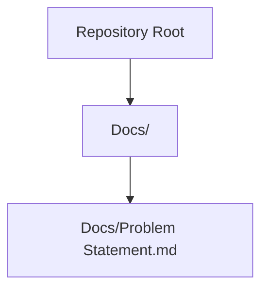
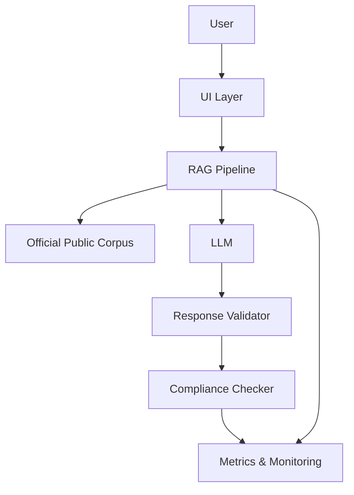
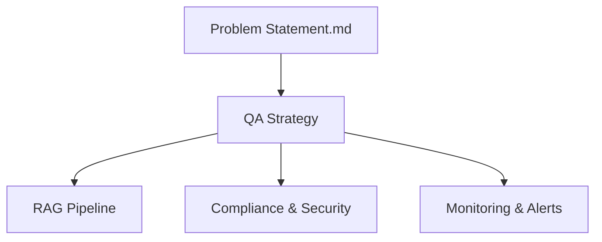

# Quality Assurance

<cite>
**Referenced Files in This Document**
- [Problem Statement.md](file://Docs/Problem Statement.md)
</cite>

## Table of Contents
1. [Introduction](#introduction)
2. [Project Structure](#project-structure)
3. [Core Components](#core-components)
4. [Architecture Overview](#architecture-overview)
5. [Detailed Component Analysis](#detailed-component-analysis)
6. [Dependency Analysis](#dependency-analysis)
7. [Performance Considerations](#performance-considerations)
8. [Troubleshooting Guide](#troubleshooting-guide)
9. [Conclusion](#conclusion)
10. [Appendices](#appendices)

## Introduction
This document defines the quality assurance and validation processes for the Mutual Fund FAQ Assistant. It focuses on testing strategies for factual accuracy, source citation validation, and compliance checking; response validation criteria; performance metrics; and user acceptance testing procedures. It also outlines automated testing frameworks for RAG pipeline validation, manual compliance verification protocols, continuous monitoring approaches, quality gates, acceptance criteria, defect resolution processes, performance optimization, scalability testing, and security validation requirements.

## Project Structure
The repository currently contains a problem statement that defines functional requirements, constraints, and success criteria for the assistant. These requirements serve as the foundation for QA planning and test design.

**Diagram sources**
- [Problem Statement.md:1-140](file://Docs/Problem Statement.md#L1-L140)

**Section sources**
- [Problem Statement.md:1-140](file://Docs/Problem Statement.md#L1-L140)

## Core Components
The QA strategy centers on validating three pillars:
- Factual accuracy: Ensuring retrieved answers reflect verified, official information.
- Source citation validation: Confirming each response includes a single, valid source link and a last-updated date.
- Compliance: Enforcing content restrictions, privacy and security constraints, and transparency requirements.

Key acceptance criteria derived from the problem statement:
- Accurate retrieval of factual mutual fund information.
- Strict adherence to facts-only responses.
- Consistent inclusion of valid source citations.
- Proper refusal of advisory queries.
- Clean, minimal, and user-friendly interface.

**Section sources**
- [Problem Statement.md:42-134](file://Docs/Problem Statement.md#L42-L134)

## Architecture Overview
The assistant follows a Retrieval-Augmented Generation (RAG) approach with a curated corpus of official documents. QA validation targets:
- Retrieval fidelity: Ensuring relevant, official sources are selected.
- Generation constraints: Enforcing sentence limits, single-citation policy, and footer formatting.
- Compliance enforcement: Preventing advisory content and protecting sensitive data.

[No sources needed since this diagram shows conceptual workflow, not actual code structure]

## Detailed Component Analysis

### Factual Accuracy Testing
Objectives:
- Verify that answers are grounded in official public sources.
- Confirm that retrieved context aligns with the query intent.
- Validate that non-factual or advisory queries are refused.

Testing approach:
- Manual verification against official sources for a representative set of queries.
- Automated checks to ensure retrieval relevance and source presence.
- Edge-case testing for ambiguous or borderline advisory queries.

Validation criteria:
- Each response must cite a single, official source link.
- Footer must include a last-updated date.
- Advisory queries must be refused with an appropriate educational link.

**Section sources**
- [Problem Statement.md:42-73](file://Docs/Problem Statement.md#L42-L73)
- [Problem Statement.md:107-111](file://Docs/Problem Statement.md#L107-L111)

### Source Citation Validation
Objectives:
- Ensure every response includes exactly one valid source link.
- Confirm the presence of a last-updated date footer.
- Validate that the cited source is official and publicly accessible.

Testing approach:
- Unit tests for response formatting and footer parsing.
- Integration tests to confirm source link validity and accessibility.
- Regression tests after corpus updates.

Validation criteria:
- Single-citation requirement per response.
- Official-source-only policy.
- Last-updated date present in the expected format.

**Section sources**
- [Problem Statement.md:55-59](file://Docs/Problem Statement.md#L55-L59)
- [Problem Statement.md:87-91](file://Docs/Problem Statement.md#L87-L91)
- [Problem Statement.md:107-111](file://Docs/Problem Statement.md#L107-L111)

### Compliance Checking
Objectives:
- Enforce content restrictions and privacy/security constraints.
- Prevent investment advice, performance comparisons, and return calculations.
- Protect sensitive data (PAN, Aadhaar, account numbers, OTPs, emails, phone numbers).

Testing approach:
- Content scanning for restricted terms and patterns.
- Privacy and security validation for data handling.
- Disclaimers and UI checks for visibility and clarity.

Validation criteria:
- No investment advice or recommendations.
- No performance comparisons or return calculations.
- No collection or processing of sensitive identifiers.

**Section sources**
- [Problem Statement.md:101-105](file://Docs/Problem Statement.md#L101-L105)
- [Problem Statement.md:92-99](file://Docs/Problem Statement.md#L92-L99)

### Response Validation Criteria
Objectives:
- Enforce response length and structure.
- Validate footer formatting and date presence.
- Ensure refusal messages are polite and informative.

Testing approach:
- Unit tests for response formatting and constraints.
- UI tests for disclaimer visibility and example questions.
- Acceptance tests for end-to-end scenarios.

Validation criteria:
- Maximum of three sentences per response.
- Exactly one citation link per response.
- Footer with last-updated date.

**Section sources**
- [Problem Statement.md:55-59](file://Docs/Problem Statement.md#L55-L59)

### Performance Metrics
Objectives:
- Measure retrieval latency, generation throughput, and system responsiveness.
- Track compliance rate and accuracy metrics.
- Monitor uptime and error rates.

Testing approach:
- Load and stress testing to assess scalability.
- A/B testing for retrieval and generation improvements.
- Continuous monitoring dashboards for real-time insights.

Validation criteria:
- Response time SLAs.
- Accuracy thresholds for factual retrieval.
- Compliance and security pass rates.

[No sources needed since this section provides general guidance]

### User Acceptance Testing Procedures
Objectives:
- Validate usability and clarity for retail investors and support teams.
- Confirm adherence to disclaimer and example questions.
- Gather feedback on helpfulness and trustworthiness.

Testing approach:
- Pilot testing with target users.
- Usability studies focusing on clarity and trust.
- Feedback collection and iteration cycles.

Validation criteria:
- Clean, minimal, and user-friendly interface.
- Visible disclaimer and example questions.
- Positive user feedback on helpfulness and transparency.

**Section sources**
- [Problem Statement.md:74-82](file://Docs/Problem Statement.md#L74-L82)
- [Problem Statement.md:127-134](file://Docs/Problem Statement.md#L127-L134)

### Automated Testing Framework for RAG Pipeline Validation
Objectives:
- Automate factual accuracy checks.
- Validate citation and footer formatting.
- Enforce compliance policies.

Testing approach:
- Unit tests for retrieval and generation components.
- Integration tests for end-to-end pipeline validation.
- Regression tests for corpus and model updates.

Validation criteria:
- Deterministic response formatting.
- Consistent citation and footer presence.
- Zero tolerance for advisory content or sensitive data.

[No sources needed since this section provides general guidance]

### Manual Testing Protocols for Compliance Verification
Objectives:
- Manually verify compliance with content and privacy constraints.
- Cross-check official source links and last-updated dates.
- Validate refusal handling for advisory queries.

Testing approach:
- Manual review of representative samples.
- Cross-reference with official sources.
- Compliance walkthroughs for disclaimers and UI elements.

Validation criteria:
- All responses include a single, official source link.
- Footer includes a last-updated date.
- Advisory queries are refused politely with educational links.

**Section sources**
- [Problem Statement.md:61-73](file://Docs/Problem Statement.md#L61-L73)
- [Problem Statement.md:107-111](file://Docs/Problem Statement.md#L107-L111)

### Continuous Monitoring Approaches
Objectives:
- Monitor system health, accuracy, and compliance in production.
- Track performance metrics and error trends.
- Alert on anomalies and compliance violations.

Testing approach:
- Real-time dashboards for key metrics.
- Automated alerts for performance degradation.
- Periodic audits for compliance and accuracy.

Validation criteria:
- SLA adherence for response time and accuracy.
- Continuous compliance pass rate.
- Timely incident response and remediation.

[No sources needed since this section provides general guidance]

### Quality Gates, Acceptance Criteria, and Defect Resolution Processes
Objectives:
- Define checkpoints for release readiness.
- Establish acceptance criteria aligned with success criteria.
- Streamline defect reporting and resolution.

Testing approach:
- Pre-release quality gates for accuracy, compliance, and performance.
- Post-release monitoring and defect triage.
- Iterative improvement based on feedback and metrics.

Validation criteria:
- Success criteria alignment: accurate retrieval, facts-only responses, valid citations, proper refusal, and clean UI.
- Defect resolution SLAs and escalation paths.

**Section sources**
- [Problem Statement.md:127-134](file://Docs/Problem Statement.md#L127-L134)

### Performance Optimization, Scalability Testing, and Security Validation Requirements
Objectives:
- Optimize retrieval and generation performance.
- Validate scalability under load.
- Ensure robust security and privacy controls.

Testing approach:
- Performance profiling and bottleneck identification.
- Load testing and capacity planning.
- Security assessments for data protection and access control.

Validation criteria:
- Measurable SLAs for latency and throughput.
- Horizontal scaling capabilities with stable performance.
- Zero incidents of sensitive data exposure or privacy violations.

[No sources needed since this section provides general guidance]

## Dependency Analysis
QA depends on:
- Problem statement-defined requirements and constraints.
- RAG pipeline components (retrieval, generation, validation).
- Compliance and security policies.
- Monitoring and alerting systems.

[No sources needed since this diagram shows conceptual relationships, not specific code structure]

## Performance Considerations
- Establish SLAs for response time, accuracy, and compliance.
- Conduct load testing to validate scalability.
- Monitor error rates and adjust thresholds accordingly.
- Continuously optimize retrieval and generation components.

[No sources needed since this section provides general guidance]

## Troubleshooting Guide
Common issues and resolutions:
- Non-factual or advisory responses: Review compliance checks and refine refusal prompts.
- Missing citations or incorrect footers: Validate response formatting and enforce constraints.
- Privacy or security violations: Audit data handling and strengthen access controls.
- Performance regressions: Profile bottlenecks and scale infrastructure as needed.

[No sources needed since this section provides general guidance]

## Conclusion
The QA strategy for the Mutual Fund FAQ Assistant is built upon strict factual accuracy, reliable source citation, and rigorous compliance. By combining automated validation, manual verification, continuous monitoring, and user acceptance testing, the system can maintain trustworthiness and transparency while meeting performance and security requirements.

## Appendices
- Appendix A: Test Case Templates
  - Factual accuracy test template
  - Citation validation test template
  - Compliance test template
  - Performance test template
- Appendix B: Metrics Dashboard Definitions
  - Accuracy, latency, compliance, and error rate metrics
- Appendix C: Incident Response Playbooks
  - Compliance violation handling
  - Performance degradation escalation
  - Security breach response

[No sources needed since this section provides general guidance]