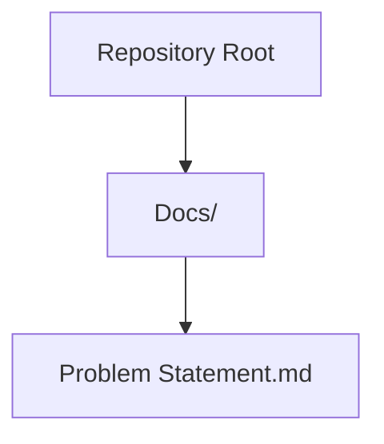
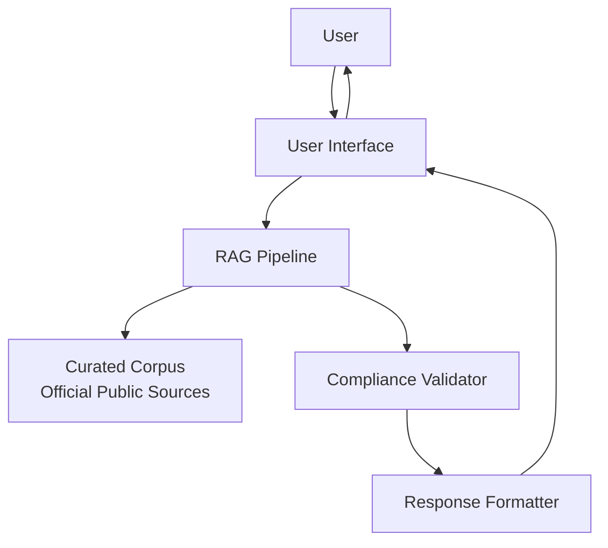
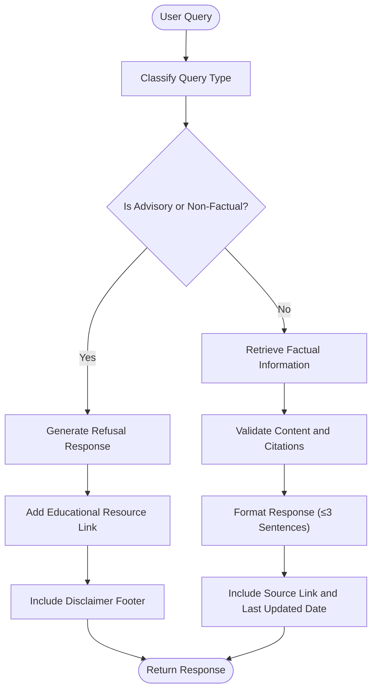
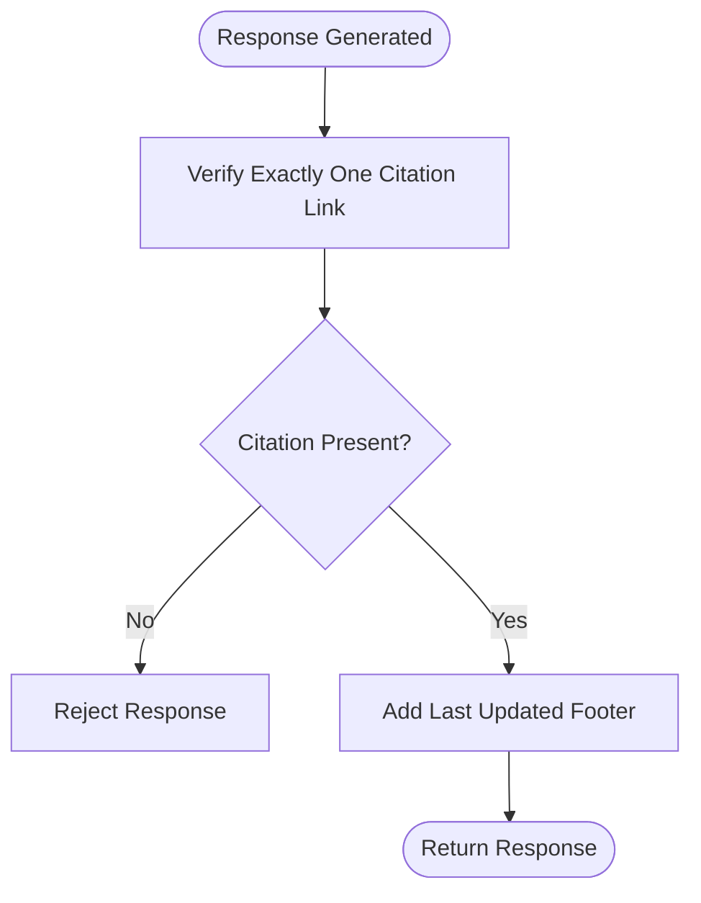
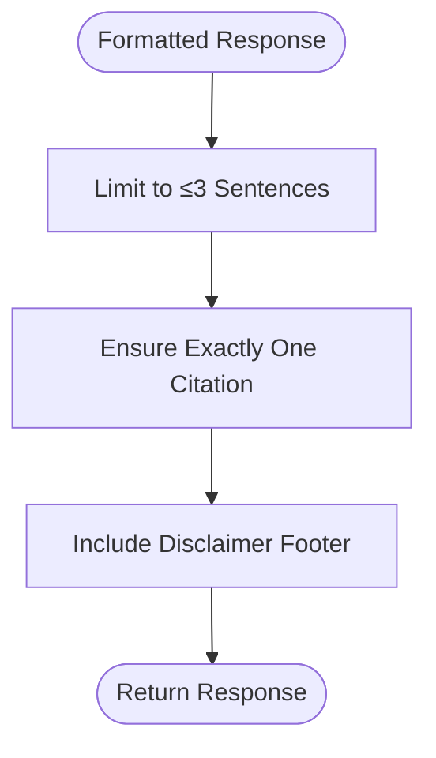
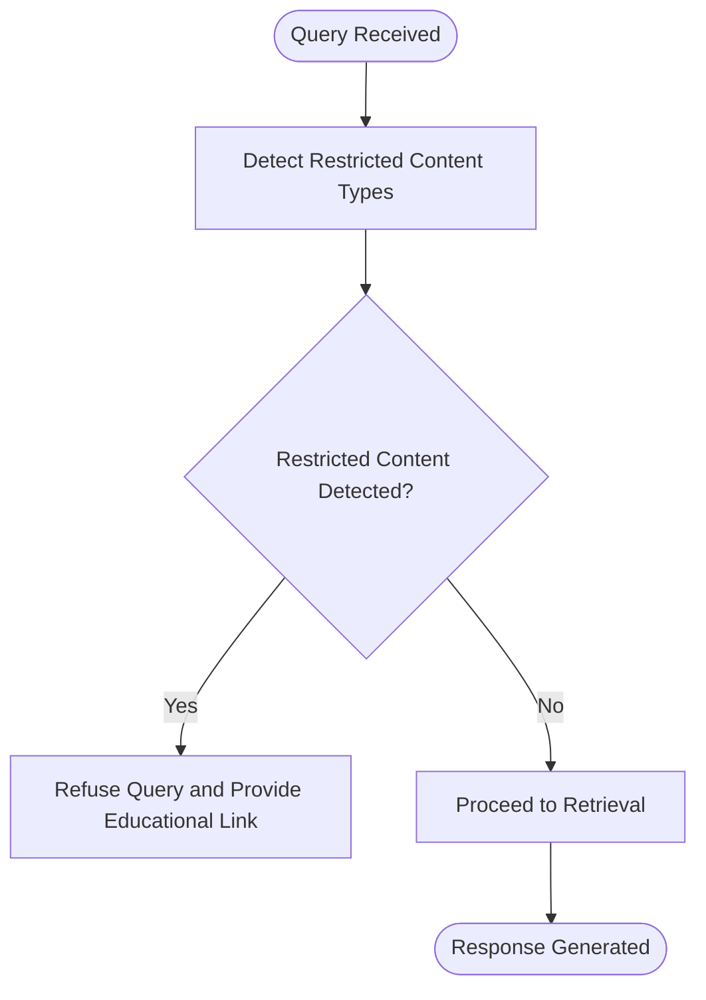
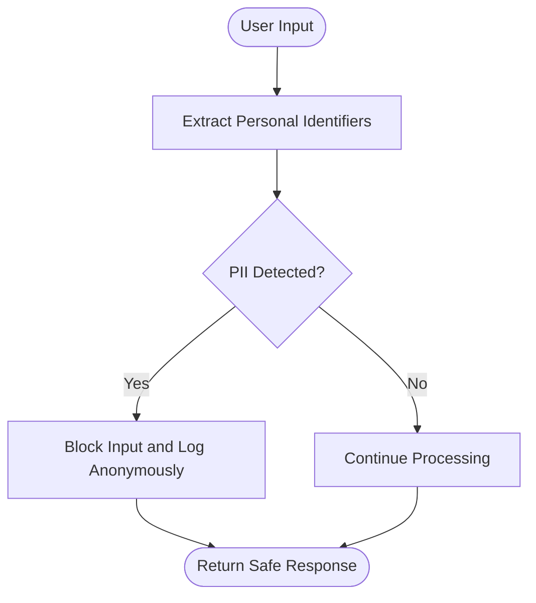
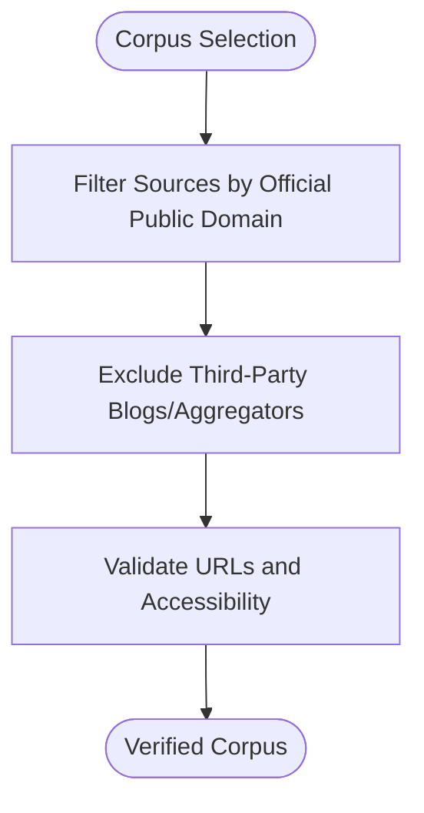
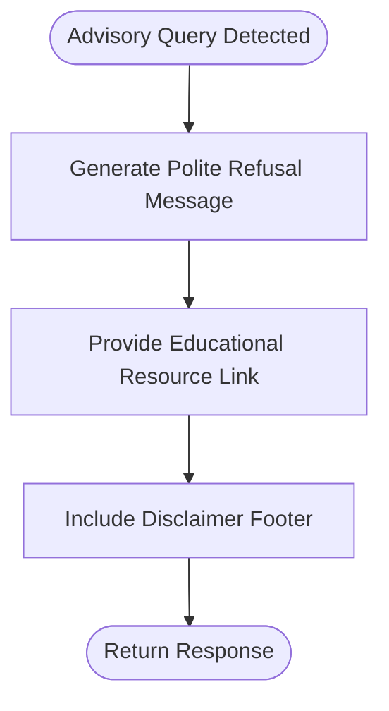
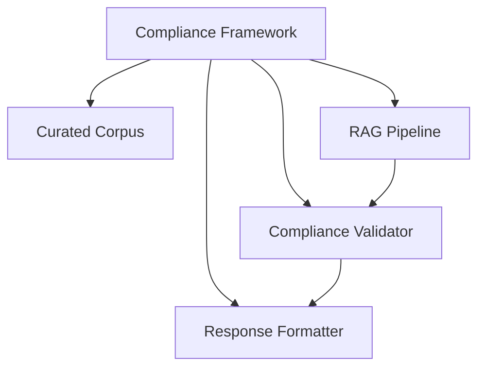

# Compliance and Validation

<cite>
**Referenced Files in This Document**
- [Problem Statement.md](file://Docs/Problem Statement.md)
</cite>

## Table of Contents
1. [Introduction](#introduction)
2. [Project Structure](#project-structure)
3. [Core Components](#core-components)
4. [Architecture Overview](#architecture-overview)
5. [Detailed Component Analysis](#detailed-component-analysis)
6. [Dependency Analysis](#dependency-analysis)
7. [Performance Considerations](#performance-considerations)
8. [Troubleshooting Guide](#troubleshooting-guide)
9. [Conclusion](#conclusion)

## Introduction
This document defines the compliance and validation framework for a facts-only mutual fund FAQ assistant. It establishes the facts-only constraint enforcement, source citation requirements, and response formatting standards. It also documents the compliance validation mechanisms, including content restriction enforcement, privacy protection measures, and source verification processes. Concrete examples of compliance checks, refusal handling for advisory queries, and educational resource redirection are included. Finally, it explains how the system enforces regulatory requirements while maintaining functionality and user experience.

## Project Structure
The repository contains a single problem statement document that defines the compliance and validation requirements for the assistant. The document outlines the scope, constraints, and success criteria for building a facts-only assistant that retrieves information exclusively from official public sources and enforces strict content and privacy policies.

**Diagram sources**
- [Problem Statement.md:1-140](file://Docs/Problem Statement.md#L1-L140)

**Section sources**
- [Problem Statement.md:1-140](file://Docs/Problem Statement.md#L1-L140)

## Core Components
This section summarizes the compliance and validation requirements defined in the problem statement.

- Facts-only constraint enforcement
  - Responses must be objective, verifiable, and limited to factual information.
  - Advisory queries are refused with a clear explanation and redirection to educational resources.
  - Example advisory queries include comparative recommendations and suitability advice.

- Source citation requirements
  - Each response must include exactly one citation link to an official public source.
  - Responses must include a footer indicating the last updated date from sources.

- Response formatting standards
  - Responses must be concise, limited to a maximum of three sentences.
  - A visible disclaimer must be present in the user interface: “Facts-only. No investment advice.”

- Content restriction enforcement
  - Investment advice, opinions, or recommendations are strictly prohibited.
  - Performance comparisons and return calculations are not permitted.
  - For performance-related queries, only a link to the official factsheet is provided.

- Privacy protection measures
  - Personal identifiers and sensitive data must not be collected, stored, or processed.
  - Prohibited data includes PAN/Aadhaar numbers, account numbers, OTPs, and contact details.

- Source verification processes
  - Only official public sources are used (AMC, AMFI, SEBI).
  - Third-party blogs or aggregator websites are excluded.

- Educational resource redirection
  - Refusal responses must include a relevant educational link (e.g., AMFI or SEBI guidance).

- Success criteria
  - Accurate retrieval of factual information.
  - Consistent inclusion of valid source citations.
  - Proper refusal of advisory queries.
  - Clean, minimal, and user-friendly interface.

**Section sources**
- [Problem Statement.md:42-140](file://Docs/Problem Statement.md#L42-L140)

## Architecture Overview
The assistant follows a retrieval-augmented generation (RAG) approach to ensure responses are grounded in official public sources. The architecture enforces compliance by restricting retrieval to curated, authoritative sources and applying strict content and formatting rules at the response stage.

[No sources needed since this diagram shows conceptual workflow, not actual code structure]

## Detailed Component Analysis

### Facts-Only Constraint Enforcement
The system enforces a strict facts-only policy to prevent advisory content. Advisory queries are identified and refused with a clear explanation and redirection to educational resources.

[No sources needed since this diagram shows conceptual workflow, not actual code structure]

### Source Citation Requirements
Each response must include exactly one citation link and a footer indicating the last updated date from sources. This ensures transparency and verifiability.

[No sources needed since this diagram shows conceptual workflow, not actual code structure]

### Response Formatting Standards
Responses must be concise, factual, and verifiable, with a maximum of three sentences and a single citation link.

[No sources needed since this diagram shows conceptual workflow, not actual code structure]

### Content Restriction Enforcement
Content restrictions prevent investment advice, performance comparisons, and return calculations. Performance-related queries are redirected to official factsheets.

[No sources needed since this diagram shows conceptual workflow, not actual code structure]

### Privacy Protection Measures
Privacy protection measures ensure personal identifiers and sensitive data are not collected, stored, or processed.

[No sources needed since this diagram shows conceptual workflow, not actual code structure]

### Source Verification Processes
Source verification ensures that only official public sources are used for retrieval and that third-party blogs or aggregator websites are excluded.

[No sources needed since this diagram shows conceptual workflow, not actual code structure]

### Educational Resource Redirection
When advisory queries are refused, the system redirects users to educational resources such as AMFI or SEBI guidance pages.

[No sources needed since this diagram shows conceptual workflow, not actual code structure]

## Dependency Analysis
Compliance and validation depend on the quality and curation of the corpus, the accuracy of the retrieval mechanism, and the strictness of the validator and formatter components.

[No sources needed since this diagram shows conceptual relationships, not actual code structure]

## Performance Considerations
- Efficient retrieval: Ensure the RAG pipeline retrieves relevant documents quickly to maintain a responsive user experience.
- Minimal processing: Apply compliance checks and formatting rules efficiently to avoid latency.
- Transparent logging: Maintain logs for compliance audits without compromising privacy or performance.

[No sources needed since this section provides general guidance]

## Troubleshooting Guide
- Advisory queries: If a query is flagged as advisory, ensure the refusal response is polite, clearly worded, and includes a redirect to an educational resource.
- Citation issues: If a response lacks a citation or contains multiple citations, reject it and regenerate with exactly one official source link.
- Privacy violations: If personal identifiers are detected, block the input and log anonymized events for audit purposes.
- Source validity: If a source is not an official public source, replace it with an approved alternative and re-validate.

**Section sources**
- [Problem Statement.md:61-100](file://Docs/Problem Statement.md#L61-L100)

## Conclusion
The compliance and validation framework ensures that the mutual fund FAQ assistant remains facts-only, transparent, and compliant. By enforcing strict content and privacy policies, verifying official sources, and providing clear refusal handling with educational redirection, the system maintains regulatory alignment while delivering a clean and user-friendly experience.