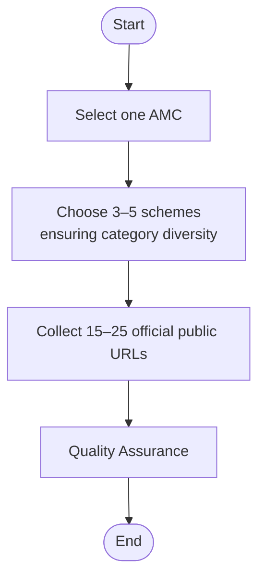
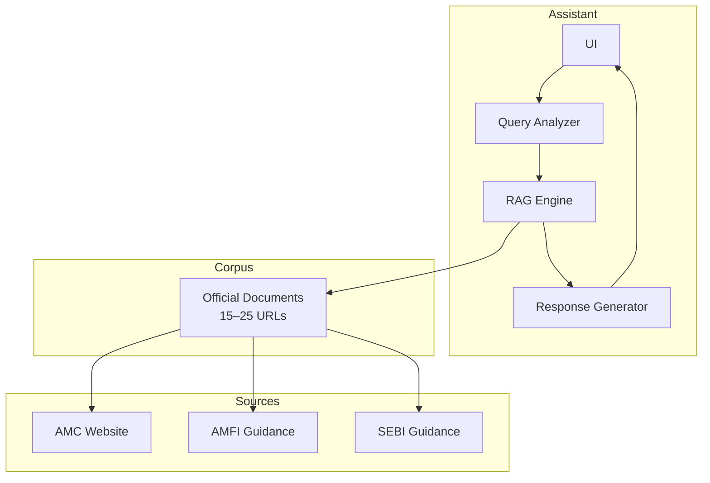
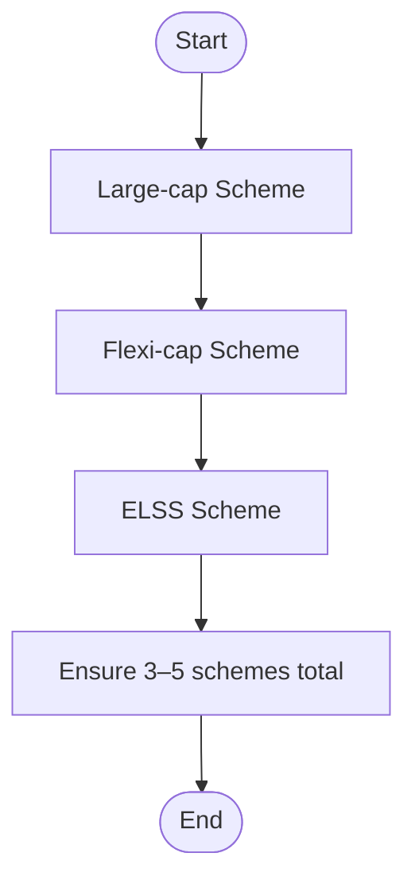
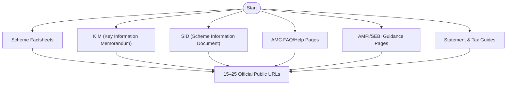
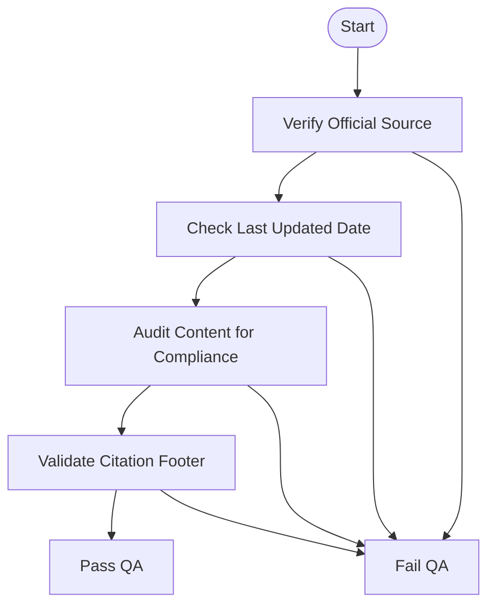
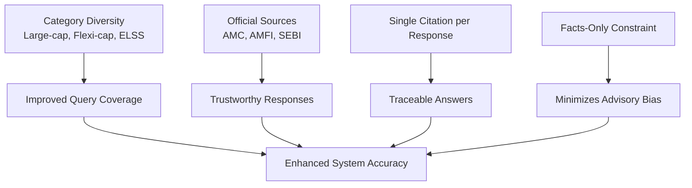
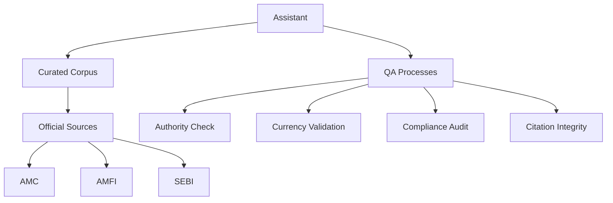

# Corpus Definition

<cite>
**Referenced Files in This Document**
- [Problem Statement.md](file://Docs/Problem Statement.md)
</cite>

## Table of Contents
1. [Introduction](#introduction)
2. [Project Structure](#project-structure)
3. [Core Components](#core-components)
4. [Architecture Overview](#architecture-overview)
5. [Detailed Component Analysis](#detailed-component-analysis)
6. [Dependency Analysis](#dependency-analysis)
7. [Performance Considerations](#performance-considerations)
8. [Troubleshooting Guide](#troubleshooting-guide)
9. [Conclusion](#conclusion)

## Introduction
This document defines the corpus requirements for building a facts-only mutual fund FAQ assistant. It specifies how to select an Asset Management Company (AMC) and a set of mutual fund schemes, the official document collection process, and the quality assurance mechanisms that ensure system accuracy and compliance.

## Project Structure
The repository contains a single problem statement document that outlines the corpus definition requirements and assistant constraints. The corpus definition is scoped to:
- One AMC selection
- 3–5 schemes ensuring category diversity (e.g., large-cap, flexi-cap, ELSS)
- 15–25 official public URLs covering scheme factsheets, KIM, SID, AMC FAQ/help pages, AMFI/SEBI guidance pages, and statement/tax document guides

**Section sources**
- [Problem Statement.md:30-41](file://Docs/Problem Statement.md#L30-L41)

## Core Components
- AMC Selection: Choose a single AMC as the primary source of official documents.
- Scheme Diversity: Select 3–5 schemes spanning distinct categories to improve coverage of typical investor queries.
- Official Document Collection: Gather authoritative URLs from AMC, AMFI, and SEBI sources.

**Section sources**
- [Problem Statement.md:30-41](file://Docs/Problem Statement.md#L30-L41)

## Architecture Overview
The corpus feeds a retrieval-augmented generation (RAG) assistant that answers factual queries using only official public sources. The assistant must:
- Limit responses to facts-only answers
- Include a single citation link per response
- Add a “Last updated from sources” footer
- Refuse advisory or comparative queries

**Section sources**
- [Problem Statement.md:42-60](file://Docs/Problem Statement.md#L42-L60)

## Detailed Component Analysis

### AMC Selection Criteria
- Purpose: Centralize official content under one trusted source.
- Method: Choose a well-established AMC with comprehensive scheme offerings and publicly accessible documentation.
- Justification: Simplifies corpus curation and ensures consistent branding and tone across documents.

**Section sources**
- [Problem Statement.md:30-34](file://Docs/Problem Statement.md#L30-L34)

### Scheme Category Diversity Requirements
- Objective: Cover frequently asked questions across major categories.
- Categories: Large-cap, flexi-cap, ELSS.
- Rationale: Diverse categories increase the likelihood of retrieving answers for typical retail investor queries.

**Section sources**
- [Problem Statement.md:30-34](file://Docs/Problem Statement.md#L30-L34)

### Official Document Collection Process
The corpus must include 15–25 official public URLs. The collection targets:
- Scheme factsheets
- KIM (Key Information Memorandum)
- SID (Scheme Information Document)
- AMC FAQ/help pages
- AMFI/SEBI guidance pages
- Statement and tax document download guides

**Section sources**
- [Problem Statement.md:34-40](file://Docs/Problem Statement.md#L34-L40)

### Concrete Examples of Document Sources
- Scheme factsheets: Example URL pattern for a scheme factsheet hosted on the AMC website.
- KIM: Example URL pattern for the Key Information Memorandum.
- SID: Example URL pattern for the Scheme Information Document.
- AMC FAQ/help: Example URL pattern for the AMC’s help or FAQ page.
- AMFI/SEBI guidance: Example URL pattern for AMFI or SEBI official guidance pages.
- Statement and tax guides: Example URL pattern for downloadable statements and tax document guides.

Note: The above examples describe URL patterns and are intended to guide the collection process. They do not represent specific live links.

**Section sources**
- [Problem Statement.md:34-40](file://Docs/Problem Statement.md#L34-L40)

### Collection Methodologies
- Automated Discovery: Use sitemaps and structured navigation to identify official pages.
- Manual Validation: Confirm authority and currency of each URL.
- Categorization: Tag each URL by document type (factsheet, KIM, SID, FAQ, guidance, tax).
- Version Control: Track last updated dates and revisions.

**Section sources**
- [Problem Statement.md:87-111](file://Docs/Problem Statement.md#L87-L111)

### Quality Assurance Processes
- Authority Check: Verify that each URL belongs to an official public source (AMC, AMFI, SEBI).
- Currency Validation: Ensure documents reflect the latest regulatory and scheme updates.
- Compliance Audit: Confirm content adheres to facts-only constraints and avoids advisory language.
- Citation Integrity: Validate that each response includes a single, verifiable source link and a “Last updated from sources” footer.

**Section sources**
- [Problem Statement.md:87-111](file://Docs/Problem Statement.md#L87-L111)

### Relationship Between Corpus Selection and System Accuracy
- Diverse Categories: Including large-cap, flexi-cap, and ELSS schemes increases coverage of typical queries.
- Official Sources: Using only AMC, AMFI, and SEBI ensures facts-only, verifiable responses.
- Citation Requirement: Single-citation responses reduce ambiguity and improve traceability.
- Compliance: Strict constraints prevent advisory bias and maintain trust.

**Section sources**
- [Problem Statement.md:30-41](file://Docs/Problem Statement.md#L30-L41)
- [Problem Statement.md:42-60](file://Docs/Problem Statement.md#L42-L60)

## Dependency Analysis
- Assistant depends on curated corpus of official documents.
- Corpus depends on authoritative sources (AMC, AMFI, SEBI).
- Quality assurance depends on validation of authority, currency, and compliance.

**Section sources**
- [Problem Statement.md:87-111](file://Docs/Problem Statement.md#L87-L111)

## Performance Considerations
- Document freshness: Prefer recent versions of factsheets, KIM, and guidance pages.
- Accessibility: Ensure URLs are reachable and not behind paywalls or login barriers.
- Coverage breadth: Include FAQs and tax guides to handle common user intents.

[No sources needed since this section provides general guidance]

## Troubleshooting Guide
- Non-official URLs: Remove or replace with official alternatives.
- Outdated documents: Replace with newer versions or redirect to updated pages.
- Missing citations: Add a single, verifiable source link and update the “Last updated from sources” footer.
- Advisory content: Rewrite to present only verifiable facts and avoid recommendations.

**Section sources**
- [Problem Statement.md:87-111](file://Docs/Problem Statement.md#L87-L111)

## Conclusion
A well-defined corpus—centered on one AMC, diversified by scheme categories, and populated with 15–25 official public URLs—provides the foundation for a facts-only, compliant mutual fund assistant. Rigorous quality assurance ensures accuracy, traceability, and adherence to constraints, ultimately enhancing user trust and system reliability.