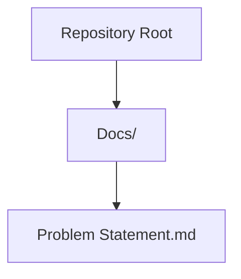
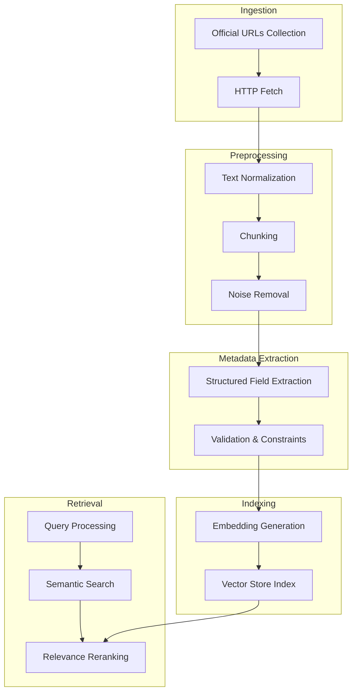
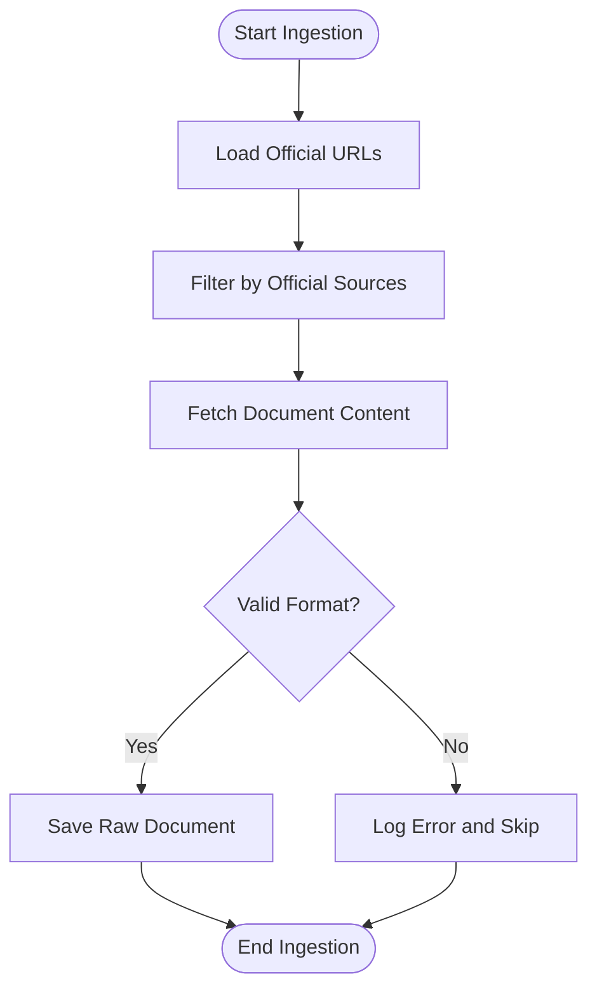
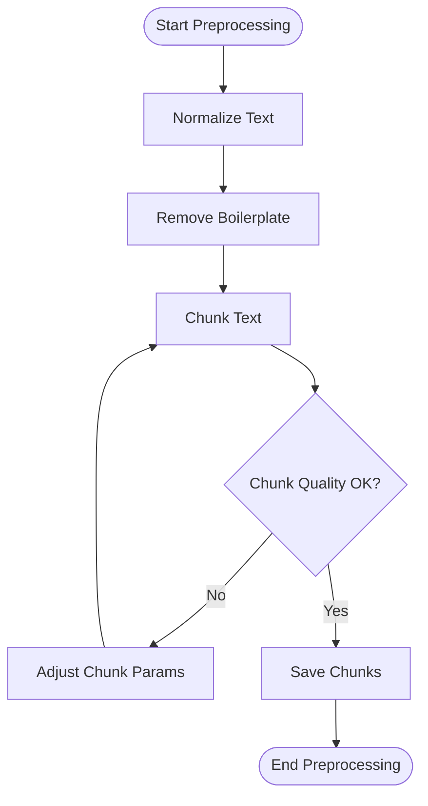
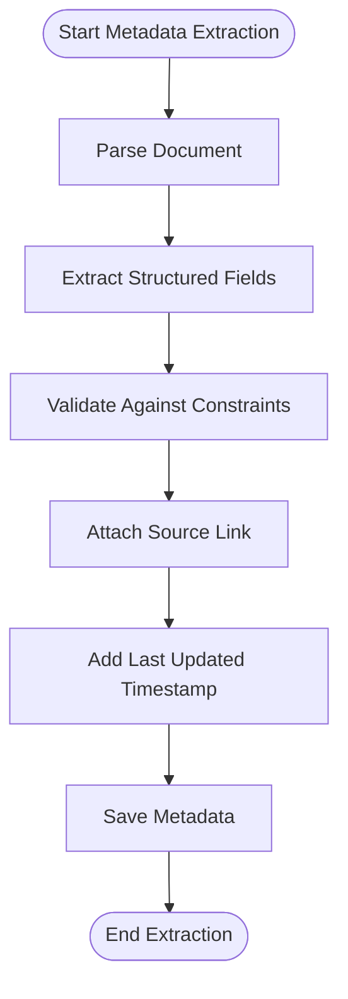
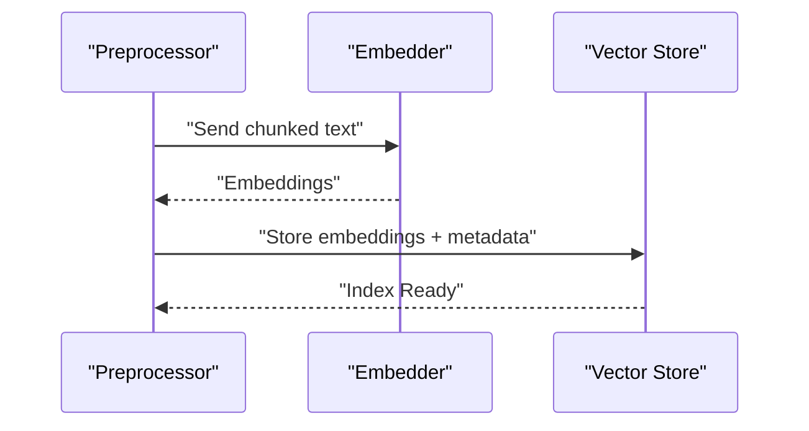
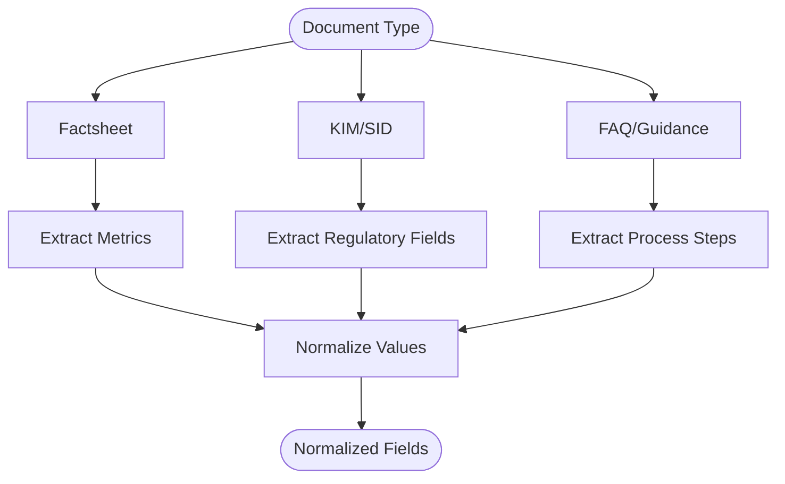
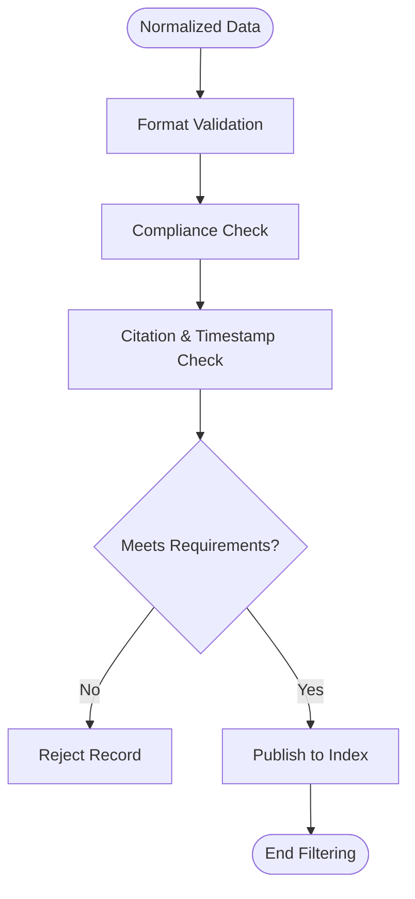
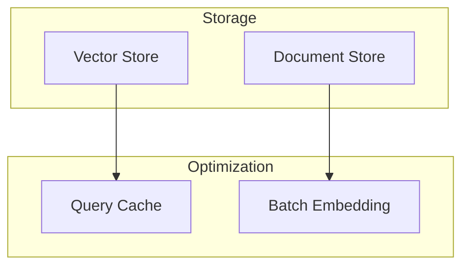
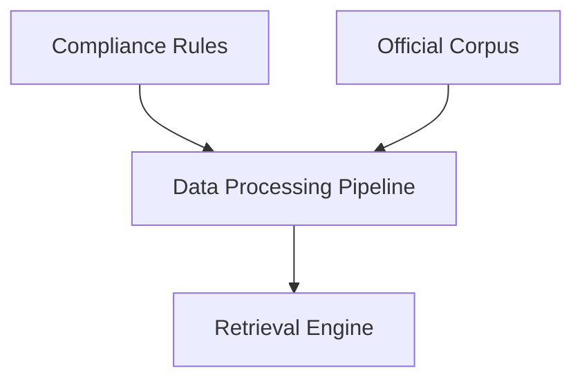

# Data Processing Pipeline

<cite>
**Referenced Files in This Document**
- [Problem Statement.md](file://Docs/Problem Statement.md)
</cite>

## Table of Contents
1. [Introduction](#introduction)
2. [Project Structure](#project-structure)
3. [Core Components](#core-components)
4. [Architecture Overview](#architecture-overview)
5. [Detailed Component Analysis](#detailed-component-analysis)
6. [Dependency Analysis](#dependency-analysis)
7. [Performance Considerations](#performance-considerations)
8. [Troubleshooting Guide](#troubleshooting-guide)
9. [Conclusion](#conclusion)

## Introduction
This document defines the data processing pipeline requirements for building a facts-only mutual fund FAQ assistant. The pipeline ingests official financial documents, normalizes and extracts structured metadata, preprocesses text for retrieval, and indexes content to enable fast, accurate retrieval. The focus is on official sources such as Asset Management Company (AMC) websites, AMFI, and SEBI, ensuring compliance with strict facts-only constraints and citation requirements.

## Project Structure
The repository currently contains a problem statement that outlines the scope, corpus definition, and constraints for the assistant. The data processing pipeline described here is intended to align with the documented corpus composition and retrieval requirements.

**Diagram sources**
- [Problem Statement.md:1-140](file://Docs/Problem Statement.md#L1-L140)

**Section sources**
- [Problem Statement.md:1-140](file://Docs/Problem Statement.md#L1-L140)

## Core Components
The data processing pipeline comprises the following stages, aligned with the official document corpus and retrieval needs:

- Document ingestion: Collect official URLs for factsheets, KIM, SID, FAQs, and guidance documents.
- Text preprocessing: Normalize text, segment into chunks, and extract metadata.
- Metadata extraction: Parse standardized fields such as scheme name, category, benchmark, expense ratio, lock-in period, and exit load.
- Indexing: Build embeddings and index for semantic retrieval.
- Quality filtering: Enforce content restrictions and compliance rules.

These components are designed to support the assistant’s requirement for concise, source-backed answers with a single citation and a last-updated footer.

**Section sources**
- [Problem Statement.md:30-41](file://Docs/Problem Statement.md#L30-L41)
- [Problem Statement.md:42-73](file://Docs/Problem Statement.md#L42-L73)
- [Problem Statement.md:114-124](file://Docs/Problem Statement.md#L114-L124)

## Architecture Overview
The pipeline architecture integrates ingestion, preprocessing, metadata extraction, indexing, and retrieval. It emphasizes official sources and strict compliance with facts-only constraints.

[No sources needed since this diagram shows conceptual workflow, not actual code structure]

## Detailed Component Analysis

### Document Ingestion
- Purpose: Populate the curated corpus with official URLs for schemes, KIM, SID, FAQs, and guidance documents.
- Inputs: URL lists for selected AMC and schemes.
- Outputs: Raw document content and metadata.
- Compliance: Restrict to official sources; avoid third-party blogs or aggregators.

**Section sources**
- [Problem Statement.md:30-41](file://Docs/Problem Statement.md#L30-L41)
- [Problem Statement.md:87-91](file://Docs/Problem Statement.md#L87-L91)

### Text Preprocessing
- Purpose: Normalize text, remove noise, and segment into retrievable chunks.
- Steps:
  - Normalize whitespace and encoding.
  - Remove headers, footers, and boilerplate content.
  - Segment into overlapping chunks optimized for retrieval.
- Constraints: Preserve factual content; avoid inference or advisory language.

**Section sources**
- [Problem Statement.md:42-73](file://Docs/Problem Statement.md#L42-L73)

### Metadata Extraction
- Purpose: Extract structured fields from documents to support precise retrieval and filtering.
- Fields: Scheme name, category, benchmark index, expense ratio, lock-in period, exit load, minimum SIP amount, and last updated date.
- Validation: Enforce content restrictions and ensure fields are verifiable from official sources.

**Section sources**
- [Problem Statement.md:46-53](file://Docs/Problem Statement.md#L46-L53)
- [Problem Statement.md:101-111](file://Docs/Problem Statement.md#L101-L111)

### Indexing Mechanisms
- Purpose: Enable fast semantic retrieval of relevant document segments.
- Steps:
  - Generate embeddings for chunks and metadata.
  - Store vectors with associated metadata in a vector store.
  - Support hybrid retrieval combining lexical and semantic signals.
- Storage: Maintain separate indices for documents and metadata for efficient querying.

**Section sources**
- [Problem Statement.md:114-124](file://Docs/Problem Statement.md#L114-L124)

### Parsing Strategies for Official Financial Documents
- Factsheets: Extract scheme-specific metrics (expense ratio, benchmark, SIP minimum).
- KIM/SID: Extract regulatory disclosures, risk factors, lock-in periods, exit loads.
- FAQs/Guidance: Extract process steps for downloads and tax-related procedures.
- Techniques:
  - Rule-based extraction for fixed-field documents.
  - Pattern matching for dates, monetary values, and percentages.
  - Structured templates for consistent field mapping.

**Section sources**
- [Problem Statement.md:34-40](file://Docs/Problem Statement.md#L34-L40)

### Data Normalization and Quality Filtering
- Normalization:
  - Standardize currency, percentage, and date formats.
  - Map categories to canonical taxonomy.
- Quality filtering:
  - Exclude content that implies advice or comparisons.
  - Enforce sentence limits and citation requirements.
  - Validate presence of source links and timestamps.

**Section sources**
- [Problem Statement.md:87-111](file://Docs/Problem Statement.md#L87-L111)

### Retrieval Performance and Storage Requirements
- Optimization:
  - Use dense embeddings for semantic search.
  - Apply reranking to refine top-k results.
  - Cache frequent queries and precompute embeddings for static documents.
- Storage:
  - Vector store for embeddings and metadata.
  - Document store for raw content and source links.
  - Index size proportional to number of chunks and embedding dimensionality.

[No sources needed since this diagram shows conceptual workflow, not actual code structure]

## Dependency Analysis
The pipeline depends on:
- Official document sources for corpus integrity.
- Compliance rules dictating content restrictions and citation requirements.
- Retrieval constraints limiting response length and enforcing a single citation.

[No sources needed since this diagram shows conceptual relationships, not actual code structure]

## Performance Considerations
- Embedding model selection: Balance accuracy and latency for the target corpus.
- Chunk size tuning: Optimize overlap and size for retrieval precision.
- Index maintenance: Periodic reindexing for new documents and updates.
- Caching: Cache embeddings and frequently accessed documents to reduce latency.

[No sources needed since this section provides general guidance]

## Troubleshooting Guide
- Ingestion failures:
  - Verify official source URLs and network connectivity.
  - Log and retry transient HTTP errors.
- Preprocessing issues:
  - Inspect encoding and whitespace normalization.
  - Adjust chunk parameters if retrieval quality degrades.
- Metadata extraction errors:
  - Validate extraction rules against document variations.
  - Maintain fallback strategies for missing fields.
- Compliance violations:
  - Audit retrieved content for advisory language or comparisons.
  - Enforce response constraints at query time.

**Section sources**
- [Problem Statement.md:87-111](file://Docs/Problem Statement.md#L87-L111)

## Conclusion
The data processing pipeline ensures that the assistant retrieves only verified, source-backed information from official financial documents. By focusing on ingestion from trusted sources, robust preprocessing, structured metadata extraction, and efficient indexing, the system meets the facts-only constraint while maintaining retrieval performance and compliance.