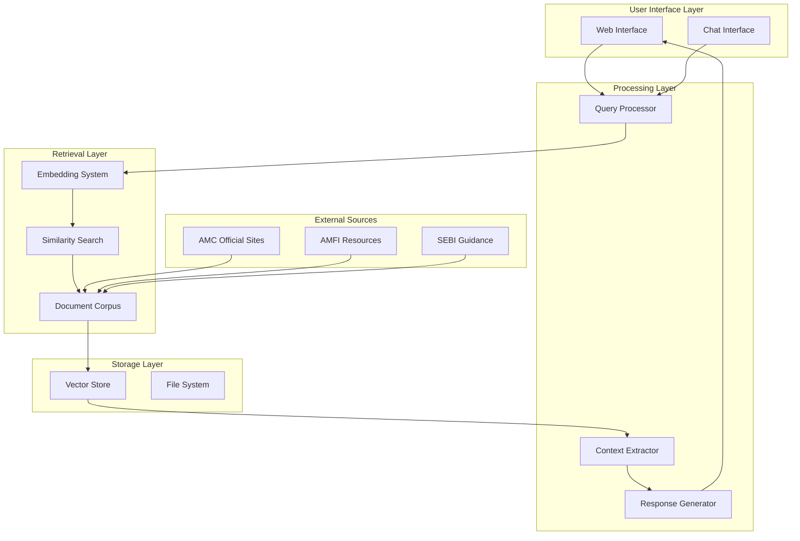
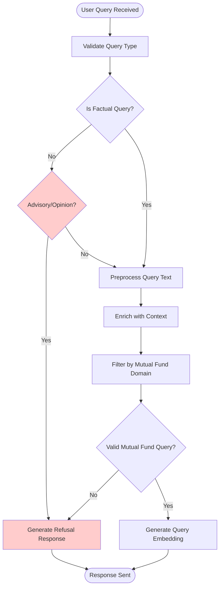
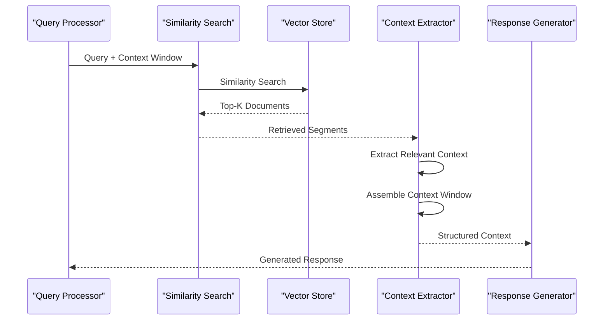
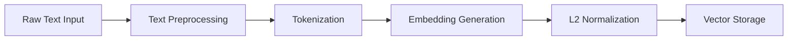
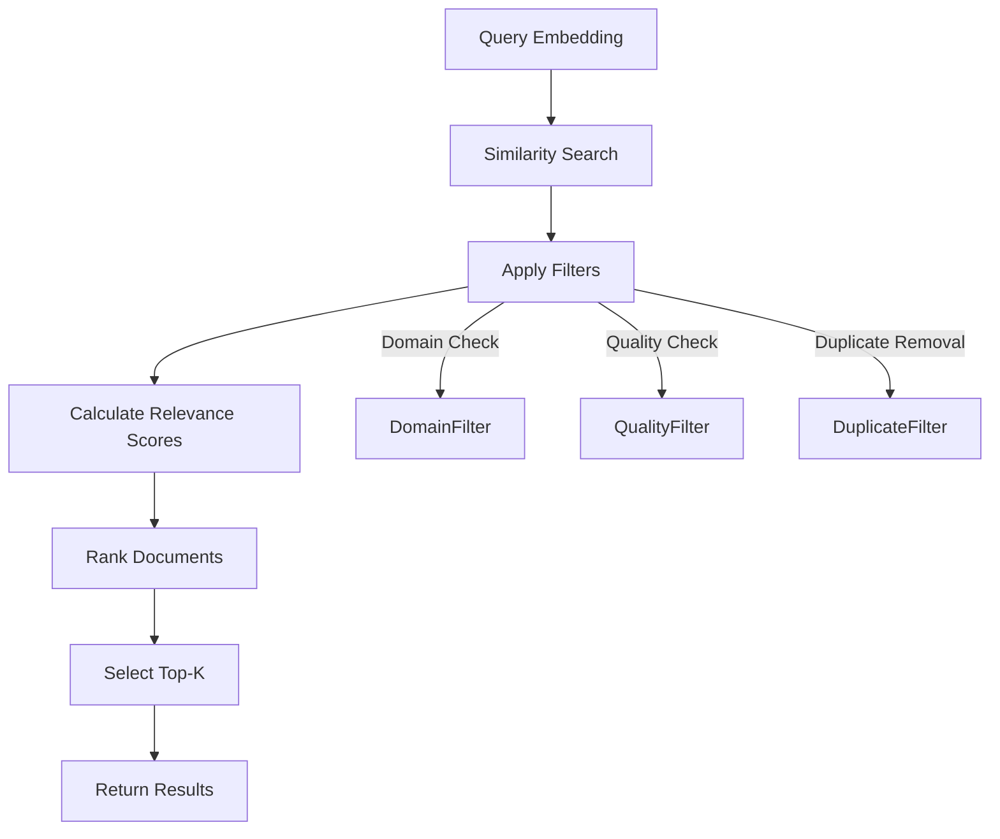
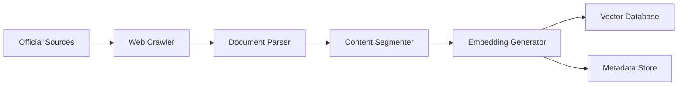
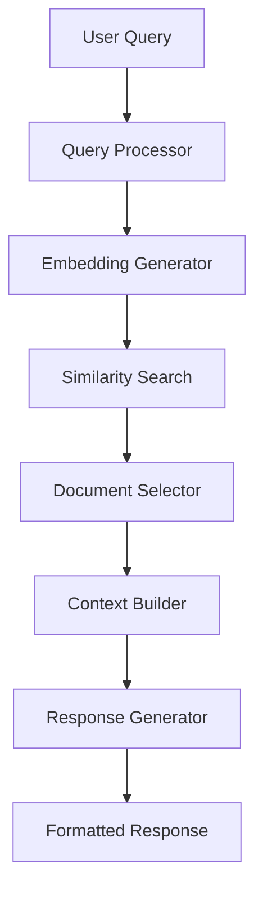
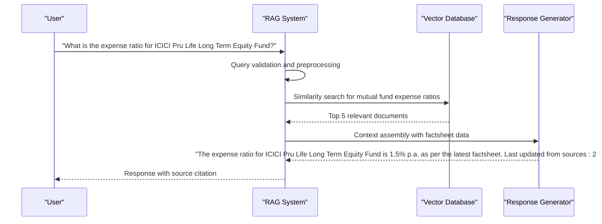
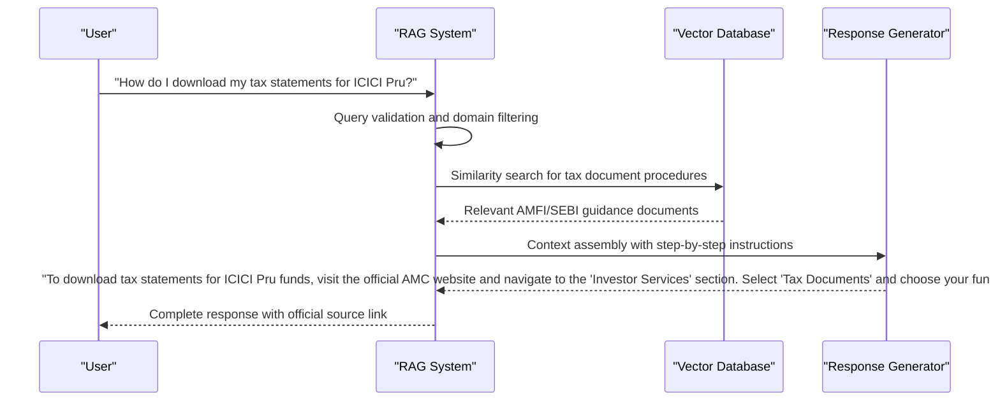

# RAG Architecture

<cite>
**Referenced Files in This Document**
- [Problem Statement.md](file://Docs/Problem Statement.md)
</cite>

## Table of Contents
1. [Introduction](#introduction)
2. [System Architecture Overview](#system-architecture-overview)
3. [Core RAG Components](#core-rag-components)
4. [Query Processing Pipeline](#query-processing-pipeline)
5. [Document Retrieval Mechanism](#document-retrieval-mechanism)
6. [Context Extraction and Assembly](#context-extraction-and-assembly)
7. [Response Generation Engine](#response-generation-engine)
8. [Embedding Model Specifications](#embedding-model-specifications)
9. [Similarity Search Implementation](#similarity-search-implementation)
10. [Data Flow Patterns](#data-flow-patterns)
11. [System Integration Points](#system-integration-points)
12. [Performance Considerations](#performance-considerations)
13. [Scalability Requirements](#scalability-requirements)
14. [Architectural Decisions](#architectural-decisions)
15. [Example Workflows](#example-workflows)
16. [Conclusion](#conclusion)

## Introduction

The Mutual Fund FAQ Assistant employs a Retrieval-Augmented Generation (RAG) architecture designed specifically for factual, verifiable queries about mutual fund schemes. Built using Groww as the reference product context, this system retrieves information exclusively from official public sources including Asset Management Company (AMC) websites, AMFI, and SEBI resources.

The primary objective is to deliver facts-only responses with strict adherence to transparency, accuracy, and compliance requirements. Every response must include a single, clear source link and maintain a maximum of three sentences while providing comprehensive coverage of the queried information.

## System Architecture Overview

The RAG system follows a modular architecture with clear separation of concerns across four primary processing stages:

**Diagram sources**
- [Problem Statement.md:13-18](file://Docs/Problem Statement.md#L13-L18)

The architecture ensures that all responses remain factual and source-backed while maintaining system performance and scalability requirements.

## Core RAG Components

### Query Processing Component
The query processing component handles incoming user requests through multiple channels including web forms and chat interfaces. It performs initial validation to ensure queries meet the facts-only criteria before proceeding to the retrieval phase.

### Document Retrieval System
The document retrieval system manages a curated corpus of official mutual fund documentation including scheme factsheets, Key Information Memorandums (KIM), Scheme Information Documents (SID), and regulatory guidance materials.

### Context Assembly Module
This module extracts relevant information from retrieved documents and assembles it into a coherent context window for the generation phase, ensuring optimal information density while maintaining response conciseness.

### Generation Engine
The response generation engine produces structured, factual responses with integrated citations and compliance footers, adhering to the three-sentence maximum and single-citation requirement.

**Section sources**
- [Problem Statement.md:42-73](file://Docs/Problem Statement.md#L42-L73)

## Query Processing Pipeline

The query processing pipeline implements a multi-stage validation and enhancement system:

**Diagram sources**
- [Problem Statement.md:61-73](file://Docs/Problem Statement.md#L61-L73)

The pipeline ensures that only factual, verifiable queries about mutual funds proceed to the retrieval stage, while advisory queries receive appropriate refusal responses with educational links.

## Document Retrieval Mechanism

The document retrieval mechanism operates on a carefully curated corpus of official sources:

### Corpus Composition
- **Asset Management Companies**: 1 selected AMC with 3-5 diverse schemes
- **Scheme Documentation**: Factsheets, KIM, SID documents
- **Regulatory Sources**: AMFI and SEBI official guidance pages
- **Support Materials**: Statement and tax document download guides

### Retrieval Strategy
Documents are segmented into logical units of approximately 500-800 words, balancing retrieval precision with computational efficiency. Each segment maintains contextual coherence while enabling focused similarity search.

### Quality Assurance
All documents undergo validation against official source URLs and are cross-referenced for consistency before indexing into the vector database.

**Section sources**
- [Problem Statement.md:30-41](file://Docs/Problem Statement.md#L30-L41)

## Context Extraction and Assembly

The context extraction process implements intelligent document selection and assembly:

**Diagram sources**
- [Problem Statement.md:13-18](file://Docs/Problem Statement.md#L13-L18)

The context assembly ensures optimal information density while maintaining the three-sentence response constraint.

## Response Generation Engine

The response generation engine implements strict compliance controls:

### Generation Parameters
- **Maximum Response Length**: 3 sentences
- **Source Integration**: Single citation link per response
- **Footer Requirement**: "Last updated from sources: <date>"
- **Content Validation**: Factual-only responses with official sourcing

### Compliance Features
- Automatic detection of advisory language
- Educational resource linking for non-factual queries
- Consistent formatting and citation standards
- Regulatory compliance verification

**Section sources**
- [Problem Statement.md:55-59](file://Docs/Problem Statement.md#L55-L59)

## Embedding Model Specifications

### Model Selection Criteria
The embedding model must balance accuracy with computational efficiency for the mutual fund domain:

#### Primary Requirements
- **Domain Adaptation**: Specialized training for financial/document understanding
- **Dimensionality**: 768-1024 dimensions for optimal retrieval performance
- **Efficiency**: Fast inference for real-time query processing
- **Open Source**: MIT/Apache license for commercial deployment

#### Recommended Specifications
- **Model Family**: Sentence Transformers or BERT variants
- **Training Data**: Financial documents, regulatory texts, scheme documentation
- **Performance Targets**: 
  - Query embedding: < 50ms
  - Document embedding: < 100ms
  - Similarity computation: < 10ms per document

### Embedding Pipeline

**Diagram sources**
- [Problem Statement.md:13-18](file://Docs/Problem Statement.md#L13-L18)

## Similarity Search Implementation

### Search Algorithm
The system implements approximate nearest neighbor (ANN) search for efficient similarity computation:

#### Index Structure
- **Vector Database**: FAISS or Annoy for high-dimensional similarity search
- **Index Type**: IVF (Inverted File) with optimized clustering parameters
- **Search Parameters**: 
  - Top-K: 5-10 documents for balanced recall and speed
  - Threshold: 0.7-0.8 cosine similarity threshold
  - Parallel processing: Multi-threaded search for latency reduction

#### Optimization Strategies
- **Batch Processing**: Concurrent similarity searches for multiple queries
- **Caching**: Frequently accessed embeddings cached in memory
- **Incremental Updates**: Delta updates for new document ingestion

### Search Workflow

**Diagram sources**
- [Problem Statement.md:13-18](file://Docs/Problem Statement.md#L13-L18)

## Data Flow Patterns

### Ingestion Pipeline

### Query Pipeline

**Diagram sources**
- [Problem Statement.md:13-18](file://Docs/Problem Statement.md#L13-L18)

## System Integration Points

### External System Interfaces
- **AMC APIs**: Direct access to scheme information (when available)
- **Regulatory Databases**: Real-time updates from AMFI and SEBI
- **Web Scraping**: Controlled extraction from official websites
- **Content Management**: Integration with existing FAQ systems

### Internal Integration
- **Authentication**: User session management for compliance tracking
- **Logging**: Comprehensive audit trail for all queries and responses
- **Monitoring**: Real-time performance metrics and error tracking
- **Caching**: Multi-level caching for improved response times

## Performance Considerations

### Latency Targets
- **Query Response Time**: < 2 seconds for 95th percentile
- **Embedding Generation**: < 100ms per document
- **Similarity Search**: < 50ms per query
- **System Throughput**: 100+ queries per second sustained

### Memory Optimization
- **Vector Compression**: Quantization for reduced storage requirements
- **Eviction Policies**: LRU cache for frequently accessed embeddings
- **Streaming Processing**: Incremental processing for large document sets

### Scalability Metrics
- **Horizontal Scaling**: Stateless components for easy scaling
- **Load Balancing**: Round-robin distribution across instances
- **Auto-scaling**: CPU and memory-based scaling triggers

## Scalability Requirements

### Infrastructure Design
- **Microservices Architecture**: Independent scaling of components
- **Container Orchestration**: Kubernetes for automated deployment and scaling
- **CDN Integration**: Static assets and frequently accessed documents
- **Database Scaling**: Sharded vector database for large-scale deployments

### Growth Projections
- **Document Volume**: 1000+ documents initially, scaling to 10,000+
- **Query Volume**: 1000+ daily queries, supporting 10,000+ concurrent users
- **Storage Requirements**: 10GB initial, scaling to 100GB+ with compression

## Architectural Decisions

### Technology Choices
- **Python Ecosystem**: Mature NLP libraries and vector databases
- **FastAPI**: High-performance web framework for API endpoints
- **PostgreSQL**: Relational metadata storage with JSON support
- **Redis**: High-speed caching and session management

### Design Principles
- **Facts-Only Constraint**: Strict enforcement of factual responses only
- **Source Transparency**: Every response includes verifiable citation
- **Compliance First**: Regulatory requirements embedded in system design
- **User Experience**: Minimal interface with clear disclaimer messaging

### Trade-off Analysis
- **Accuracy vs. Speed**: Optimized for retrieval accuracy over raw speed
- **Coverage vs. Precision**: Balanced approach to document coverage
- **Cost vs. Performance**: Cost-effective solutions without compromising quality

## Example Workflows

### Expense Ratio Query

### Tax Document Download Process

**Diagram sources**
- [Problem Statement.md:46-54](file://Docs/Problem Statement.md#L46-L54)

## Conclusion

The RAG architecture for the Mutual Fund FAQ Assistant represents a sophisticated yet practical solution for delivering accurate, source-backed financial information. By focusing on facts-only responses with strict compliance requirements, the system ensures trustworthiness while maintaining usability and performance.

The modular design enables future enhancements including expanded document sources, improved query understanding, and enhanced user interaction capabilities. The careful balance between accuracy, performance, and compliance positions the system as a reliable resource for retail investors seeking verifiable mutual fund information.

Through continuous refinement of the embedding models, retrieval algorithms, and response generation processes, the system will evolve to meet the growing needs of the mutual fund community while maintaining its commitment to transparency and factual accuracy.