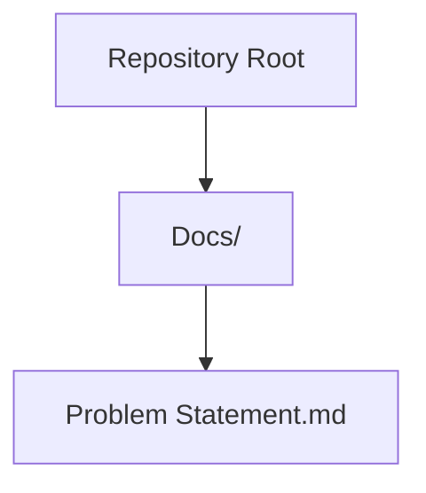
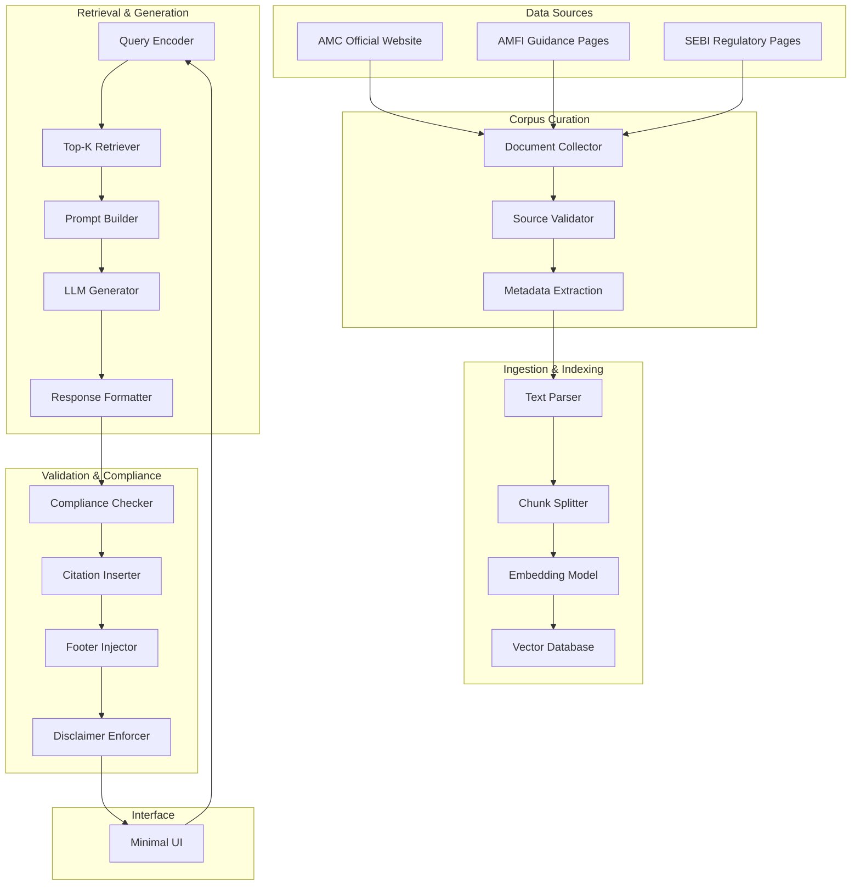
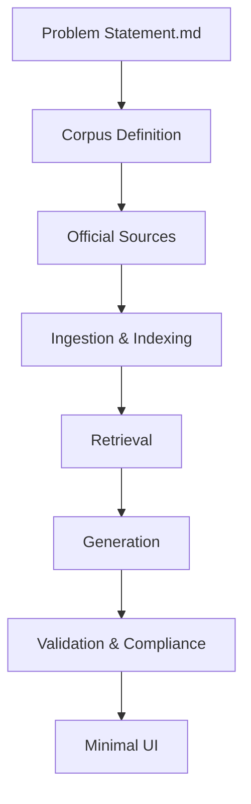

# Technical Requirements

<cite>
**Referenced Files in This Document**
- [Problem Statement.md](file://Docs/Problem Statement.md)
</cite>

## Table of Contents
1. [Introduction](#introduction)
2. [Project Structure](#project-structure)
3. [Core Components](#core-components)
4. [Architecture Overview](#architecture-overview)
5. [Detailed Component Analysis](#detailed-component-analysis)
6. [Dependency Analysis](#dependency-analysis)
7. [Performance Considerations](#performance-considerations)
8. [Troubleshooting Guide](#troubleshooting-guide)
9. [Conclusion](#conclusion)
10. [Appendices](#appendices)

## Introduction
This document defines the technical requirements for building a Retrieval-Augmented Generation (RAG)-based Mutual Fund FAQ Assistant. The system must answer objective, verifiable queries about mutual fund schemes using a curated corpus of official financial documents sourced from Asset Management Companies (AMCs), AMFI, and SEBI. It enforces strict compliance constraints, including facts-only responses, mandatory citations, and explicit disclaimers. The document outlines corpus definition requirements, data source specifications, configuration options for the RAG pipeline, vector database requirements, and validation mechanisms aligned with the problem statement.

## Project Structure
The repository contains a single problem statement document that defines the scope, constraints, deliverables, and success criteria for the assistant. The structure is minimal and focused on requirements capture.

**Diagram sources**
- [Problem Statement.md:1-140](file://Docs/Problem Statement.md#L1-L140)

**Section sources**
- [Problem Statement.md:1-140](file://Docs/Problem Statement.md#L1-L140)

## Core Components
This section describes the essential components derived from the problem statement and their roles in the RAG system.

- Curated Corpus
  - Purpose: Provide official, verifiable content for retrieval.
  - Composition: One AMC, 3–5 diverse mutual fund schemes, and 15–25 official public URLs covering factsheets, KIM, SID, AMC help pages, AMFI/SEBI guidance, and tax/document download guides.
  - Constraints: Must use only official public sources; avoid third-party blogs or aggregators.

- RAG Pipeline
  - Purpose: Retrieve relevant documents and generate concise, source-backed answers.
  - Output Requirements: Facts-only, up to three sentences, one citation link, and a last-updated footer.

- Compliance Engine
  - Purpose: Enforce content restrictions and refusal handling for advisory queries.
  - Actions: Refuse non-factual or advisory queries with a polite message and an educational link.

- User Interface (Minimal)
  - Purpose: Present example questions, a welcome message, and a clear disclaimer.

- Validation Mechanisms
  - Purpose: Ensure transparency, accuracy, and compliance.
  - Checks: Citation presence, sentence limit, disclaimer inclusion, and adherence to facts-only policy.

**Section sources**
- [Problem Statement.md:30-82](file://Docs/Problem Statement.md#L30-L82)
- [Problem Statement.md:85-111](file://Docs/Problem Statement.md#L85-L111)

## Architecture Overview
The RAG system architecture centers on a retrieval-first workflow that ensures every answer is grounded in official financial sources. The system integrates corpus curation, ingestion, indexing, retrieval, generation, and validation layers.

**Diagram sources**
- [Problem Statement.md:30-82](file://Docs/Problem Statement.md#L30-L82)
- [Problem Statement.md:85-111](file://Docs/Problem Statement.md#L85-L111)

## Detailed Component Analysis

### Corpus Definition Requirements
- AMC Selection
  - Choose one AMC as the primary source of scheme-specific information.
  - Ensure the chosen AMC maintains official factsheets, KIM, SID, and help pages.

- Scheme Selection
  - Select 3–5 schemes to represent category diversity (e.g., large-cap, flexi-cap, ELSS).
  - Confirm availability of official documents for each scheme.

- Document Collection Targets
  - Scheme factsheets
  - Key Information Memorandum (KIM)
  - Scheme Information Document (SID)
  - AMC FAQ/help pages
  - AMFI/SEBI guidance pages
  - Statement and tax document download guides

- Source Constraints
  - Use only official public sources (AMC, AMFI, SEBI).
  - Do not include third-party blogs or aggregator websites.

- Quality Assurance
  - Validate document URLs and ensure they remain publicly accessible.
  - Extract metadata (scheme name, document type, last updated date) during ingestion.

**Section sources**
- [Problem Statement.md:30-41](file://Docs/Problem Statement.md#L30-L41)
- [Problem Statement.md:87-91](file://Docs/Problem Statement.md#L87-L91)

### Data Source Specifications
- Official Financial Sources
  - AMC: Scheme factsheets, KIM, SID, FAQs, and help pages.
  - AMFI: Investor education and guidance materials.
  - SEBI: Regulatory guidance and investor protection resources.

- Document Types and Purposes
  - Factsheets: Scheme performance, expense ratio, benchmark index, riskometer.
  - KIM/SID: Detailed scheme disclosures and regulatory requirements.
  - FAQs: Common operational queries and account-related processes.
  - Tax/Statement Guides: Instructions for downloading statements and capital gains reports.

- Accessibility and Stability
  - Prefer static, archival-friendly URLs.
  - Track last updated dates to inform response footers.

**Section sources**
- [Problem Statement.md:34-40](file://Docs/Problem Statement.md#L34-L40)

### RAG Pipeline Configuration Options
- Ingestion
  - Text parsing: Normalize whitespace, remove headers/footers, preserve key-value pairs.
  - Chunk splitting: Use overlapping windows to retain context across boundaries.
  - Metadata tagging: Tag chunks with scheme name, document type, and last updated date.

- Embedding Model
  - Use a domain-appropriate embedding model (e.g., sentence-transformers or OpenAI).
  - Ensure embeddings align with the chunk size and retrieval strategy.

- Vector Database
  - Index type: Flat or IVF for small to medium corpora; HNSW for larger datasets.
  - Metric: Cosine or dot-product similarity.
  - Upsert strategy: Append new documents; update metadata on re-ingest.
  - Query-time filters: Filter by scheme name and document type.

- Retrieval
  - Top-K: Tune K to balance precision and recall.
  - Filters: Restrict retrieval to selected AMC and schemes.
  - Rerank (optional): Apply a cross-encoder for higher precision.

- Generation
  - Prompt template: Include retrieved context, a strict instruction to answer facts-only, and a citation requirement.
  - Output constraints: Sentence count limit, citation insertion, and footer formatting.

- Validation
  - Pre-generation checks: Advisory query detection and refusal routing.
  - Post-generation checks: Citation presence, sentence count, and disclaimer enforcement.

**Section sources**
- [Problem Statement.md:42-60](file://Docs/Problem Statement.md#L42-L60)
- [Problem Statement.md:85-111](file://Docs/Problem Statement.md#L85-L111)

### Compliance Validation Mechanisms
- Advisory Query Detection
  - Detect queries seeking advice or comparisons.
  - Route to refusal handler with an educational link.

- Citation Enforcement
  - Insert a single, valid source link per response.
  - Include a last-updated footer derived from document metadata.

- Content Restrictions
  - Prohibit investment advice, performance comparisons, and speculative content.
  - For performance-related queries, link to the official factsheet only.

- Transparency and Accuracy
  - Ensure responses are short, factual, and verifiable.
  - Maintain a disclaimer: “Facts-only. No investment advice.”

**Section sources**
- [Problem Statement.md:61-73](file://Docs/Problem Statement.md#L61-L73)
- [Problem Statement.md:101-111](file://Docs/Problem Statement.md#L101-L111)

### Technical Constraints
- Data and Sources
  - Use only official public sources (AMC, AMFI, SEBI).
  - Do not use third-party blogs or aggregator websites.

- Privacy and Security
  - Do not collect, store, or process sensitive identifiers (PAN, Aadhaar, account numbers, OTPs, emails, phone numbers).

- Content Restrictions
  - No investment advice or recommendations.
  - No performance comparisons or return calculations.
  - For performance-related queries, provide a link to the official factsheet only.

- Transparency
  - Responses must be short, factual, and verifiable.
  - Every answer must include a source link and last updated date.

**Section sources**
- [Problem Statement.md:85-111](file://Docs/Problem Statement.md#L85-L111)

### Example Queries and Expected Behaviors
- Factual Queries
  - Examples: Expense ratio of a scheme, exit load details, minimum SIP amount, ELSS lock-in period, riskometer classification, benchmark index, process to download statements or capital gains reports.
  - Behavior: Provide a concise answer with a single citation link and a last-updated footer.

- Advisory Queries
  - Examples: “Should I invest in this fund?”, “Which fund is better?”
  - Behavior: Refuse politely, reinforce the facts-only limitation, and provide an educational link.

**Section sources**
- [Problem Statement.md:46-54](file://Docs/Problem Statement.md#L46-L54)
- [Problem Statement.md:63-73](file://Docs/Problem Statement.md#L63-L73)

### User Interface (Minimal)
- Requirements
  - Welcome message.
  - Three example questions.
  - Visible disclaimer: “Facts-only. No investment advice.”

**Section sources**
- [Problem Statement.md:74-82](file://Docs/Problem Statement.md#L74-L82)

## Dependency Analysis
The RAG system depends on official financial sources and internal validation layers. The following diagram illustrates dependencies among major components.

**Diagram sources**
- [Problem Statement.md:30-82](file://Docs/Problem Statement.md#L30-L82)
- [Problem Statement.md:85-111](file://Docs/Problem Statement.md#L85-L111)

**Section sources**
- [Problem Statement.md:30-82](file://Docs/Problem Statement.md#L30-L82)
- [Problem Statement.md:85-111](file://Docs/Problem Statement.md#L85-L111)

## Performance Considerations
- Retrieval Efficiency
  - Tune Top-K and filters to minimize latency while maintaining recall.
  - Consider caching frequent queries and their top-k results.

- Embedding and Indexing
  - Batch embedding for large corpora to reduce overhead.
  - Use efficient index types (e.g., HNSW) for larger datasets.

- Generation Constraints
  - Limit prompt length and output tokens to control latency.
  - Use fast, compact models for generation where feasible.

- Validation Overhead
  - Perform quick checks (advisory query detection) before retrieval to avoid unnecessary computation.

[No sources needed since this section provides general guidance]

## Troubleshooting Guide
- Common Issues and Solutions
  - Missing Citations
    - Symptom: Responses lack a citation link.
    - Solution: Enforce citation insertion and footer formatting in the validation stage.
  - Excessive Sentences
    - Symptom: Responses exceed three sentences.
    - Solution: Add a post-generation sentence count check and truncate if needed.
  - Non-Factual Queries
    - Symptom: Users ask for advice or comparisons.
    - Solution: Implement advisory query detection and route to refusal with an educational link.
  - Outdated Information
    - Symptom: Responses cite stale documents.
    - Solution: Track last updated dates and include them in the footer; periodically re-ingest documents.
  - Privacy Violations
    - Symptom: Sensitive data collected inadvertently.
    - Solution: Enforce strict input sanitization and avoid storing personal identifiers.

**Section sources**
- [Problem Statement.md:55-60](file://Docs/Problem Statement.md#L55-L60)
- [Problem Statement.md:61-73](file://Docs/Problem Statement.md#L61-L73)
- [Problem Statement.md:85-111](file://Docs/Problem Statement.md#L85-L111)

## Conclusion
The RAG system for the Mutual Fund FAQ Assistant must prioritize accuracy, compliance, and transparency. By curating a focused corpus from official financial sources, configuring a robust retrieval pipeline, enforcing strict validation rules, and providing a minimal, compliant UI, the system can reliably answer factual queries while avoiding advisory content. Adhering to the outlined constraints and validation mechanisms ensures trustworthiness and legal alignment.

[No sources needed since this section summarizes without analyzing specific files]

## Appendices
- Success Criteria
  - Accurate retrieval of factual mutual fund information.
  - Strict adherence to facts-only responses.
  - Consistent inclusion of valid source citations.
  - Proper refusal of advisory queries.
  - Clean, minimal, and user-friendly interface.

**Section sources**
- [Problem Statement.md:127-134](file://Docs/Problem Statement.md#L127-L134)