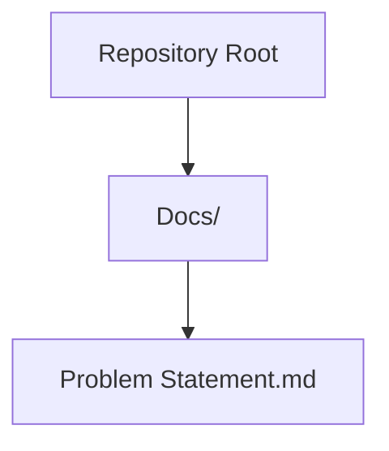
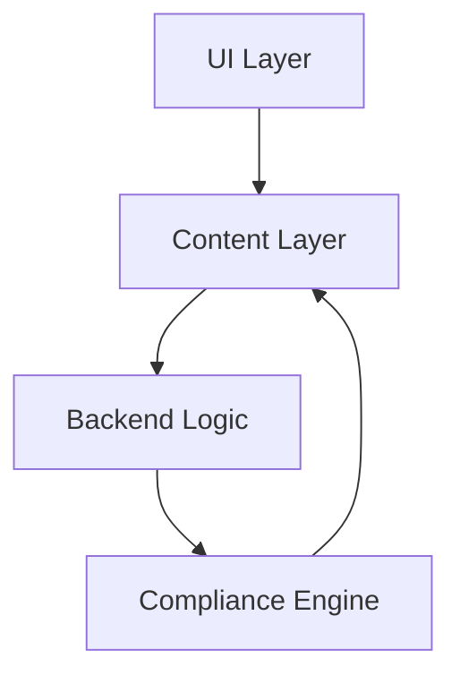
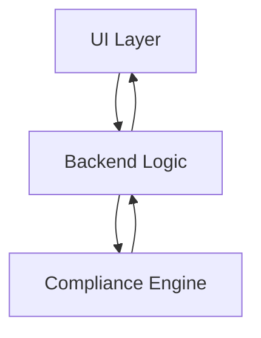

# User Interface Design

<cite>
**Referenced Files in This Document**
- [Problem Statement.md](file://Docs/Problem Statement.md)
</cite>

## Table of Contents
1. [Introduction](#introduction)
2. [Project Structure](#project-structure)
3. [Core Components](#core-components)
4. [Architecture Overview](#architecture-overview)
5. [Detailed Component Analysis](#detailed-component-analysis)
6. [Dependency Analysis](#dependency-analysis)
7. [Performance Considerations](#performance-considerations)
8. [Troubleshooting Guide](#troubleshooting-guide)
9. [Conclusion](#conclusion)

## Introduction
This document defines the user interface design requirements for the Mutual Fund FAQ Assistant. The interface must be minimal, transparent, and compliant with strict facts-only constraints. It targets retail investors and support teams, emphasizing clarity, trust, and accessibility. The design ensures that every interaction reinforces the assistant’s commitment to providing only verified, source-backed information without investment advice.

## Project Structure
The repository currently contains a single problem statement document that outlines the functional and UI requirements. The UI design is defined conceptually in this document and does not include separate UI code files in the repository.

**Diagram sources**
- [Problem Statement.md](file://Docs/Problem Statement.md)

**Section sources**
- [Problem Statement.md](file://Docs/Problem Statement.md)

## Core Components
The minimal UI must include three core components aligned with the problem statement:

- Welcome message: A concise, friendly greeting that sets expectations for a facts-only assistant.
- Example questions: Three representative prompts demonstrating factual queries about mutual funds (e.g., expense ratio, exit load, minimum SIP amount, lock-in period, riskometer classification, benchmark index, and downloading statements).
- Disclaimer: A visible, prominent disclaimer stating “Facts-only. No investment advice.”

These components collectively establish trust, reduce cognitive load, and ensure users understand the assistant’s scope and limitations.

**Section sources**
- [Problem Statement.md:74-82](file://Docs/Problem Statement.md#L74-L82)

## Architecture Overview
The UI architecture is intentionally lightweight and focused on clarity. It separates content presentation from backend logic while enforcing compliance constraints at the interface level.

- UI Layer: Presents the welcome message, example questions, and disclaimer.
- Content Layer: Ensures every response adheres to the facts-only constraint and includes a single citation link and a last-updated footer.
- Backend Logic: Implements retrieval-augmented generation (RAG) to source answers from official public sources.
- Compliance Engine: Enforces refusal of advisory queries and content restrictions.

**Diagram sources**
- [Problem Statement.md:42-82](file://Docs/Problem Statement.md#L42-L82)

## Detailed Component Analysis

### Welcome Message
- Purpose: Establish context and set expectations for a facts-only assistant.
- Placement: Prominent and immediately visible upon page load.
- Tone: Friendly, professional, and transparent.
- Guidance: Encourage users to ask factual questions about mutual funds and explain that responses will include a source link and last-updated date.

User experience principle:
- Reduce friction by providing immediate clarity about the assistant’s capabilities and limitations.

Accessibility consideration:
- Ensure sufficient color contrast and readable font sizes for the welcome message.

Responsive design guideline:
- Maintain readability on small screens; avoid layout shifts when resizing.

**Section sources**
- [Problem Statement.md:74-82](file://Docs/Problem Statement.md#L74-L82)

### Example Questions
- Purpose: Demonstrate typical factual queries and encourage exploration.
- Quantity: Three representative examples covering common areas of interest.
- Categories: Include queries such as expense ratio, exit load, minimum SIP amount, lock-in period, riskometer classification, benchmark index, and downloading statements or capital gains reports.

User experience principle:
- Provide clear, low-risk prompts to help users discover the assistant’s scope without requiring prior knowledge.

Accessibility consideration:
- Offer keyboard navigation and screen reader support for example prompts.

Responsive design guideline:
- Stack prompts vertically on small screens; ensure touch targets are appropriately sized.

**Section sources**
- [Problem Statement.md:46-53](file://Docs/Problem Statement.md#L46-L53)

### Disclaimer
- Purpose: Reinforce the facts-only constraint and clarify that no investment advice is provided.
- Presentation: Visible and prominently displayed near the welcome message and example prompts.
- Text: “Facts-only. No investment advice.”

User experience principle:
- Make the disclaimer easy to notice and understand, reducing ambiguity about the assistant’s role.

Accessibility consideration:
- Ensure the disclaimer is perceivable by assistive technologies and meets WCAG contrast requirements.

Responsive design guideline:
- Maintain visibility across breakpoints; avoid hiding behind menus.

**Section sources**
- [Problem Statement.md:74-82](file://Docs/Problem Statement.md#L74-L82)

### Response Display
- Constraint: Each response must be limited to a maximum of three sentences, include exactly one citation link, and end with a footer indicating the last updated date from sources.
- Role: Maintain the facts-only constraint through clear messaging and example prompts.

User experience principle:
- Keep responses concise and scannable; highlight the citation link for transparency.

Accessibility consideration:
- Ensure links are keyboard focusable and announceable; provide clear focus indicators.

Responsive design guideline:
- Preserve readability on mobile devices; wrap long links appropriately.

**Section sources**
- [Problem Statement.md:55-59](file://Docs/Problem Statement.md#L55-L59)

### Refusal Handling
- Constraint: Advisory queries (e.g., “Should I invest in this fund?” or “Which fund is better?”) must be politely refused with a clear explanation and a relevant educational link.
- Role: Prevent the assistant from crossing into advisory territory while remaining helpful.

User experience principle:
- Provide a constructive alternative (educational link) to maintain user trust and engagement.

Accessibility consideration:
- Ensure refusal messages are announced clearly by screen readers.

Responsive design guideline:
- Keep refusal messages short and actionable.

**Section sources**
- [Problem Statement.md:61-72](file://Docs/Problem Statement.md#L61-L72)

### Component States
- Idle: Display welcome message, example questions, and disclaimer.
- Loading: Indicate processing when a query is submitted.
- Response: Present the facts-only answer with a citation link and last-updated footer.
- Refused: Show a polite refusal with an educational link.
- Error: Display a clear, non-technical error message with guidance to retry or contact support.

User feedback mechanism:
- Use subtle animations or transitions to indicate state changes.
- Provide clear, visible cues for loading and error states.

**Section sources**
- [Problem Statement.md:55-59](file://Docs/Problem Statement.md#L55-L59)
- [Problem Statement.md:61-72](file://Docs/Problem Statement.md#L61-L72)

### User Interaction Patterns
- Query submission: Single-line input with a submit button; support Enter key for quick submission.
- Example prompt selection: Click-to-copy or click-to-paste example prompts to the input field.
- Citation navigation: Open-source links in a new tab to preserve context.
- Accessibility: Full keyboard navigation, ARIA labels, and screen reader announcements.

Cross-platform compatibility:
- Ensure consistent behavior across desktop, tablet, and mobile browsers.
- Test with assistive technologies (screen readers, keyboard-only navigation).

**Section sources**
- [Problem Statement.md:46-53](file://Docs/Problem Statement.md#L46-L53)
- [Problem Statement.md:74-82](file://Docs/Problem Statement.md#L74-L82)

## Dependency Analysis
The UI depends on backend logic to enforce compliance and deliver facts-only responses. The compliance engine ensures that every interaction aligns with the assistant’s mission.

- UI Layer: Presents content and collects user input.
- Backend Logic: Executes retrieval and generates responses.
- Compliance Engine: Validates queries and enforces content restrictions.

**Diagram sources**
- [Problem Statement.md:42-82](file://Docs/Problem Statement.md#L42-L82)

**Section sources**
- [Problem Statement.md:42-82](file://Docs/Problem Statement.md#L42-L82)

## Performance Considerations
- Lightweight UI: Minimize DOM complexity and rendering work to ensure fast initial load and smooth interactions.
- Efficient state updates: Debounce input events and batch UI updates to reduce reflows.
- Accessibility-first: Prioritize performance for assistive technologies (e.g., screen readers) to ensure responsive feedback.
- Cross-browser testing: Validate performance across target browsers and devices to maintain consistent experience.

[No sources needed since this section provides general guidance]

## Troubleshooting Guide
Common issues and resolutions:
- Query not understood: Suggest example questions and rephrase the query as a factual question.
- Missing citation: Inform users that every response includes a single citation link and a last-updated footer.
- Advisory query detected: Politely refuse and redirect to an educational link.
- Accessibility concerns: Verify keyboard navigation, focus indicators, and screen reader announcements.

User feedback mechanisms:
- Provide clear, non-technical error messages with actionable steps.
- Offer a way to report issues without compromising privacy.

**Section sources**
- [Problem Statement.md:61-72](file://Docs/Problem Statement.md#L61-L72)
- [Problem Statement.md:55-59](file://Docs/Problem Statement.md#L55-L59)

## Conclusion
The UI design for the Mutual Fund FAQ Assistant centers on transparency, simplicity, and compliance. By anchoring the interface with a welcome message, example questions, and a visible disclaimer, the assistant establishes trust and sets clear expectations. The design enforces the facts-only constraint through structured response formatting and refusal handling, while prioritizing accessibility and responsive behavior. Together, these elements support both retail investors and support teams in obtaining reliable, source-backed information efficiently.